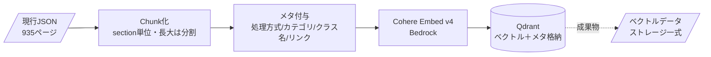
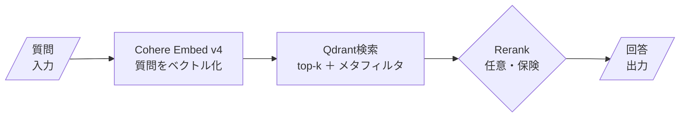

# RAG版Nabledge 設計書（RAGネイティブ）

質問を入力、回答を出力とし、その間を **RAGでやるならどう作るか** をゼロから設計する。v6で設計・計測し、他バージョン（構造同一）へ横展開する。

---

## 1. 要件

### 1.1 目的

現行Nabledgeはエージェンティック検索（LLMが `index.md` / `classes.md` を辿る）。
本件は、知識検索を **ベクトル検索（RAG）で再構成**し、現行と同等の精度が出るかを実測。合格すれば本開発に進む。

### 1.2 達成基準

- v6の **34ベンチマークシナリオ全パス**（ゼロディフェクト要件）。
- 計測構成がそのまま本開発・配布に使えること。
- コストが日常運用に耐えること。

### 1.3 スコープ

- 入力＝質問、出力＝回答。その間（検索方式）をRAGネイティブに設計。
- 設計・計測はv6単独。他バージョンはバージョン番号等を除き構造同一のため横展開で対応。
- 知識は全件対象（処理方式・カテゴリの除外なし）。
- 配布形態（MCP化等）は本開発フェーズで決定。計測時はDocker起動。

---

## 2. 前提・制約

### 2.1 入力フォーマット制約（唯一の制約）

ベクトルストアは、**RST / HTML / 現行JSON / 閲覧用MD のいずれかから、ルールベース（AIなし＝RBKC）で生成**できること。

主入力は **現行JSONを採用**。section構造が素直で、メタがパスから機械導出でき、ルールベース生成と最も相性が良い（§4）。

### 2.2 実物確認済みの前提【事実】

- **JSON構造**：`id / title / content / sections[]`。各sectionは `id / title / content / level`。
- **規模**：935ページ / 9,376 sections。section content長は median 123・p90 586・max 11,881 文字。総文字数 約277万字（≒111〜139万トークン）。
- **メタ導出**：処理方式・カテゴリは**ファイルパスに表現**（JSON本文にメタフィールドは無い）。
  - `processing-pattern/` 配下 ＝ 処理方式（nablarch-batch, mom-messaging, http-messaging, web-application, db-messaging, restful-web-service, jakarta-batch）。
  - `component/` 配下 ＝ カテゴリ（adapters, handlers, libraries）。
- **classes.md**：v6では埋まっている（クラス名→pathの紐付け）。1.2/1.3/1.4は空（入力RSTにJavadocリンクが無いため。新旧ではなくRSTの性質による）。
- **section内リンク**：本文に `(../../component/handlers/xxx.json)` 形式のページ間リンクが埋まっている。

### 2.3 実装前提の確認結果【事実】

実装着手前に4点を実物・一次情報で確認済み。

| # | 確認項目 | 結果 |
|---|---|---|
| 1 | Bedrock Cohere Embed v4 の東京対応 | ap-northeast-1でオンデマンド利用可。モデルID `cohere.embed-v4:0`、$0.12/1Mトークン。 |
| 2 | 34シナリオ（qa.json）の正解定義 | 正解は**section単位**（`path.json:s1`形式）。`then.must`=必須section、`acceptable`=許容section。pass判定＝must sectionがtop-kに入るか。 |
| 3 | メタフィルタの属性値域 | `processing_type`=4種（Nablarchバッチ/ウェブアプリ/RESTful/なし）、`purpose`=5種（実装/セキュリティ/理解/テスト/バージョンアップ）。シナリオの`hearing_answer`が供給。 |
| 4 | classes.md のパース仕様 | `## カテゴリ→### 見出し→path:→- クラス名`の行構造。157ページ・1,025クラス。page_idキーで`class_names`へ機械流し込み可。 |

---

## 3. 技術選定

### 3.0 採用スタック（全体像）

| 軸 | 採用 | ライセンス | 実行場所 | 定番性 |
|---|---|---|---|---|
| Embedding | Cohere Embed v4 multilingual | 商用（Bedrock従量） | Bedrock API | Bedrockの現行embedding標準 |
| Vector Store | Qdrant | Apache-2.0 | クライアントPC（Docker） | OSS vector DBの主要定番（GitHub 30k★超） |
| Orchestrator | LlamaIndex | MIT | クライアントPC | 純粋RAGの定番（GitHub 50k★） |
| Re-ranker | Cohere Rerank 3.5 | 商用（Bedrock従量） | Bedrock API | 精度不足時の保険（第2段） |

各軸の候補・選定理由・コスト・スペック・ライセンスは **Appendix A** に詳述する。

## 4. 「RAGでやるなら」決めるべきこと一覧

RAGを設計する際に決定が必要な論点と、本件での対応方針。起点は「RAGならどうするか」。

| # | 決めるべきこと | 本件の対応方針 |
|---|---|---|
| 1 | **Chunk粒度**（どの単位で区切るか） | JSONの**section単位**。RST見出しは既にRBKCでsection展開済み（これ以上見出しでは割れない）。長大section（4000字超46件＝0.5%）の正体は、(a) getting-started手順でRST原典に見出しが無く番号リストで書かれた数件、(b) 1見出し配下にコード例・表が集中した正常な塊。Cohere v4は128kまで1 chunkで入るため、**計測第1走は分割なし**。長大sectionが絡むシナリオがmissした場合のみ、(a)は番号リスト境界で意味分割する（固定長分割は採らない）。 |
| 2 | **何をembedするか**（chunk本文の作り方） | section の `title` ＋ `content` を結合してembed。pageの `title` も前置し、文脈を補強。 |
| 3 | **メタデータ**（フィルタ・表示に使う属性） | パス・JSON構造・classes.md から機械導出：`processing_type`／`category`／`page_id`／`section_id`／`title`／`level`／`class_names`／`linked_pages`。すべてルールベース（AIなし）。 |
| 4 | **Embeddingモデル**（Appendix A.1） | Cohere Embed v4 multilingual。Indexing時とQuery時で同一モデル必須（同一ベクトル空間）。 |
| 5 | **クライアント側のembedding呼び出し** | クライアントPCのRAGサーバー（LlamaIndex）が、**質問テキストをBedrock APIに送ってベクトル化**。`input_type=search_query` を指定（文書側は `search_document`）。Embeddingはローカル実行せずBedrock呼び出し。 |
| 6 | **検索方式**（top-k・フィルタ） | Qdrantで類似検索 top-k（k=10/20で計測）。メタフィルタで処理方式・目的を絞り込み（現行index.mdのページ選別に相当）。 |
| 7 | **Re-rank**（Appendix A.4） | 第1計測では無し。精度不足時にCohere Rerank 3.5を投入。 |
| 8 | **検索結果の組み立て**（LLMに渡す形） | ヒットしたchunk本文＋メタの `linked_pages`（関連ページ）を併せて返す。現行Phase Eのリンク追従を、検索後処理でなくメタ構造で吸収。 |
| 9 | **配布形態** | 計測はDocker（`docker compose up`）。本開発でMCP化等を決定。 |
| 10 | **ベクトルデータの更新**（再Indexing） | 知識更新時はIndexingを再実行しQdrantストレージを再生成・再配布。差分更新は本開発で検討。 |

### 4.1 クライアント側embeddingの呼び出しイメージ

クライアントPCで完結するのは Qdrant（検索）と LlamaIndex（オーケストレーション）。embeddingだけはBedrock APIを呼ぶ。

```
質問 → LlamaIndex
        → Bedrock embed API（input_type=search_query）でベクトル化
        → Qdrant検索（top-k＋メタフィルタ）
        → （任意）Bedrock rerank API
        → chunk＋linked_pages を返す
```

注記：embeddingをBedrockにするためQuery時もBedrock接続が必要。完全オフラインにするならローカルembeddingモデルが要るが、本件はNablarch開発PJ＝Bedrock前提のため接続を前提とする。

---

## 5. 登場人物

| 登場人物 | 役割 | 本件での対応 |
|---|---|---|
| Document/Chunk | 検索単位 | JSONのsection単位（長大は分割） |
| Embedding Model | テキスト→ベクトル | Cohere Embed v4（Bedrock） |
| Vector Store | 保存・類似検索・フィルタ | Qdrant（Docker） |
| Retriever | 質問をベクトル化しk件取得 | LlamaIndex経由、k=10/20 |
| Re-ranker（任意） | 精度で並替 | Cohere Rerank 3.5 |
| LLM | 取得chunkで回答生成 | CC（Bedrock） |
| Orchestrator | 全体接続 | LlamaIndex |

---

## 6. フロー

### 6.1 Indexing（ルールベース・AIなし／事前に1回）



成果物 ＝ Qdrantのストレージ一式（＝配布物）。Indexingコストは約25円（1回のみ）。

### 6.2 Query（質問のたび）



クライアントPCではQdrant＋LlamaIndexが動作し、embed/rerankのみBedrockを呼ぶ。

### 6.3 配布物の実体

| # | 配布物 | 実体 | ライセンス |
|---|---|---|---|
| ① | RAGサーバー起動環境 | `docker-compose.yml` / `Dockerfile`（Qdrant＋検索/回答スクリプト） | Qdrant=Apache-2.0, LlamaIndex=MIT |
| ② | ベクトルデータ | Qdrantのストレージ・ファイル一式（6.1の出力） | 自社知識 |

クライアントPCで ① を `docker compose up`、② をマウントして使う。推奨スペック 2 vCPU / 2〜4GB RAM。

---

## 7. 検証計画（計測）

### 7.0 基本方針：既存ベンチマークの最大流用

現行Nabledgeは既にDeepEvalでE2E計測しbaselineがある。**同じ qa.json・同じ DeepEval・同じ手順骨格で測り、現行 vs RAG を同一軸で直接比較**する。新しい判定軸は発明せず、既存の出力フォーマットに合わせる。

既存ベンチマークは各ステップの中間結果を `workflow_details.json` に出力済み。これがretrieval比較の軸として使える。

| 既存の出力 | 意味 | RAG版での扱い |
|---|---|---|
| step3 `selected_pages` | ページ選定（Phase A〜C相当） | top-kページを同形式で出力 |
| step4 `read_sections`（`path.json:sN`） | 読み込んだsection | **top-k sectionを同形式で出力（retrieval比較の主軸）** |
| step8 `answer_sections.used` | 回答に使ったsection＋reason | LLM回答が使ったsectionを同形式で |
| DeepEval（answer_correctness 等） | 回答質のE2E評価 | そのまま（E2E主指標・現行と同条件） |
| 手順骨格・run-label規約 | 実行手順 | そのまま、実行コマンドのみ差替 |
| `evaluate.py` の parse/load 関数 | 正解section取得部品 | そのまま流用 |
| `run_qa.py` 実行層 | agenticスキル起動 | RAG版（embed→Qdrant→top-k）に置換 |

### 7.1 計測指標（2層）

- **主指標：E2E回答質**（DeepEval：answer_correctness / answer_relevancy / faithfulness）。現行baselineと同条件で比較。
- **診断指標：retrieval命中**。step4 `read_sections` 形式で出力し、`then.must` のsectionがtop-kに含まれるか。E2Eが落ちた際、検索段（引けていない）かLLM段（引けたが活かせない）かを切り分ける。

判定：must sectionがtop-kに**全て**含まれれば pass、一部なら partial、無ければ miss（`acceptable` は加点）。

### 7.2 計測条件

- k値：k=10 / k=20。
- フィルタ条件：メタフィルタあり（`processing_type`・`purpose` で絞込）／ naive（フィルタなし）／ ベースライン（no-filter全件）。
- 回答生成：現行と同じLLM（CC/Bedrock）・同じ回答プロンプト（`prompts/e2e-prompt.md`）を使用（同条件の肝）。

### 7.3 手順

1. Indexing実行（JSON→chunk→メタ付与→Cohere Embed→Qdrant）。
2. RAG版run_qa：質問をembed→Qdrant検索（k×フィルタ）→top-kを step3/step4 形式で出力。
3. top-k sectionをLLMに渡し回答生成→step8・answer.md 出力。
4. DeepEvalでE2E採点（主指標）＋ retrieval命中集計（診断指標）。
5. 現行baselineと同一フォーマットで突き合わせ比較。
6. 不足時のみ Cohere Rerank 3.5 を投入し再計測。

### 7.4 計測ディシプリン

- 報告前に敵対的セルフレビュー（設計通り走ったか・好成績の裏取り・確証バイアス排除）。
- 報告は「結果＋検証エビデンス」をセットで。
- 全主張に 【事実】/【試算】/【推測】 を付す。

---

## 8. リスクと対応

| リスク | 内容 | 対応 |
|---|---|---|
| 語彙ギャップ（最重要） | 一般埋め込みがNablarch固有語彙（例「後勝ち問題」↔「排他制御」）を繋げられず精度未達。RAG化の唯一の関門。 | まずCohereで天井測定 → 不足ならRerank → chunk設計・メタフィルタ見直し |
| 長大section | max 11,881文字のsectionが1chunkだと検索精度劣化 | 一定長で分割（page_id/section_idで親子保持） |
| ゼロディフェクト未達 | 34シナリオの一部がmiss | RAG置換見送りの判断材料（＝計測目的は達成） |
| 配布サイズ | ベクトルデータが大きい | Qdrantの量子化（RAM最大97%削減）で圧縮 |
| Query時のBedrock依存 | embed/rerankでBedrock接続必須 | Nablarch開発PJはBedrock前提のため許容。完全オフライン要件が出たらローカルembed検討 |

---

## 9. 次のアクション

1. `docker-compose.yml`（Qdrant起動）の雛形作成。
2. Indexingスクリプト（JSON→chunk→メタ付与→Cohere Embed→Qdrant）の実装。
3. RAG版 run_qa：既存 `run_qa.py` の実行層をembed→Qdrant検索に差し替え。step3/4/8の出力フォーマットと `evaluate.py`・DeepEval評価層・手順骨格は流用。

すべてBedrock/OSSで完結し、計測合格後そのまま本開発へ接続する。


---

## Appendix A. 技術選定の詳細

各軸の候補比較・選定理由・コスト・スペック・ライセンス。本文§3.0の採用結論の根拠。

### A.1 Embeddingモデル

選定基準：日本語＋Nablarch専門語彙の検索精度（最重要）、Bedrockで利用可能なこと。

| 候補 | 評価 | 採否 |
|---|---|---|
| **Cohere Embed v4 (multilingual)** | 100以上の言語を同一ベクトル空間にマップ。クロス言語検索に対応。128kトークンの長コンテキスト。1024〜1536次元。 | **採用** |
| Titan Text Embeddings v2 | 英語最適化で多言語は限定的。クロス言語クエリは結果が劣化するとAWS明記。英語のみなら5倍安い。 | 不採用（多言語が弱い） |
| Nova Multimodal Embeddings | テキスト・画像・動画対応の最新モデル。本件はテキストのみで過剰。 | 不採用（過剰） |

選定理由：本件の成否を決めるのは専門語彙の検索精度であり、判定軸は多言語性能。Titan v2は多言語が弱くクロス言語検索でCohere推奨と複数ソースが一致。コスト差（Titanが安い）はゼロディフェクト要件下では精度に劣後。

**コスト試算【試算】**（Embed v4 ＝ $0.12/1Mトークン）：

| 項目 | 量 | コスト |
|---|---|---|
| v6全体のIndexing（1回のみ） | 約111〜139万トークン | **約21〜26円** |
| クエリ毎のembed（質問のみ ~50tok） | 1クエリ | **ほぼ0円**（$0.000006） |

→ ベクトル化のコストは無視できる水準。v6を1回変換しても約25円。

注記：Cohereを選んでも語彙ギャップが埋まる保証はない。実測でのみ判明（§7）。

### A.2 Vector Store

選定基準：クライアントPCでDocker起動可・配布可・**メタデータフィルタ**（処理方式/目的の絞り込みに必須）。

| 候補 | 評価 | 採否 |
|---|---|---|
| **Qdrant** | Rust製OSS（Apache-2.0）。メタフィルタがHNSW探索内で効くpre-filter方式。REST/gRPC、Docker自己ホスト。量子化でRAM最大97%削減。 | **採用** |
| Chroma | pip一発・組込みで最速プロト。フィルタ言語が浅く、pre-filter正確性が要る場面でQdrantへ移行が定石。 | 不採用（フィルタが浅い） |
| pgvector | 既存Postgresがあれば追加インフラ実質ゼロ。本件にPostgres前提なし、フィルタはSQL自前。 | 不採用（前提インフラ不一致） |
| Weaviate | ハイブリッド検索・マルチモーダルが強いが学習コスト高く過剰。 | 不採用（過剰・複雑） |

選定理由：本件はメタフィルタ（処理方式・目的での絞り込み）が機能要件の中核（§4）。フィルタの正確性と深さでQdrantが最適。配布・Docker起動は全候補満たすが、フィルタ品質が決め手。

**ライセンス**：Apache-2.0（個人・商用とも自由に利用・改変・再配布可）。配布物に同梱して問題なし。

**クライアントPCで起動可能か・推奨スペック**：可能。`docker run -p 6333:6333 -v ./qdrant_storage:/qdrant/storage qdrant/qdrant` で起動。

| 用途 | スペック目安 |
|---|---|
| 開発・プロト（10万ベクトル未満） | 1 vCPU / 512MB RAM |
| 本件規模（約1万chunk、量子化あり） | 2 vCPU / 2〜4GB RAM |
| 高スループット（非量子化・大規模） | 4+ vCPU / 8GB+ RAM |

→ 本件は約9,400 chunk規模のため、**2 vCPU / 2〜4GB RAM**で十分。一般的な開発PCで問題なく動作。

**定番性**：OSS vector DBの主要定番。GitHub 30,000★超、Apache-2.0、2020年公開で実績豊富。LlamaIndex/LangChainと公式統合。

### A.3 Orchestrator

選定基準：純粋RAG（文書Q&A・検索）への最適性、少コード、本開発・MCP化への接続性。

| 候補 | 評価 | 採否 |
|---|---|---|
| **LlamaIndex** | 検索特化設計で「純粋RAGなら2026年の第一候補」。少コードで実装、手続き的で読みやすくデバッグ容易。トークン効率も高い。 | **採用** |
| LangChain | ツール呼び出し・多段エージェントなど汎用オーケストレーションに強いが、本件はRAG単体で過剰、複雑性が増す。 | 不採用（過剰） |
| Haystack | 監査可能・パイプライン規律が強く規制業界向け。計測フェーズにはセットアップ重い。 | 不採用（重い） |

選定理由：本件は検索精度の計測でありエージェント機能は不要。複数ベンチマークで、モデル・embedding・retrieverを固定すると框架間の精度差はゼロに収束する＝**精度は框架で決まらず、本件で重要なのは実装の軽さと検索特化**。LlamaIndexが最小コードで読みやすい。将来MCP化もクエリエンジンのツール化で接続でき無駄にならない。

**ライセンス**：MIT（最も寛容なOSSライセンスの一つ。商用利用・改変・再配布自由）。

**推奨スペック**：LlamaIndexはPythonライブラリで、それ自体は軽量（数百MBのRAMで動作）。実際の負荷はembedding（Bedrock API）とQdrantが担うため、Orchestrator固有のスペック要求は小さい。クライアントPCで問題なく動作。

**定番性**：純粋RAGの定番。GitHub 50,000★、MIT、PyPIで年間1,500万DL、Fortune 500の約40%が利用。160+のvector DB・100+のLLMと統合。

**他選定のライセンス（まとめ）**：

| 技術 | ライセンス | 種別 |
|---|---|---|
| Qdrant | Apache-2.0 | OSS（配布自由） |
| LlamaIndex | MIT | OSS（配布自由） |
| Cohere Embed v4 | 商用（Bedrock従量課金） | API利用 |
| Cohere Rerank 3.5 | 商用（Bedrock従量課金） | API利用 |

→ クライアント配布物（Qdrant＋LlamaIndex）は両方ともOSSで配布制約なし。Embedding/RerankのみBedrock API接続が必要。

### A.4 Re-ranker

| 候補 | 評価 | 採否 |
|---|---|---|
| **Cohere Rerank 3.5** | Bedrockネイティブ。ベクトル検索結果を意味的に並べ替え、関連chunkを上位に集約。$2.00/1000クエリ（1検索＝1クエリ＋最大100文書）。 | **採用（保険・第2段）** |

選定理由：第1計測では入れない。目的は「素のベクトル検索の天井」を測ることであり、最初からRerankを足すと改善レバーの効果を切り分けられない。素のベクトル検索 → 不足分をRerankで埋められるか、の順とする。

**コスト【試算】**：約0.3円/クエリ。投入してもクエリコストは無視できる水準。

---
