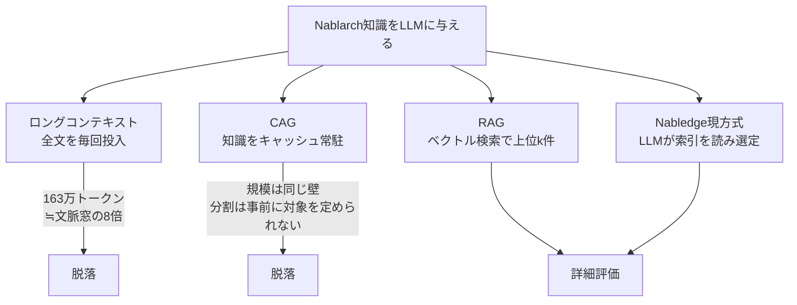
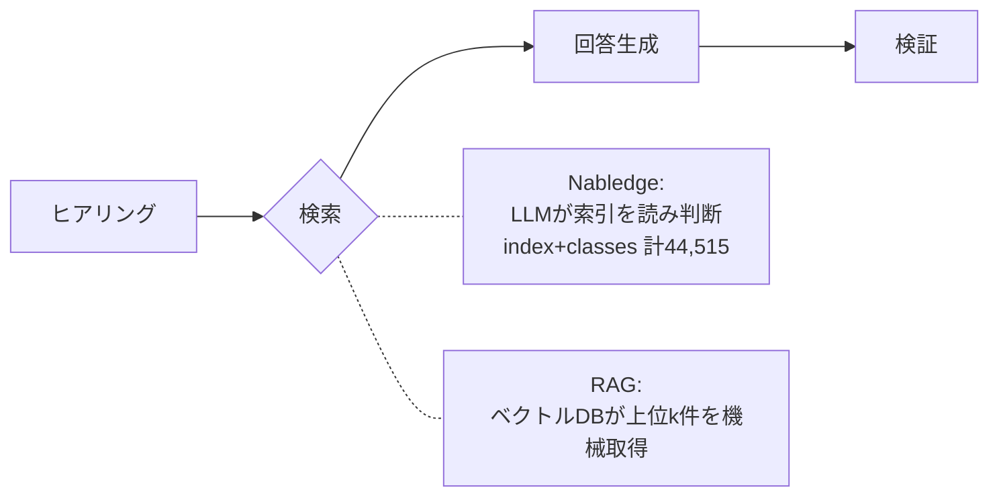

# Nablarch知識基盤のコスト最適化評価 ① アーキテクチャ

---

## 1. 結論

**現要件下では Nabledge 現方式を維持する。**

| | 1回 | 1人月額 (10回/日×20日) | 確度 |
|---|---|---|---|
| Nabledge | ¥80.6 | ¥16,128 | 実測 |
| RAG | ¥70.3 | ¥14,048 | 概算 |
| 差 | ¥10.3 | ¥2,080 | 約1.15倍 |

コスト差は約15%。RAGは検索精度に構造的リスク（処理方式の取り違え等）を持つ。誤りを1件も許さない品質（34シナリオ全パス、現方式は達成済み）を要件とするなら、この程度のコスト差でリスクを負う合理性はない。**判断はコストの大小ではなく、品質リスクを取るかに帰着する。**

---

## 2. 評価基準

Nablarchはミッションクリティカルな金融基盤等で使われ、Nabledgeにも同等品質が求められる。

| 基準 | 内容 |
|---|---|
| 品質 | 誤った知識を1件も出さない。34シナリオ全パスが現状水準 |
| コスト | 利用PJ側の1回・規模別ランニング。Bedrock東京 Sonnet 4.6 |
| 更新性・提供形態 | 知識更新の容易さ、配布の仕組み |

---

## 3. 方式の絞り込み

LLMに未学習知識を与える方式は4系統。原理的に成立しない要因があるかを先に判定する。

ロングコンテキストとCAGは知識規模（v6だけで約163万トークン、文脈窓の約8倍）で脱落。残るは RAG と Nabledge現方式。

---

## 4. 両方式の違いは「検索」だけ

RAGはNabledgeの処理のうち検索（材料選定）だけを置き換える。ヒアリング・回答生成・検証は共通。

この差が、コスト差（索引を読むか否か）と精度差（文脈判断か機械検索か）の両方を生む。

---

## 5. コスト

### 5-1. Nabledge：実測（Claude Code 実ログ6件）

質問の種類を変えて測定。¥74〜90 にほぼ一定、平均 ¥80.6/回。

| 質問 | キャッシュ読取 | キャッシュ書込 | 出力 | 円@160 |
|---|---|---|---|---|
| バッチ都度起動 | 436,900 | 97,800 | 3,500 | 88.0 |
| UniversalDao検索 | 321,600 | 90,400 | 2,400 | 75.5 |
| バリデーション(ヒアリング有) | 371,600 | 92,500 | 2,700 | 79.7 |
| REST 400+JSON | 301,500 | 111,400 | 3,200 | 89.6 |
| DBRecordReaderメッセージング | 321,700 | 91,700 | 2,700 | 76.9 |
| GraphQL(範囲外) | 257,100 | 94,100 | 2,100 | 73.7 |
| **平均** | **335,067** | **96,317** | **2,767** | **80.6** |

コストの大半は、検索で読んだ索引（index.md+classes.md＝約44,515トークン）が、Claude Codeのツール呼び出しごとに再送されるキャッシュ読取。質問の軽重よりこの再送が支配的なため、コストは一定になる。

単価（実測と検算一致）：

| 種別 | 単価 |
|---|---|
| 入力 | $3 / 100万トークン |
| 出力 | $15 / 100万トークン |
| キャッシュ書込 | 入力単価 × 1.25 |
| キャッシュ読取 | 入力単価 × 0.10 |

### 5-2. RAG：Claude Code 実行前提の概算

RAGをClaude Code上で動かす場合、Nabledgeとの差は索引（44,515）を読むか否かのみ。これが無いぶん文脈が軽く、Nabledge実測から差し引くと **約¥70.3/回**。

ツール呼び出し回数と文脈構造を推定で置いた概算。確定値が出れば差し替える。[要確認：RAGコスト実測]

### 5-3. 規模別 月額（1人10回/日 × 20営業日）

| 規模 | Nabledge | RAG |
|---|---|---|
| 小（10名/2,000回） | ¥161,280 | ¥140,480 |
| 中（50名/10,000回） | ¥806,400 | ¥702,400 |
| 大（200名/40,000回） | ¥3,225,600 | ¥2,809,600 |

RAGは「開発側が全社共通のベクトル検索基盤を1つ用意し、各PJはそれを利用する」形を前提とする。この形なら基盤の費用は開発側に集約され、利用PJ側には乗らない。ただし全社では別途その基盤費（月$345〜≒¥55,200〜）が発生する。利用頻度（1日10回）は実ログのない仮置きで、頻度が倍なら月額も倍。[要確認：実利用頻度]

---

## 6. 精度：RAGの構造的リスク（机上）

要件は34シナリオ全パス。Nabledgeは達成済み（実測）。RAG精度は机上評価で、実測は未完了。[要確認：RAG精度実測]

| 要因 | 具体例 | なぜ外すか |
|---|---|---|
| 処理方式を区別できない | 「バリデーションの実装方法」（質問文に処理方式なし） | ベクトル検索は全処理方式を等しく上位に引く。Nablarchは処理方式ごとに実装が異なる |
| 頻出固有語の文脈判別が弱い | `UniversalDao`（知識中134回出現） | 多数のセクションに散る固有語を、類似度だけでは絞れない |
| 記号系が類似度に乗らない | `-requestPath` | 埋め込みが記号列に意味を持たせにくい |

Nabledgeはヒアリングで処理方式・目的を先に確定し、LLMが索引を読んで文脈判断するため、これらを回避して全パスする。

実測の事前確認で判明：「ウェブアプリケーション」の正解12件は処理方式専用ディレクトリに0件、全て横断カテゴリにある。素朴な「処理方式＝専用ディレクトリ」フィルタだと構造的に全miss。**フィルタ設計の巧拙がRAG精度を大きく左右する。**

---

## 7. 更新性・提供形態

知識を更新するときの手順と、配布の仕組みの違い。

| 観点 | RAG（全社共通基盤） | Nabledge |
|---|---|---|
| 更新手順 | 差分を再埋め込み → ベクトルDB更新 | RBKC再実行 → 自動品質チェック → Git push |
| 配布 | 共通基盤を1回更新で全PJに即反映 | 各PJが再取得。バージョンずれの余地 |
| 品質保証 | 標準では明示ゲートなし | 知識生成時に自動品質チェック |
| バージョン併存 | 出し分けの仕組みが要る | バージョン別プラグインでPJが必要分だけ導入 |

配布の即時性はRAGが優位、品質保証とバージョン併存はNabledgeが優位。ただしNablarchは頻繁に変わらない（v6更新は最新追随・不具合対応が中心）ため、**この軸の差は年間の重みが小さい**。

---

## 8. 根拠と次の一歩

| 主張 | 確度 |
|---|---|
| Nabledgeコスト¥80.6、単価式、34シナリオ全パス、知識163万トークン | 実測 |
| RAGコスト¥70.3 | 概算（Claude Code 実行前提、呼び出し回数は推定） |
| RAG精度の構造的リスク | 机上（実測は未完了） |

「コスト差が小さい」という結論は、単価訂正（書込×1.25）という確度の高い事実に基づき、RAG実測で多少動いても覆りにくい。

**次の一歩**：

| # | 作業 | 確定する箇所 |
|---|---|---|
| 1 | RAG精度の実測（ローカル埋め込みで34シナリオ） | 6章 |
| 2 | RAGコストの実測 | 5-2 |
| 3 | Nabledge自身の最適化（文書②） | — |
