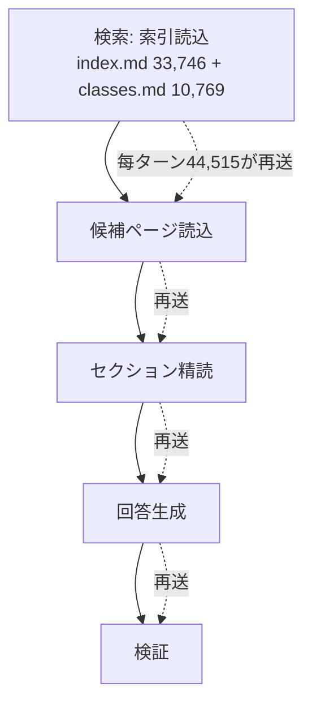
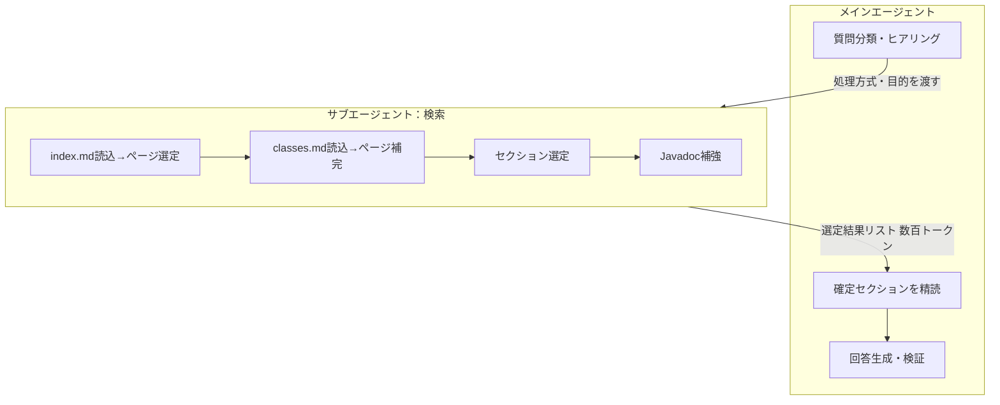

# Nablarch知識基盤のコスト最適化評価 ② Nabledge単体の最適化

---

## 1. 結論

**検索処理をサブエージェント化する。**

| | 1回 | 1人月額 (10回/日×20日) |
|---|---|---|
| 現状 | ¥80.6 | ¥16,128 |
| サブ化後 | ¥21.3 | ¥4,256 |
| 削減 | 約74%減 | ¥11,872 |

コストの約89%は、検索で読んだ索引（index.md+classes.md）がメインエージェントの会話に居座り、毎ターン再送されること。この索引をサブエージェントで処理し結果リストだけメインへ返せば、索引はメインに載らず再送が止まる。索引を読んで判断する行為自体はサブ内で維持されるため、精度は犠牲にしない（スクリプトによる機械検索への置き換えと異なり品質トレードオフがない）。

削減率は概算。実測（サブ化版の実装＋Claude Code 実ログ）で確定する。[要確認：サブ化実測]

---

## 2. なぜ高いか：索引の繰り返し再送

Claude Codeはツール呼び出し（ファイル読込・検索）のたびに、その時点までの全文脈を再送する。検索の起点で読んだ巨大な索引が、回答・検証まで会話に居座り、毎ターン再送されてキャッシュ読取として課金される。

実測（1回平均）のキャッシュ読取33.5万トークンの内訳：

| 要素 | キャッシュ読取への寄与 | 割合 |
|---|---|---|
| index.md の再送 | 約236,000 | 約70% |
| classes.md の再送 | 約65,000 | 約19% |
| 候補ページ・精読・Javadoc | 約34,000 | 約11% |

索引2ファイルで約89%。ここが最適化の的。

---

## 3. 解決策：検索フェーズをサブに出す

LLMの会話は追記式で、一度載せた索引を途中で「捨てる」ことはできない。代わりに、索引を**最初からメインに載せず**、サブエージェントで処理して結果だけ受け取る。

メインから index.md+classes.md（44,515）が丸ごと消える。候補ページ・Javadocもサブ内で消費され、メインは選定結果リスト（数百トークン）だけ受け取る。

| | 現状 | サブ化後 |
|---|---|---|
| 1回コスト | ¥80.6（実測） | 約¥21.3（概算） |

この¥21.3は、別評価（アーキテクチャ比較）でのRAG概算¥70.3を下回る。**サブ化が成立すれば、NabledgeはコストでもRAGに優位、かつ精度でも優位になる。**

---

## 4. 検討した設計上の制約

サブエージェント化は過去にNabledgeで見送られた経緯がある。その理由と、本案がどう回避するかを示す。

| 制約 | 内容 | 本案の回避 |
|---|---|---|
| サブはユーザーに問い返せない | ヒアリングがサブ内でできない | ヒアリングはメインに残し、問い返し不要の検索だけサブ化 |
| サブからサブは呼べない | 検索の各フェーズを個別サブにすると入れ子になる | 検索の各処理を1つのサブ内で連続実行し、入れ子を作らない |
| 精度維持の条件 | メインとサブで文脈が分断される | ヒアリング結果（処理方式・目的）をサブへ明示的に渡す。渡せれば判断材料は現状と同じ |

実装面：サブエージェントの仕組みはClaude Code（CC）とGitHub Copilot（GHC）で異なるため、両プラットフォーム対応が必要。これは実装コストとして見込む。

---

## 5. 副次的な削減候補

サブ化が根本対策。以下は補完的で、効果が小さいか品質トレードオフを伴う。

| 候補 | 効果 | 留意 |
|---|---|---|
| index.mdのセクション見出し除去 | index.mdが約2/3に | ページ選定で未使用だが、LLMが暗黙の手がかりにしている可能性。要検証 |
| classes.mdのスクリプト化 | classes.md再送が消える | classes.mdは精度向上の実績があり、外すと精度低下リスク |
| 精読セクション上限の最適化 | 回答フェーズのトークン減 | 回答品質に直結。索引サブ化と違い品質トレードオフあり |

サブ化はメインから索引そのものを除く根本対策で、これらの部分最適化より効果が大きい。

---

## 6. 根拠と次の一歩

**根拠の確度**：
- 【実測】現状¥80.6、キャッシュ読取33.5万トークン
- 【試算】内訳（索引が89%）、サブ化後¥21.3（再送係数・呼び出し回数は仮置き）

「索引の繰り返し再送がコストの主因」という構造は実測に基づく。サブ化が大幅削減につながる方向は確実で、削減率の精度のみ実測待ち。

**次の一歩**：
1. サブ化版を実装し、Claude Code 実ログでコストを実測 → 1章の¥21.3を確定
2. 同実測で34シナリオの全パス維持を確認 → 精度非劣化を検証
3. CC/GHC両対応の実装コストを見積もり、削減効果と対比
