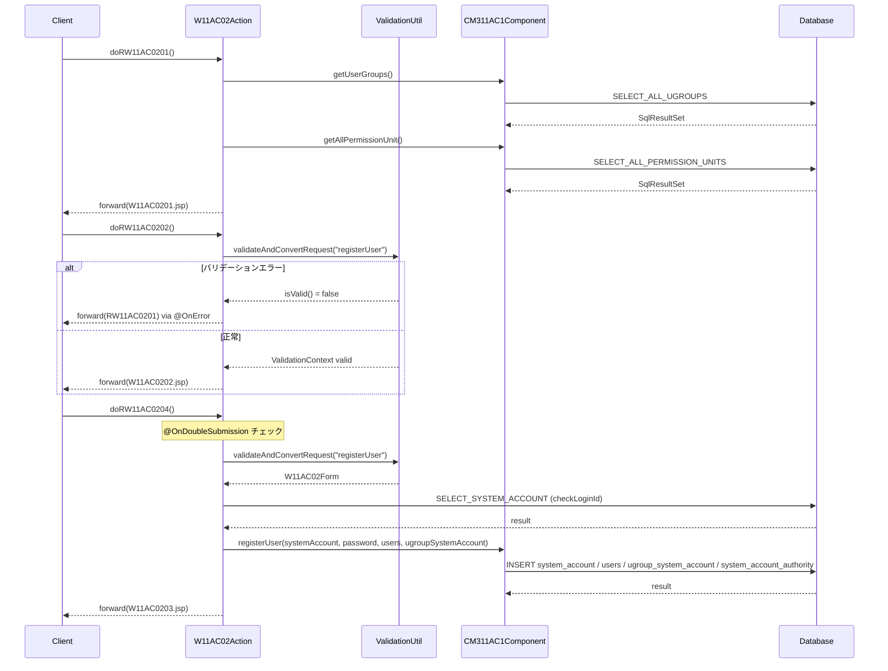

# Code Analysis: W11AC02Action

**Generated**: 2026-07-01 (ベンチマークモード)
**Target**: ユーザー情報登録機能のウェブアクションクラス
**Modules**: nabledge-1.4 (web-application-07-insert)
**Analysis Duration**: 不明(ベンチマークモード)

---

## Overview

`W11AC02Action` は Nablarch ウェブアプリケーションにおけるユーザー情報登録機能を担うアクションクラスである。`DbAccessSupport` を継承し、登録画面表示・入力確認・登録確定の4段階のフローを処理する。入力バリデーション（`ValidationUtil`）、二重サブミット防止（`@OnDoubleSubmission`）、エラー時リダイレクト（`@OnError`）を組み合わせ、登録操作の安全性と整合性を保証する。実際のDB登録処理は `CM311AC1Component` に委譲し、アクションクラスはフロー制御に専念する設計となっている。

---

## Architecture

### Dependency Graph

```mermaid
classDiagram
    class W11AC02Action {
        <<Action>>
    }
    class DbAccessSupport {
        <<Nablarch>>
    }
    class W11AC02Form {
        <<Form>>
    }
    class CM311AC1Component
    class SystemAccountEntity {
        <<Entity>>
    }
    class UsersEntity {
        <<Entity>>
    }
    class UgroupSystemAccountEntity {
        <<Entity>>
    }
    class ValidationUtil {
        <<Nablarch>>
    }
    class ExecutionContext {
        <<Nablarch>>
    }
    class SqlPStatement {
        <<Nablarch>>
    }
    class W11AC01SearchForm {
        <<Form>>
    }

    W11AC02Action --|> DbAccessSupport
    CM311AC1Component --|> DbAccessSupport
    W11AC02Action ..> W11AC02Form : validates
    W11AC02Action ..> CM311AC1Component : delegates to
    W11AC02Action ..> ValidationUtil : invokes
    W11AC02Action ..> ExecutionContext : uses
    W11AC02Action ..> SqlPStatement : queries
    W11AC02Action ..> W11AC01SearchForm : creates
    W11AC02Form ..> SystemAccountEntity : creates
    W11AC02Form ..> UsersEntity : creates
    W11AC02Form ..> UgroupSystemAccountEntity : creates
```



**Note**: This diagram uses Mermaid `classDiagram` syntax to show class names and their relationships. Use `--|>` for inheritance (extends/implements) and `..>` for dependencies (uses/creates).

### Component Summary

| Component | Role | Type | Dependencies |
|-----------|------|------|--------------|
| W11AC02Action | ユーザー登録フロー制御 | Action | W11AC02Form, CM311AC1Component, ValidationUtil, ExecutionContext |
| W11AC02Form | ユーザー登録入力値のバリデーションと変換 | Form | SystemAccountEntity, UsersEntity, UgroupSystemAccountEntity |
| CM311AC1Component | ユーザー管理機能の内部共通DB操作 | Component | DbAccessSupport, 各Entity |
| SystemAccountEntity | システムアカウント情報 | Entity | なし |
| UsersEntity | ユーザー基本情報 | Entity | なし |
| UgroupSystemAccountEntity | グループとユーザーの関連情報 | Entity | なし |
| W11AC01SearchForm | 登録完了後の引き継ぎ検索条件 | Form | SystemAccountEntity |

---

## Flow

### Processing Flow

**メイン処理フロー（4段階）：**

1. **doRW11AC0201()** (L36-42): 登録画面初期表示。`setUpViewData()` でグループ一覧・認可単位一覧をリクエストスコープに格納してJSPへフォワード。
2. **doRW11AC0202()** (L53-63): 「確認」ボタン処理。`validate()` で入力精査 → 確認画面へフォワード。`@OnError` によりバリデーションエラー時は入力画面へ戻る。
3. **doRW11AC0203()** (L70-82): 確認画面からの「登録画面へ」戻り処理。再バリデーション後に入力画面へフォワード。
4. **doRW11AC0204()** (L88-112): 「確定」ボタン処理（実登録）。`@OnDoubleSubmission` で二重サブミット防止、バリデーション後に `CM311AC1Component.registerUser()` を呼び出して4テーブルへの登録を実行。

**プライベートメソッド（1段階下）：**

- **setUpViewData()** (L118-132): CM311AC1Component を経由してグループ一覧・認可単位一覧を取得し、リクエストスコープへ格納。
- **validate()** (L138-168): `ValidationUtil.validateAndConvertRequest()` でフォームバリデーションを実行。ログインID重複チェック（`checkLoginId()`）・グループID存在確認・認可単位ID存在確認をそれぞれ `ApplicationException` で保護。
- **checkLoginId()** (L174-183): `SqlPStatement` で `SELECT_SYSTEM_ACCOUNT` を実行し、ログインID重複を直接DB照会で確認。

### Sequence Diagram



---

## Components

### W11AC02Action

**場所**: [W11AC02Action.java](../../.claude/skills/nabledge-1.4/knowledge/assets/web-application-07-insert/W11AC02Action.java)

**役割**: ユーザー情報登録機能のフロー制御。画面遷移・バリデーション呼び出し・登録委譲を担う。

**主要メソッド**:
- `doRW11AC0201()` (L36-42): 登録画面表示。グループ/認可単位情報をビューにセット。
- `doRW11AC0204()` (L88-112): 登録確定。`@OnDoubleSubmission` で二重送信防止後、フォームバリデーション・登録処理を実行。
- `validate()` (L138-168): 内部バリデーションロジック。フォームチェック + ビジネスルール検証（ログインID重複、グループ/認可単位存在確認）。

**依存関係**: W11AC02Form, CM311AC1Component, ValidationUtil, SqlPStatement, ExecutionContext

---

### W11AC02Form

**場所**: [W11AC02Form.java](../../.claude/skills/nabledge-1.3/knowledge/assets/web-application-04-validation/W11AC02Form.java)

**役割**: ユーザー登録画面の入力値を受け取り、バリデーションアノテーションと `@ValidateFor` メソッドで精査を担う。

**主要メソッド**:
- `validateForRegister()` (L~128-140): `@ValidateFor("registerUser")` によるバリデーション定義。パスワードと確認パスワードの相関チェックを含む。
- `W11AC02Form(Map<String, Object> params)` (L~52-58): Mapコンストラクタ（ValidationUtil が内部で使用）。

**依存関係**: SystemAccountEntity, UsersEntity, UgroupSystemAccountEntity

---

### CM311AC1Component

**場所**: [CM311AC1Component.java](../../.claude/skills/nabledge-1.4/knowledge/assets/web-application-07-insert/CM311AC1Component.java)

**役割**: ユーザー管理機能のDB操作を集約した内部共通コンポーネント。複数テーブルへの登録・検索・削除を提供。

**主要メソッド**:
- `registerUser()` (L~80-120): ユーザーID採番・日付計算・パスワード暗号化を行いシステムアカウント/ユーザー/グループ/権限の4テーブルへ一括登録。
- `existGroupId()` / `existPermissionUnitId()` (L~55-80): バリデーションで使用する存在確認クエリ。
- `getUserGroups()` / `getAllPermissionUnit()` (L~43-55): 画面表示用マスターデータ取得。

**依存関係**: DbAccessSupport, SystemAccountEntity, UsersEntity, UgroupSystemAccountEntity, BusinessDateUtil, IdGeneratorUtil, AuthenticationUtil

---

## Nablarch Framework Usage

### ValidationUtil / ValidationContext

**クラス**: `nablarch.core.validation.ValidationUtil`

**説明**: リクエストパラメータをFormクラスにバインドしつつバリデーションを実行するユーティリティ。`@ValidateFor` アノテーションで指定したメソッドによるカスタムバリデーションも実行する。

**使用方法**:
```java
ValidationContext<W11AC02Form> context =
    ValidationUtil.validateAndConvertRequest("W11AC02", W11AC02Form.class, req, "registerUser");
if (!context.isValid()) {
    throw new ApplicationException(context.getMessages());
}
W11AC02Form form = context.createObject();
```

**重要ポイント**:
- ✅ **`createObject()` の前に `isValid()` チェック必須**: バリデーションエラーがある状態で `createObject()` を呼ぶと不正なオブジェクトが生成される
- ⚠️ **相関バリデーションは `@ValidateFor` メソッド内で実装**: パスワード確認など複数項目の整合性チェックはFormの静的メソッドで行う（本コードの `validateForRegister()` がその例）
- 💡 **第1引数の `prefix`**: リクエストパラメータのプレフィックスを指定。フォームのネスト構造（`SystemAccountEntity` など）とパラメータ名のマッピングに使用される

**このコードでの使い方**:
- `validate()` (L138) で `validateAndConvertRequest("W11AC02", W11AC02Form.class, req, "registerUser")` を呼び出し
- バリデーション後 `context.createObject()` でフォームオブジェクトを取得
- フォームから各エンティティ（`getSystemAccount()` 等）を取得してビジネスロジックへ渡す

**詳細**: [Nablarch Validation](../../.claude/skills/nabledge-6/docs/component/libraries/libraries-nablarch-validation.md)

---

### OnDoubleSubmission

**クラス**: `nablarch.common.web.token.OnDoubleSubmission`

**説明**: ウェブアクションメソッドへのアノテーション。二重サブミット（フォームの二重送信）を検出し、指定されたパスへリダイレクトすることで不正な二重登録を防ぐインターセプタ。

**使用方法**:
```java
@OnDoubleSubmission(path = "forward://RW11AC0201")
public HttpResponse doRW11AC0204(HttpRequest req, ExecutionContext ctx) {
    // 登録処理
}
```

**重要ポイント**:
- ✅ **登録・更新・削除の確定処理には必ず付与**: フォームの「確定」ボタンに対応するメソッドに適用する
- ⚠️ **JSPに `<n:token>` タグが必要**: サーバー側のアノテーション単体では機能しない。フォームHTMLにトークン埋め込みタグを配置して初めて二重サブミット検出が動作する
- 🎯 **`path` 属性に戻り先を指定**: 二重送信検出時のフォールバック先を `forward://` または JSP パスで指定する

**このコードでの使い方**:
- `doRW11AC0204()` (L~86-87) に `@OnDoubleSubmission(path = "forward://RW11AC0201")` を付与
- ユーザーが「確定」ボタンを複数回押した場合に入力画面へ戻す

**詳細**: [OnDoubleSubmissionインターセプタ](../../.claude/skills/nabledge-6/docs/component/handlers/handlers-on-double-submission.md)

---

### OnError

**クラス**: `nablarch.fw.web.interceptor.OnError`

**説明**: 業務アクションメソッドで指定した例外が発生した場合の遷移先を宣言的に定義するインターセプタ。try-catchを不要にしてアクションメソッドのコードをシンプルに保つ。

**使用方法**:
```java
@OnError(type = ApplicationException.class, path = "forward://RW11AC0201")
public HttpResponse doRW11AC0202(HttpRequest req, ExecutionContext ctx) {
    validate(req); // ApplicationException がスローされると forward://RW11AC0201 へ
}
```

**重要ポイント**:
- ✅ **`type` に `RuntimeException` のサブクラスを指定**: `ApplicationException` が最も一般的なユースケース
- 💡 **アクションメソッドのコードがシンプルになる**: 例外ハンドリングを宣言側に寄せることで、正常フローのみを記述できる
- ⚠️ **`path` の `forward://` と JSPパスの違い**: `forward://RW11AC0201` はURLマッピングを経由; `/ss11AC/W11AC0201.jsp` は直接JSPへフォワード

**このコードでの使い方**:
- `doRW11AC0202()`, `doRW11AC0203()`, `doRW11AC0204()` の3メソッドに付与
- バリデーションエラー（`ApplicationException`）発生時に入力画面（`RW11AC0201`）へ自動的にフォワード

**詳細**: [OnErrorインターセプタ](../../.claude/skills/nabledge-6/docs/component/handlers/handlers-on-error.md)

---

### DbAccessSupport / SqlPStatement

**クラス**: `nablarch.core.db.support.DbAccessSupport`

**説明**: DBアクセスを行うクラスの基底クラス。`getSqlPStatement()` でSQL IDによるステートメント取得、`getParameterizedSqlStatement()` でBean入力型ステートメント取得を提供する。

**使用方法**:
```java
// SQL IDで検索
SqlPStatement statement = getSqlPStatement("SELECT_SYSTEM_ACCOUNT");
statement.setString(1, loginId);
SqlResultSet result = statement.retrieve();

// Beanオブジェクトで挿入
ParameterizedSqlPStatement stmt = getParameterizedSqlStatement("INSERT_SYSTEM_ACCOUNT");
stmt.executeUpdateByObject(systemAccount);
```

**重要ポイント**:
- ✅ **SQL IDはクラスと同名の `.sql` ファイルで管理**: `CM311AC1Component.sql` ファイルに `SELECT_SYSTEM_ACCOUNT`, `INSERT_USERS` 等のSQLを定義する
- 💡 **`executeUpdateByObject()` でBean→SQL自動マッピング**: Entityのプロパティ名とSQL名前付きパラメータ（`:loginId`）が自動対応される
- ⚠️ **`DuplicateStatementException` は明示的にハンドリング**: 一意制約違反は `ApplicationException` へ変換して業務エラーとして扱う（`registerSystemAccount()` の実装を参照）

**このコードでの使い方**:
- `W11AC02Action.checkLoginId()` (L174): `getSqlPStatement("SELECT_SYSTEM_ACCOUNT")` でログインID重複チェック
- `CM311AC1Component.registerSystemAccount()` 等: `getParameterizedSqlStatement()` で4テーブルへのINSERT実行

**詳細**: [データベースアクセス(JDBCラッパー)](../../.claude/skills/nabledge-6/docs/component/libraries/libraries-database.md)

---

## References

### Source Files

- [W11AC02Action.java](../../.claude/skills/nabledge-1.4/knowledge/assets/web-application-07-insert/W11AC02Action.java) — メインアクションクラス
- [W11AC02Form.java](../../.claude/skills/nabledge-1.3/knowledge/assets/web-application-04-validation/W11AC02Form.java) — 入力フォーム（バリデーション定義）
- [CM311AC1Component.java](../../.claude/skills/nabledge-1.4/knowledge/assets/web-application-07-insert/CM311AC1Component.java) — DB操作共通コンポーネント

### Knowledge Base

- [Nablarch Validation](../../.claude/skills/nabledge-6/docs/component/libraries/libraries-nablarch-validation.md) — ValidationUtil・ValidationContext・@ValidateFor の詳細
- [OnDoubleSubmissionインターセプタ](../../.claude/skills/nabledge-6/docs/component/handlers/handlers-on-double-submission.md) — 二重サブミット防止の設定・動作
- [OnErrorインターセプタ](../../.claude/skills/nabledge-6/docs/component/handlers/handlers-on-error.md) — 例外ハンドリングの宣言的定義
- [データベースアクセス(JDBCラッパー)](../../.claude/skills/nabledge-6/docs/component/libraries/libraries-database.md) — SqlPStatement・ParameterizedSqlPStatement の使い方

### Official Documentation

- [Nablarch Validation](https://nablarch.github.io/docs/LATEST/doc/application_framework/application_framework/libraries/validation/nablarch_validation.html)
- [ウェブアプリケーション ハンドラ](https://nablarch.github.io/docs/LATEST/doc/application_framework/application_framework/handlers/web/index.html)
- [データベースアクセス](https://nablarch.github.io/docs/LATEST/doc/application_framework/application_framework/libraries/database.html)

---

**Output**: `.nabledge/20260701/code-analysis-W11AC02Action.md`

**Note**: This documentation was generated by the code-analysis workflow of the nabledge-6 skill.