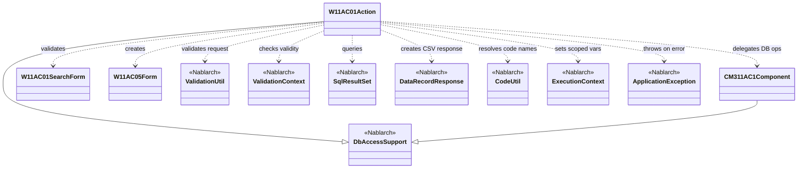
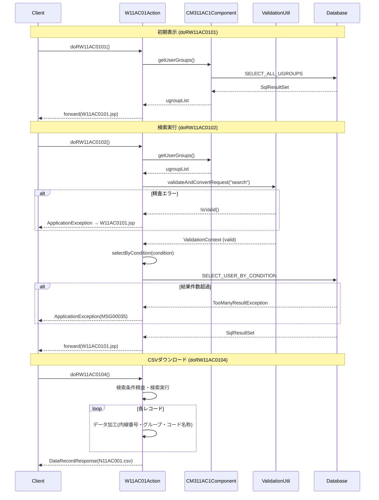

# Code Analysis: W11AC01Action

**Generated**: 2026-07-01 (今日)
**Target**: ユーザ検索・照会・CSVダウンロード機能のアクションクラス
**Modules**: nablarch.sample.ss11AC (Nablarch Webアプリケーションサンプル)
**Analysis Duration**: 不明(ベンチマークモード)

---

## Overview

`W11AC01Action` はNablarchウェブアプリケーションサンプルにおけるユーザ管理機能（SS11AC）のアクションクラスである。`DbAccessSupport` を継承し、4つのHTTPハンドラメソッドを提供する。

- **doRW11AC0101**: ユーザ一覧照会画面の初期表示（グループ一覧取得のみ）
- **doRW11AC0102**: 検索条件バリデーション後、条件検索を実行して結果一覧を表示
- **doRW11AC0103**: 一覧から選択したユーザの詳細情報を表示
- **doRW11AC0104**: 検索結果をCSV形式でダウンロード

内部コンポーネントとして `CM311AC1Component` を用いてDBアクセスを行い、Nablarchの `ValidationUtil` でリクエストパラメータを検証、`CodeUtil` でコード名称を解決する。

---

## Architecture

### Dependency Graph



**Note**: このダイアグラムは `classDiagram` 構文を使用し、クラス名と関係を示す。`--|>` は継承、`..>` は依存（使用/生成）を表す。

### Component Summary

| Component | Role | Type | Dependencies |
|-----------|------|------|--------------|
| W11AC01Action | ユーザ検索・照会・CSVダウンロードの制御 | Action | CM311AC1Component, W11AC01SearchForm, W11AC05Form, ValidationUtil, CodeUtil |
| CM311AC1Component | ユーザ管理機能の内部共通DBコンポーネント | Component | DbAccessSupport, SqlPStatement |
| W11AC01SearchForm | ユーザ検索条件のバリデーション用Form | Form | SystemAccountEntity (ネスト) |
| W11AC05Form | 一括操作用Form（選択状態管理） | Form | なし |
| DbAccessSupport | Nablarch DBアクセス基底クラス | Nablarch | SqlPStatement, ParameterizedSqlPStatement |
| ValidationUtil | リクエストパラメータのバリデーション実行 | Nablarch | ValidationContext |
| DataRecordResponse | CSVダウンロードレスポンス生成 | Nablarch | フォーマット定義ファイル |
| CodeUtil | コードテーブルから名称を取得 | Nablarch | BasicCodeManager |

---

## Flow

### Processing Flow

**doRW11AC0101（初期表示）**:
1. `CM311AC1Component.getUserGroups()` でグループ一覧を取得
2. `ExecutionContext.setRequestScopedVar("ugroupList", ...)` でスコープに設定
3. `/ss11AC/W11AC0101.jsp` へフォワード

**doRW11AC0102（検索実行）**:
1. `CM311AC1Component.getUserGroups()` でグループ一覧取得
2. `ValidationUtil.validateAndConvertRequest(...)` で検索条件を精査・変換
3. 精査エラー時は `ApplicationException` をスロー（`@OnError` でJSPへ遷移）
4. `selectByCondition(condition)` でSQL検索（内部で `search("SELECT_USER_BY_CONDITION", condition)` を呼ぶ）
5. `TooManyResultException` 時はエラーメッセージで `ApplicationException`
6. 検索結果・件数・W11AC05Form・コード名称配列をリクエストスコープへ設定
7. `/ss11AC/W11AC0101.jsp` へフォワード

**doRW11AC0103（詳細表示）**:
1. `ValidationUtil.validateAndConvertRequest(...)` でユーザID精査
2. `CM311AC1Component` 経由で4種類のDB検索（システムアカウント、ユーザ、認可単位、グループ）
3. 必須情報取得失敗時は `ApplicationException`
4. 各検索結果をリクエストスコープに設定し `/ss11AC/W11AC0102.jsp` へフォワード

**doRW11AC0104（CSVダウンロード）**:
1. グループ一覧取得 + 検索条件精査（doRW11AC0102と同様）
2. `selectByCondition(condition)` で検索
3. `DataRecordResponse` を生成（フォーマット定義 "format"、SQLID "N11AC001"）
4. ヘッダレコード書き込み後、各レコードに加工（内線番号結合・グループ文字列生成・コード名称変換）してデータレコード書き込み

**ヘルパーメソッド**:
- `selectByCondition(condition)`: `DbAccessSupport.search("SELECT_USER_BY_CONDITION", condition)` のラッパー。Formオブジェクトをバインド変数としてSQLを実行する。

### Sequence Diagram



---

## Components

### W11AC01Action

**ファイル**: `.claude/skills/nabledge-1.4/knowledge/assets/web-application-03-listSearch/W11AC01Action.java`

**役割**: ユーザ検索・照会・CSVダウンロードを担うウェブアクション

**主要メソッド**:
- `doRW11AC0101(HttpRequest, ExecutionContext)` - 初期表示（グループ一覧取得）
- `doRW11AC0102(HttpRequest, ExecutionContext)` - 検索実行・結果表示（L47-98）
- `doRW11AC0103(HttpRequest, ExecutionContext)` - ユーザ詳細表示（L105-140）
- `doRW11AC0104(HttpRequest, ExecutionContext)` - CSVダウンロード（L148-195）
- `selectByCondition(W11AC01SearchForm)` - 条件検索ヘルパー（L207-209）

**依存**:
- `CM311AC1Component`: 全メソッドでインスタンス化して使用
- `ValidationUtil`: doRW11AC0102/0103/0104 で使用
- `CodeUtil`: doRW11AC0102/0104 でコード名称解決に使用
- `DataRecordResponse`: doRW11AC0104 のCSV出力

**実装ポイント**:
- `@OnError` アノテーションにより `ApplicationException` 発生時の遷移先をメソッド単位で宣言
- doRW11AC0102 では検索結果に加えて `W11AC05Form`（一括操作用）もスコープに設定
- コード名称（ユーザIDロック状態）はActionで取得してリクエストスコープに設定しているが、コメントでは「実用上はJSPの `<n:code>` タグ使用を推奨」と明記

---

### CM311AC1Component

**ファイル**: `.claude/skills/nabledge-1.4/knowledge/assets/web-application-02-basic/CM311AC1Component.java`

**役割**: ユーザ管理機能内の共通DBアクセスコンポーネント（設計書なし）

**主要メソッド**:
- `getUserGroups()` - 全グループ取得（SELECT_ALL_UGROUPS）
- `selectSystemAccount(userId)` - システムアカウント情報取得
- `selectUsers(userId)` - ユーザテーブル情報取得
- `selectPermissionUnit(userId)` - 認可単位情報取得
- `selectUgroup(userId)` - グループ情報取得

**依存**: `DbAccessSupport`、各エンティティクラス（`SystemAccountEntity`、`UsersEntity`、`UgroupSystemAccountEntity`）

---

## Nablarch Framework Usage

### DbAccessSupport

**クラス**: `nablarch.core.db.support.DbAccessSupport`

**説明**: データベースアクセスを行うクラスの基底クラス。`SqlPStatement` や `ParameterizedSqlPStatement` の取得メソッドを提供し、SQLファイルからSQLを取得して実行する。

**使用方法**:
```java
// SQL ID で SqlPStatement を取得
SqlPStatement statement = getSqlPStatement("SELECT_ALL_UGROUPS");
SqlResultSet result = statement.retrieve();

// Beanオブジェクトをバインドしてパラメータ化SQL実行
private SqlResultSet selectByCondition(W11AC01SearchForm condition) {
    return search("SELECT_USER_BY_CONDITION", condition);
}
```

**重要ポイント**:
- ✅ **SQLはSQLファイルで管理**: SQL IDをキーにSQLファイルからSQLを取得。ロジック内にSQLを記述しない
- ⚠️ **SQLは機能ごとに作成**: 複数機能でSQLを流用すると、一方の変更（`FOR UPDATE` 追加等）が他機能に影響する
- 💡 **PreparedStatement を使用**: SQLインジェクションの脆弱性を排除

**このコードでの使い方**:
- `W11AC01Action.selectByCondition()` で `search("SELECT_USER_BY_CONDITION", condition)` を呼び出し、`W11AC01SearchForm` のプロパティをバインド変数として渡す
- `CM311AC1Component` 内では `getSqlPStatement(SQLID)` で直接 `SqlPStatement` を取得し、`setString()` でパラメータをバインド

**詳細**: [データベースアクセス(JDBCラッパー)](../../.claude/skills/nabledge-6/docs/features/libraries/database.md)

---

### ValidationUtil / ValidationContext

**クラス**: `nablarch.core.validation.ValidationUtil` / `nablarch.core.validation.ValidationContext`

**説明**: リクエストパラメータのバリデーションと型変換を実行するNablarch Validationのエントリポイント。`validateAndConvertRequest` でHTTPリクエストから指定Formクラスへのバリデーション・変換を一括で行う。

**使用方法**:
```java
// バリデーション実行 (第1引数: バリデーション識別子, 第2引数: Formクラス, 第3引数: リクエスト, 第4引数: バリデーションメソッド名)
ValidationContext<W11AC01SearchForm> searchConditionCtx =
    ValidationUtil.validateAndConvertRequest("11AC_W11AC01", W11AC01SearchForm.class, req, "search");

// 精査結果チェック
if (!searchConditionCtx.isValid()) {
    throw new ApplicationException(searchConditionCtx.getMessages());
}

// バリデーション済みオブジェクトの取得
W11AC01SearchForm condition = searchConditionCtx.createObject();
```

**重要ポイント**:
- ✅ **isValid() で必ず結果を確認**: エラー時は `getMessages()` でメッセージを取得して `ApplicationException` にラップ
- ⚠️ **`@ValidateFor` メソッドの名前と第4引数を一致させる**: 第4引数 `"search"` は Form クラスの `@ValidateFor("search")` アノテーションに対応する
- 💡 **バリデーションと型変換が同時実行**: 文字列入力値を `Integer` などの型に変換しつつバリデーションするため、`createObject()` で取得したFormは型変換済みのオブジェクトになる
- 🎯 **ウェブアプリケーションでの標準的な使い方**: `validateAndConvertRequest` はHTTPリクエスト専用のショートカットAPI

**このコードでの使い方**:
- doRW11AC0102: 検索条件フォーム ("search") の精査
- doRW11AC0103: 詳細表示用ユーザID取得 ("selectUserInfo") の精査
- doRW11AC0104: CSVダウンロード前の検索条件精査

**詳細**: [Nablarch Validation](../../.claude/skills/nabledge-6/docs/features/libraries/nablarch-validation.md)

---

### DataRecordResponse

**クラス**: `nablarch.common.web.download.DataRecordResponse`

**説明**: 汎用データフォーマット機能を使用したファイルダウンロードレスポンス。フォーマット定義ファイルに従って固定長・CSV等のフォーマットでデータを書き込み、HTTPダウンロードレスポンスとして返却する。

**使用方法**:
```java
// フォーマット定義名とレイアウトSQLIDでレスポンスを生成
DataRecordResponse response = new DataRecordResponse("format", "N11AC001");
response.setContentType("text/csv; charset=Shift_JIS");
response.setContentDisposition("N11AC001.csv");

// ヘッダレコード書き込み
Map<String, String> header = new HashMap<String, String>();
response.write("header", header);

// データレコード書き込み
for (SqlRow record : searchResult) {
    response.write("data", record);
}
return response;
```

**重要ポイント**:
- ⚠️ **フォーマット定義ファイルが必要**: コンストラクタ第1引数はフォーマット定義ファイルのベース名（拡張子なし）。対応するフォーマット定義ファイルがクラスパス上に存在しなければならない
- ⚠️ **入出力はMapに限定**: フィールド名を文字列で指定するため、IDEの補完が効かずタイポに注意
- 💡 **マルチレイアウト対応**: `write(レコードタイプ名, データ)` でヘッダ・データ・トレーラなど複数レコードタイプを書き分けられる
- ⚠️ **`Content-Disposition` の設定忘れに注意**: 設定しないとブラウザがインライン表示を試みる場合がある

**このコードでの使い方**:
- doRW11AC0104 でCSV出力に使用
- `SqlRow.put()` でデータ加工（内線番号結合、グループID:名前形式、コード名称変換）後にレコード書き込み

**詳細**: [汎用データフォーマット](../../.claude/skills/nabledge-6/docs/features/libraries/data-format.md)

---

### CodeUtil

**クラス**: `nablarch.common.code.CodeUtil`

**説明**: コードテーブルに登録されたコード値に対応する名称（名前・略称・オプション名称）を取得するユーティリティ。コードIDとコード値を指定して名称を解決する。

**使用方法**:
```java
// コードID "C0000001"、コード値、オプション名称 "OPTION01" でオプション名称を取得
String userIdLockedName = CodeUtil.getOptionalName("C0000001",
    record.getString("userIdLocked"), "OPTION01");
```

**重要ポイント**:
- ✅ **事前にコード管理テーブルへのデータ登録が必要**: `BasicCodeManager` の初期化時にDBからコード情報がロードされる
- 💡 **JSPでは `<n:code>` タグ推奨**: このコードのコメントにもあるように、ActionでCodeUtilを呼ぶのはサンプル目的。実際のアプリではJSPタグでコード名称を表示する
- 🎯 **コード管理はテーブルで一元管理**: 名称変更がコードテーブルの更新だけで完結し、アプリの再デプロイ不要

**このコードでの使い方**:
- doRW11AC0102: 検索結果リストの各行のユーザIDロック状態名称を配列に格納してリクエストスコープへ設定
- doRW11AC0104: CSVダウンロード時に各レコードのユーザIDロック状態名称を `SqlRow.put()` でレコードに追加

**詳細**: [コード管理](../../.claude/skills/nabledge-6/docs/features/libraries/code.md)

---

## References

### Source Files

- [W11AC01Action.java (listSearch版)](../../.claude/skills/nabledge-1.4/knowledge/assets/web-application-03-listSearch/W11AC01Action.java)
- [W11AC01Action.java (basic版)](../../.claude/skills/nabledge-1.4/knowledge/assets/web-application-02-basic/W11AC01Action.java)
- [CM311AC1Component.java](../../.claude/skills/nabledge-1.4/knowledge/assets/web-application-02-basic/CM311AC1Component.java)

### Knowledge Base

- [Nablarch Validation](../../.claude/skills/nabledge-6/docs/features/libraries/nablarch-validation.md) - ValidationUtil/ValidationContextの詳細、ドメインバリデーション
- [データベースアクセス(JDBCラッパー)](../../.claude/skills/nabledge-6/docs/features/libraries/database.md) - DbAccessSupport、SqlPStatement、SQLファイル管理
- [コード管理](../../.claude/skills/nabledge-6/docs/features/libraries/code.md) - CodeUtil、BasicCodeManager、コードテーブル設定
- [汎用データフォーマット](../../.claude/skills/nabledge-6/docs/features/libraries/data-format.md) - DataRecordResponse、フォーマット定義ファイル

### Official Documentation

- [Nablarch Validation](https://nablarch.github.io/docs/LATEST/doc/application_framework/application_framework/libraries/validation/nablarch_validation.html)
- [データベースアクセス(JDBCラッパー)](https://nablarch.github.io/docs/LATEST/doc/application_framework/application_framework/libraries/database.html)
- [コード管理](https://nablarch.github.io/docs/LATEST/doc/application_framework/application_framework/libraries/code.html)
- [汎用データフォーマット](https://nablarch.github.io/docs/LATEST/doc/application_framework/application_framework/libraries/data_io/data_format.html)

---

**Output**: `.nabledge/20260701/code-analysis-W11AC01Action.md`

**Note**: This documentation was generated by the code-analysis workflow of the nabledge-6 skill.