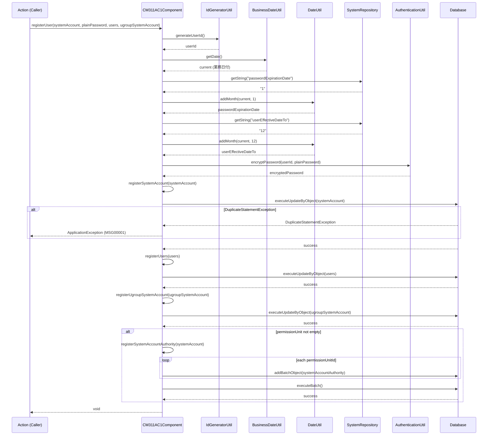

# Code Analysis: CM311AC1Component

**Generated**: 2026-07-01 13:26:49
**Target**: ユーザ管理機能 内共通コンポーネント（DB アクセス集約）
**Modules**: nablarch.sample.ss11AC
**Analysis Duration**: 不明(ベンチマークモード)

---

## Overview

`CM311AC1Component` は Nablarch サンプルアプリケーションのユーザ管理機能（SS11AC）において、複数のアクションクラスから共通的に使用される DB アクセス集約コンポーネントである。パッケージプライベートクラスとして定義されており、同一パッケージ内のアクションクラスのみがアクセス可能。

`DbAccessSupport` を継承することで Nablarch の JDBC ラッパー API（`getSqlPStatement`、`getParameterizedSqlStatement`）を直接利用し、以下 5 テーブルへの CRUD 操作を提供する：
- `SYSTEM_ACCOUNT`（システムアカウント）
- `USERS`（ユーザ）
- `UGROUP_SYSTEM_ACCOUNT`（グループシステムアカウント）
- `SYSTEM_ACCOUNT_AUTHORITY`（システムアカウント権限）
- `UGROUP`（グループ）、`PERMISSION_UNIT`（認可単位）の参照

---

## Architecture

### Dependency Graph

```mermaid
classDiagram
    class CM311AC1Component {
    }
    class DbAccessSupport {
        <<Nablarch>>
    }
    class SqlPStatement {
        <<Nablarch>>
    }
    class ParameterizedSqlPStatement {
        <<Nablarch>>
    }
    class SqlResultSet {
        <<Nablarch>>
    }
    class DuplicateStatementException {
        <<Nablarch>>
    }
    class ApplicationException {
        <<Nablarch>>
    }
    class MessageUtil {
        <<Nablarch>>
    }
    class BusinessDateUtil {
        <<Nablarch>>
    }
    class DateUtil {
        <<Nablarch>>
    }
    class SystemRepository {
        <<Nablarch>>
    }
    class SystemAccountEntity
    class UsersEntity
    class UgroupSystemAccountEntity
    class SystemAccountAuthorityEntity
    class AuthenticationUtil
    class IdGeneratorUtil

    CM311AC1Component --|> DbAccessSupport : extends
    CM311AC1Component ..> SqlPStatement : queries
    CM311AC1Component ..> ParameterizedSqlPStatement : persists
    CM311AC1Component ..> SqlResultSet : returns
    CM311AC1Component ..> DuplicateStatementException : handles
    CM311AC1Component ..> ApplicationException : throws
    CM311AC1Component ..> MessageUtil : creates message
    CM311AC1Component ..> BusinessDateUtil : gets business date
    CM311AC1Component ..> DateUtil : calculates expiry
    CM311AC1Component ..> SystemRepository : reads config
    CM311AC1Component ..> SystemAccountEntity : registers/queries
    CM311AC1Component ..> UsersEntity : registers/queries
    CM311AC1Component ..> UgroupSystemAccountEntity : registers/queries
    CM311AC1Component ..> SystemAccountAuthorityEntity : registers
    CM311AC1Component ..> AuthenticationUtil : encrypts password
    CM311AC1Component ..> IdGeneratorUtil : generates userId
```



**Note**: This diagram uses Mermaid `classDiagram` syntax to show class names and their relationships. Use `--|>` for inheritance (extends/implements) and `..>` for dependencies (uses/creates).

### Component Summary

| Component | Role | Type | Dependencies |
|-----------|------|------|--------------|
| CM311AC1Component | ユーザ管理機能 DB アクセス集約コンポーネント | Component (package-private) | DbAccessSupport, SystemAccountEntity, UsersEntity, UgroupSystemAccountEntity, SystemAccountAuthorityEntity, AuthenticationUtil, IdGeneratorUtil |
| DbAccessSupport | Nablarch DB アクセス基底クラス（SQL ステートメント取得を提供） | Nablarch Framework | SqlPStatement, ParameterizedSqlPStatement |
| SystemAccountEntity | システムアカウントテーブルのエンティティ | Entity | なし |
| UsersEntity | ユーザテーブルのエンティティ | Entity | なし |
| UgroupSystemAccountEntity | グループシステムアカウントテーブルのエンティティ | Entity | なし |
| SystemAccountAuthorityEntity | システムアカウント権限テーブルのエンティティ | Entity | なし |
| AuthenticationUtil | パスワード暗号化ユーティリティ | Utility | なし |
| IdGeneratorUtil | ユーザ ID 採番ユーティリティ | Utility | なし |

---

## Flow

### Processing Flow

**ユーザ登録フロー（`registerUser`）**:
1. `IdGeneratorUtil.generateUserId()` でユーザ ID を採番
2. `BusinessDateUtil.getDate()` で現在の業務日付を取得
3. `DateUtil.addMonth()` でパスワード有効期限（1 ヶ月後）とユーザ有効期限（12 ヶ月後）を算出
4. `SystemRepository.getString()` から設定値（`passwordExpirationDate`、`userEffectiveDateTo`）を取得
5. `AuthenticationUtil.encryptPassword()` でパスワードを暗号化
6. `registerSystemAccount()` → `registerUsers()` → `registerUgroupSystemAccount()` の順でテーブルに登録
7. 認可単位が設定されていれば `registerSystemAccountAuthority()` でバッチ登録
8. `registerSystemAccount()` 内で重複ログイン ID 検出時は `DuplicateStatementException` をキャッチして `ApplicationException` に変換

**ユーザ削除フロー（`deleteUser`）**:
`SYSTEM_ACCOUNT` → `USERS` → `UGROUP_SYSTEM_ACCOUNT` → `SYSTEM_ACCOUNT_AUTHORITY` の順で削除（同一 SQL ステートメントオブジェクトを再利用）

**照会フロー**:
`selectUserBasicInfo()`、`selectUsers()`、`selectSystemAccount()`、`selectPermissionUnit()`、`selectUgroup()` は全て SQL ID でステートメントを取得し `retrieve()` で結果を返す単純パターン。

**マスタ参照フロー**:
`getUserGroups()`、`getAllPermissionUnit()` はパラメータ不要で全件取得。`existGroupId()`、`existPermissionUnitId()` は取得結果が空かどうかで存在チェックを行う。

### Sequence Diagram



---

## Components

### CM311AC1Component

**ファイル**: [CM311AC1Component.java](../../.claude/skills/nabledge-1.4/knowledge/assets/web-application-07-insert/CM311AC1Component.java)

**役割**: ユーザ管理機能（SS11AC）における DB アクセスを集約するパッケージプライベートの共通コンポーネント。アクションクラスはこのコンポーネントに DB アクセスを委譲する。

**主要メソッド**:
- `registerUser(SystemAccountEntity, String, UsersEntity, UgroupSystemAccountEntity)` (L91-130): ユーザ登録の主処理。ID 採番・日付計算・パスワード暗号化・4 テーブルへの登録を一括実施
- `deleteUser(String userId)` (L256-272): ユーザ削除の主処理。4 テーブルからカスケード削除
- `registerSystemAccountAuthority(SystemAccountEntity)` (L171-183): 認可単位のバッチ INSERT
- `existGroupId(UgroupSystemAccountEntity)` (L61-67): グループ ID の存在確認
- `existPermissionUnitId(SystemAccountEntity)` (L76-84): 認可単位 ID の全件存在確認

**依存関係**: `DbAccessSupport`（Nablarch）、`BusinessDateUtil`（Nablarch）、`DateUtil`（Nablarch）、`SystemRepository`（Nablarch）、`AuthenticationUtil`、`IdGeneratorUtil`、各エンティティクラス

**実装上の注意点**:
- クラスはパッケージプライベート（`class` のみ、`public` なし）— 同一パッケージのアクションクラスからのみ利用可能
- `registerSystemAccount()` 内で `DuplicateStatementException` をキャッチして `ApplicationException` に変換（L136-140）— ログイン ID 重複エラーをビジネス例外として呼び出し元へ伝播
- `deleteUser()` では `getSqlPStatement()` を呼ぶたびに SQL ID を指定して `statement` を再取得しているため、1 つの `SqlPStatement` オブジェクトを複数用途で使い回していない（L259-270）
- `registerSystemAccountAuthority()` ではバッチ INSERT（`addBatchObject` → `executeBatch`）を使用しており、複数権限を一括登録（L178-182）

---

## Nablarch Framework Usage

### DbAccessSupport

**クラス**: `nablarch.core.db.support.DbAccessSupport`

**説明**: DB アクセス機能をサポートする基底クラス。`getSqlPStatement(sqlId)` と `getParameterizedSqlStatement(sqlId)` を提供し、`DbConnectionContext` からのコネクション取得を隠蔽する。

**使用方法**:
```java
// SQL ID を元にステートメントを取得（位置パラメータ版）
SqlPStatement statement = getSqlPStatement("SELECT_ALL_UGROUPS");
SqlResultSet result = statement.retrieve();

// Beanオブジェクト入力版ステートメントを取得
ParameterizedSqlPStatement statement = getParameterizedSqlStatement("INSERT_SYSTEM_ACCOUNT");
statement.executeUpdateByObject(systemAccount);
```

**重要ポイント**:
- ✅ **SQL は SQL ファイルで管理する**: SQL ID の `#` より前がクラスパス上の SQL ファイル名に対応。SQL をコードに埋め込まないこと
- 💡 **`DbAccessSupport` 継承で DB アクセスコードが簡潔になる**: `DbConnectionContext.getConnection()` を直接呼ぶ必要がなくなる
- ⚠️ **Nablarch 6 では UniversalDao の使用が推奨**: JDBC ラッパー直接利用より DAO パターンを優先すること

**このコードでの使い方**:
- クラス全体が `DbAccessSupport` を継承し、全 DB アクセスメソッドで `getSqlPStatement()` または `getParameterizedSqlStatement()` を使用

**詳細**: [データベースアクセス(JDBCラッパー)](../../.claude/skills/nabledge-6/docs/component/libraries/libraries-database.md)

---

### SqlPStatement / ParameterizedSqlPStatement

**クラス**: `nablarch.core.db.statement.SqlPStatement` / `nablarch.core.db.statement.ParameterizedSqlPStatement`

**説明**: `SqlPStatement` は位置パラメータ（`?` または `setString(index, value)`）を使う SQL ステートメント。`ParameterizedSqlPStatement` は Bean オブジェクトのプロパティを名前付きパラメータ（`:propertyName`）にバインドして実行する。

**使用方法**:
```java
// SqlPStatement: 位置パラメータで検索
SqlPStatement statement = getSqlPStatement("SELECT_USER_BASIC_INFO");
statement.setString(1, userId);
SqlResultSet result = statement.retrieve();

// ParameterizedSqlPStatement: Beanでバッチ INSERT
ParameterizedSqlPStatement stmt = getParameterizedSqlStatement("INSERT_SYSTEM_ACCOUNT_AUTHORITY");
stmt.addBatchObject(systemAccountAuthority);
stmt.executeBatch();
```

**重要ポイント**:
- ✅ **Bean 入力 SQL の IN パラメータは名前付きパラメータで記述する**: JDBC 標準の `?` では `executeUpdateByObject` が動作しない
- ⚠️ **`DuplicateStatementException` は一意制約違反時にスローされる**: `try-catch` でキャッチしてビジネス例外に変換すること（L136-140 の実装参照）
- 💡 **`addBatchObject` + `executeBatch` で複数レコードを効率的にバッチ INSERT できる**

**このコードでの使い方**:
- `SqlPStatement`: 検索（`retrieve()`）と削除（`execute()`）で使用（L41, L55, L63, L260-269 等）
- `ParameterizedSqlPStatement`: Bean を使った INSERT と バッチ INSERT で使用（L138, L151, L162, L175）

**詳細**: [データベースアクセス(JDBCラッパー)](../../.claude/skills/nabledge-6/docs/component/libraries/libraries-database.md)

---

### BusinessDateUtil / DateUtil

**クラス**: `nablarch.core.date.BusinessDateUtil` / `nablarch.common.date.DateUtil`

**説明**: `BusinessDateUtil` は業務日付（テーブル管理された論理的な「今日」）を取得する。`DateUtil` は日付の加算（`addMonth`）など日付操作ユーティリティを提供する。

**使用方法**:
```java
// 業務日付の取得
String current = BusinessDateUtil.getDate();

// 1ヶ月後を算出
String passwordExpirationDate = DateUtil.addMonth(current,
        Integer.parseInt(SystemRepository.getString("passwordExpirationDate")));
```

**重要ポイント**:
- ✅ **有効期限の月数は `SystemRepository` から取得**: `passwordExpirationDate`・`userEffectiveDateTo` をコードにハードコードせず設定ファイルで管理（L95-100）
- 💡 **`BusinessDateUtil.getDate()` は業務日付を返す**: システム日時（`new Date()`）ではなく、DB 管理のトランザクション基準日を使う点に注意

**このコードでの使い方**:
- `registerUser()` 内で業務日付を基準にパスワード有効期限（1 ヶ月後）とユーザ有効期限（12 ヶ月後）を算出（L94-100）

**詳細**: [日付管理](../../.claude/skills/nabledge-6/docs/component/libraries/libraries-date.md)

---

## References

### Source Files

- [CM311AC1Component.java (web-application-07-insert)](../../.claude/skills/nabledge-1.4/knowledge/assets/web-application-07-insert/CM311AC1Component.java)
- [CM311AC1Component.java (web-application-02-basic)](../../.claude/skills/nabledge-1.4/knowledge/assets/web-application-02-basic/CM311AC1Component.java)

### Knowledge Base

- [データベースアクセス(JDBCラッパー)](../../.claude/skills/nabledge-6/docs/component/libraries/libraries-database.md)
- [日付管理](../../.claude/skills/nabledge-6/docs/component/libraries/libraries-date.md)

### Official Documentation

- (なし — nabledge-6 知識ベースの official_doc_urls フィールドに URL なし)

---

**Output**: `.nabledge/20260701/code-analysis-CM311AC1Component.md`

**Note**: This documentation was generated by the code-analysis workflow of the nabledge-6 skill.