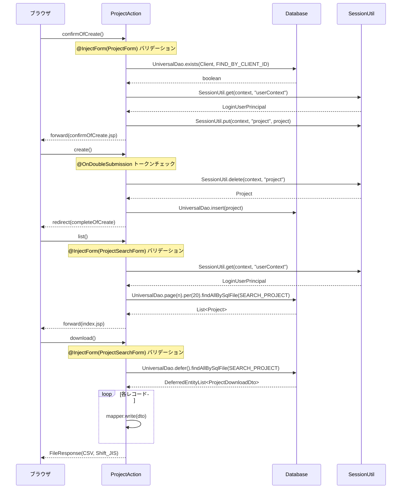

# Code Analysis: ProjectAction

**Generated**: 2026-07-01 14:15:00
**Target**: プロジェクトのCRUD・検索・CSVダウンロード処理を担うWebアクション
**Modules**: nablarch-example-web
**Analysis Duration**: 不明(ベンチマークモード)

---

## Overview

`ProjectAction`はNablarch Webアプリケーションフレームワーク上で動作するアクションクラスで、プロジェクトの**登録・参照・更新・削除・検索・CSVダウンロード**という全CRUDおよびリスト操作を一手に担う。

画面フローの要となる確認画面パターン（入力→確認→完了）を`SessionUtil`でプロジェクトエンティティを一時保存することにより実現している。`UniversalDao`でDBアクセスを行い、`@InjectForm`・`@OnError`・`@OnDoubleSubmission`の各Nablarchインターセプタで入力検証・エラー画面制御・二重サブミット防止を宣言的に設定している。CSVダウンロードでは`UniversalDao.defer()`による遅延ロードと`ObjectMapper`によるストリーミング書き出しを組み合わせ、大量データをメモリ効率よく処理する。

---

## Architecture

### Dependency Graph

```mermaid
classDiagram
    class ProjectAction
    class ProjectForm
    class ProjectSearchForm
    class ProjectUpdateForm
    class ProjectTargetForm
    class ProjectDto
    class ProjectSearchDto
    class ProjectDownloadDto
    class ProjectProfit
    class TempFileUtil
    class LoginUserPrincipal
    class Project
    class Client
    class UniversalDao {
        <<Nablarch>>
    }
    class SessionUtil {
        <<Nablarch>>
    }
    class BeanUtil {
        <<Nablarch>>
    }
    class ObjectMapperFactory {
        <<Nablarch>>
    }

    ProjectAction ..> ProjectForm : validates
    ProjectAction ..> ProjectSearchForm : validates
    ProjectAction ..> ProjectUpdateForm : validates
    ProjectAction ..> ProjectTargetForm : validates
    ProjectAction ..> Project : persists
    ProjectAction ..> Client : queries
    ProjectAction ..> ProjectDto : creates
    ProjectAction ..> ProjectSearchDto : creates
    ProjectAction ..> ProjectDownloadDto : serializes
    ProjectAction ..> ProjectProfit : creates
    ProjectAction ..> TempFileUtil : delegates to
    ProjectAction ..> LoginUserPrincipal : queries
    ProjectAction ..> UniversalDao : uses
    ProjectAction ..> SessionUtil : uses
    ProjectAction ..> BeanUtil : uses
    ProjectAction ..> ObjectMapperFactory : uses
```



**Note**: This diagram uses Mermaid `classDiagram` syntax to show class names and their relationships. Use `--|>` for inheritance (extends/implements) and `..>` for dependencies (uses/creates).

### Component Summary

| Component | Role | Type | Dependencies |
|-----------|------|------|--------------|
| ProjectAction | プロジェクトCRUD・検索・CSV出力の全操作を処理 | Action | ProjectForm, ProjectSearchForm, ProjectUpdateForm, ProjectTargetForm, Project, Client, UniversalDao, SessionUtil, BeanUtil, ObjectMapperFactory |
| ProjectForm | プロジェクト登録入力バリデーション | Form | DateRangeValidator |
| ProjectSearchForm | プロジェクト検索条件バリデーション | Form | SearchFormBase |
| ProjectUpdateForm | プロジェクト更新入力バリデーション | Form | なし |
| ProjectTargetForm | 対象プロジェクトID取得用フォーム | Form | なし |
| ProjectDto | プロジェクト参照・画面表示用DTO | DTO | なし |
| ProjectSearchDto | 検索条件保持DTO（ページング付き） | DTO | なし |
| ProjectDownloadDto | CSV出力用DTO（@Csvアノテーション想定） | DTO | なし |
| ProjectProfit | 売上・原価から利益指標を計算するValue Object | ValueObject | なし |
| TempFileUtil | 一時ファイル作成・OutputStream生成のユーティリティ | Utility | java.nio.file.Files |
| LoginUserPrincipal | ログインユーザ情報（ユーザID等）をセッションから提供 | Principal | なし |
| Project | プロジェクトEntityクラス（Jakarta Persistence） | Entity | なし |
| Client | 顧客EntityクラスDB存在確認用 | Entity | なし |

---

## Flow

### Processing Flow

**登録フロー（newEntity → confirmOfCreate → create → completeOfCreate）**:
1. `newEntity()` でセッション上の前回データを削除し、登録画面へフォワード
2. `confirmOfCreate()` で`@InjectForm`がProjectFormを生成・検証 → 顧客IDの存在確認（`UniversalDao.exists()`）→ ProjectエンティティをBeanUtilでコピー後セッションに保存 → `ProjectProfit`を計算してリクエストスコープにセット → 確認画面へ
3. `create()` で`@OnDoubleSubmission`がトークンチェック → セッションからProjectを取り出し`UniversalDao.insert()` → リダイレクト
4. `backToNew()` で入力画面に戻る際はセッションからProjectを再取得し、Client名を`UniversalDao.findById()`で補完

**検索フロー（index → list → download）**:
- `index()` は初期ソートキーをセットして`searchProject()`プライベートメソッドを呼び出す
- `searchProject()` はセッションからユーザIDを取得し`UniversalDao.page().per(20).findAllBySqlFile()`でページング検索
- `download()` では`UniversalDao.defer().findAllBySqlFile()`で遅延ロード → `ObjectMapperFactory`でCSVマッパーを生成 → ループで1件ずつ`mapper.write()` → `FileResponse`で返却

**更新フロー（edit → confirmOfUpdate → update → completeOfUpdate）**:
- `edit()` でDBから最新データを取得しセッションに保存
- `confirmOfUpdate()` で顧客ID存在確認 → セッション上のProjectに`BeanUtil.copy()`でフォーム値を上書き
- `update()` で`UniversalDao.update()` → リダイレクト

**削除フロー（show画面 → delete → completeOfDelete）**:
- `show()` でプロジェクト詳細取得・利益計算表示
- `delete()` で`@OnDoubleSubmission`後に`UniversalDao.delete()`

### Sequence Diagram



---

## Components

### ProjectAction

**ファイル**: [ProjectAction.java](../../nablarch-example-web/src/main/java/com/nablarch/example/app/web/action/ProjectAction.java)

**役割**: プロジェクトの全CRUD操作と検索・CSVダウンロードを処理するWebアクション

**主要メソッド**:
- `confirmOfCreate()` ([L66-92](../../nablarch-example-web/src/main/java/com/nablarch/example/app/web/action/ProjectAction.java#L66-92)): 登録確認。顧客ID存在確認、セッション保存、利益計算
- `searchProject()` ([L198-208](../../nablarch-example-web/src/main/java/com/nablarch/example/app/web/action/ProjectAction.java#L198-208)): ページング検索の共通ロジック。index()とlist()から呼び出される
- `download()` ([L219-243](../../nablarch-example-web/src/main/java/com/nablarch/example/app/web/action/ProjectAction.java#L219-243)): CSV遅延ロード＋ObjectMapperストリーミング書き出し

**依存コンポーネント**: ProjectForm, ProjectSearchForm, ProjectUpdateForm, ProjectTargetForm, Project, Client, UniversalDao, SessionUtil, BeanUtil, ObjectMapperFactory, TempFileUtil, LoginUserPrincipal, ProjectProfit

---

### ProjectForm

**ファイル**: [ProjectForm.java](../../nablarch-example-web/src/main/java/com/nablarch/example/app/web/form/ProjectForm.java)

**役割**: 登録画面の入力バリデーション。`@Domain`と`@Required`で検証ルールを宣言的に定義

**主要メソッド**:
- `isValidProjectPeriod()` ([L355-357](../../nablarch-example-web/src/main/java/com/nablarch/example/app/web/form/ProjectForm.java#L355-357)): `@AssertTrue`でプロジェクト開始日≤終了日を検証
- `hasClientId()` ([L141-143](../../nablarch-example-web/src/main/java/com/nablarch/example/app/web/form/ProjectForm.java#L141-143)): 顧客IDの有無チェック（存在確認の条件分岐に使用）

---

### ProjectProfit

**ファイル**: [ProjectProfit.java](../../nablarch-example-web/src/main/java/com/nablarch/example/app/web/action/ProjectProfit.java)

**役割**: 売上高・原価・販管費・本社配賦から売上総利益・営業利益・利益率を計算するValue Object

**主要メソッド**:
- `getGrossProfit()` ([L49-54](../../nablarch-example-web/src/main/java/com/nablarch/example/app/web/action/ProjectProfit.java#L49-54)): 売上総利益 = 売上高 - 売上原価
- `getOperatingProfit()` ([L95-100](../../nablarch-example-web/src/main/java/com/nablarch/example/app/web/action/ProjectProfit.java#L95-100)): 営業利益
- `getOperatingProfitRate()` ([L108-120](../../nablarch-example-web/src/main/java/com/nablarch/example/app/web/action/ProjectProfit.java#L108-120)): 営業利益率（BigDecimal、小数点以下3桁、切り捨て）

---

### TempFileUtil

**ファイル**: [TempFileUtil.java](../../nablarch-example-web/src/main/java/com/nablarch/example/app/web/common/file/TempFileUtil.java)

**役割**: CSVダウンロード用一時ファイルの作成・OutputStream生成をラップするユーティリティ

**主要メソッド**:
- `createTempFile()` ([L23-29](../../nablarch-example-web/src/main/java/com/nablarch/example/app/web/common/file/TempFileUtil.java#L23-29)): `Files.createTempFile()`をラップし、IOException をランタイム例外に変換
- `newOutputStream()` ([L37-43](../../nablarch-example-web/src/main/java/com/nablarch/example/app/web/common/file/TempFileUtil.java#L37-43)): `Files.newOutputStream()`をラップ

---

## Nablarch Framework Usage

### UniversalDao

**クラス**: `nablarch.common.dao.UniversalDao`

**説明**: Jakarta PersistenceアノテーションによるO/Rマッパー。SQL記述なしの単純CRUD＋SQLファイルによる任意検索を提供

**使用方法**:
```java
// 存在確認
UniversalDao.exists(Client.class, "FIND_BY_CLIENT_ID", new Object[]{id});
// ページング検索
UniversalDao.page(pageNo).per(20L).findAllBySqlFile(Project.class, "SEARCH_PROJECT", condition);
// 遅延ロード
try (DeferredEntityList<ProjectDownloadDto> list = (DeferredEntityList<ProjectDownloadDto>)
        UniversalDao.defer().findAllBySqlFile(ProjectDownloadDto.class, "SEARCH_PROJECT", condition)) { ... }
// CRUD
UniversalDao.insert(project);
UniversalDao.update(project);
UniversalDao.delete(project);
```

**重要ポイント**:
- ✅ **遅延ロードは必ずclose()**: `DeferredEntityList`はサーバサイドカーソルを使用するため、`try-with-resources`で確実にclose
- ⚠️ **主キー以外の条件更新は不可**: `update()`は主キー条件のみ。複雑な条件更新は`@Database`を使うこと
- 💡 **検索結果をDTOにマッピング可能**: EntityクラスだけでなくFormやDTOに直接マッピングできる。JOINの結果もDTOで受け取れる

**このコードでの使い方**:
- `confirmOfCreate()`でClient存在確認（`exists()`）
- `searchProject()`でページング検索（`page().per().findAllBySqlFile()`）
- `download()`で遅延ロードCSV出力（`defer().findAllBySqlFile()`）
- `create()`/`update()`/`delete()`でエンティティの登録・更新・削除

**詳細**: [ユニバーサルDAO](../../nablarch-document/ja/application_framework/application_framework/libraries/database/universal_dao.rst)

---

### SessionUtil

**クラス**: `nablarch.common.web.session.SessionUtil`

**説明**: NablarchセッションストアへのアクセスAPI。`put`/`get`/`delete`でセッション変数を操作する

**使用方法**:
```java
// 保存
SessionUtil.put(context, "project", project);
// 取得
Project project = SessionUtil.get(context, "project");
// 取得と同時に削除（確認画面→登録処理で使用）
Project project = SessionUtil.delete(context, "project");
```

**重要ポイント**:
- ✅ **保存オブジェクトはSerializable必須**: セッションストアに保存するJava BeansはSerializableを実装すること（ProjectFormが`implements Serializable`している理由）
- 💡 **delete()で原子的な取り出し**: `delete()`は取得と削除を一度に行い、登録/更新処理のトランザクション完了後にセッションが残らないようにする
- ⚠️ **ExecutionContextのセッションスコープAPIは非推奨**: `context.setSessionScopedVar()`ではなく`SessionUtil`を使うこと

**このコードでの使い方**:
- `confirmOfCreate()`でProjectをセッションに保存、`create()`で`delete()`で取り出しと同時削除
- 同様のパターンを`edit()`→`update()`、`confirmOfUpdate()`→`delete()`でも使用
- `"userContext"` キーでログインユーザ情報（LoginUserPrincipal）を全メソッドで参照

**詳細**: [セッションストア](../../nablarch-document/ja/application_framework/application_framework/libraries/session_store.rst)

---

### @InjectForm / @OnError

**クラス**: `nablarch.common.web.interceptor.InjectForm` / `nablarch.fw.web.interceptor.OnError`

**説明**: `@InjectForm`はリクエストパラメータの検証とFormオブジェクト生成をインターセプトで行う。`@OnError`はバリデーションエラー時の遷移先を宣言的に指定する

**使用方法**:
```java
@InjectForm(form = ProjectForm.class, prefix = "form")
@OnError(type = ApplicationException.class, path = "/WEB-INF/view/project/create.jsp")
public HttpResponse confirmOfCreate(HttpRequest request, ExecutionContext context) {
    ProjectForm form = context.getRequestScopedVar("form"); // 検証済みFormを取得
}
```

**重要ポイント**:
- ✅ **@OnErrorは必ずセットで設定**: `@InjectForm`のみではバリデーションエラーがシステムエラー扱いになる
- 💡 **prefix属性で名前空間を分離**: `prefix = "form"` のとき `form.projectName` パラメータが対象になる
- 🎯 **name属性でリクエストスコープキーを指定可能**: `list()`では`name = "searchForm"`を指定し、`"form"`ではなく`"searchForm"`で取得

**このコードでの使い方**:
- `confirmOfCreate()`: `ProjectForm.class`, `prefix = "form"` → エラー時`create.jsp`へ
- `list()`, `download()`: `ProjectSearchForm.class`, `prefix = "searchForm"`, `name = "searchForm"` → エラー時`index.jsp`へ
- `confirmOfUpdate()`: `ProjectUpdateForm.class`, `prefix = "form"` → エラー時`update.jsp`へ

**詳細**: [InjectFormインターセプタ](../../nablarch-document/ja/application_framework/application_framework/handlers/web_interceptor/InjectForm.rst)

---

### @OnDoubleSubmission

**クラス**: `nablarch.common.web.token.OnDoubleSubmission`

**説明**: トークンチェックによる二重サブミット防止インターセプタ。JSP側の`<n:form useToken="true">`と連携して動作する

**使用方法**:
```java
@OnDoubleSubmission
public HttpResponse create(HttpRequest request, ExecutionContext context) {
    // トークンが一致した場合のみ実行される
}
```

**重要ポイント**:
- ✅ **登録・更新・削除の実行メソッドに付与**: 確認画面表示メソッドではなく、DB更新を行うメソッドに付与する
- ⚠️ **path未指定時はコンポーネント定義のデフォルト値を使用**: アノテーションに`path`が未指定なら`BasicDoubleSubmissionHandler`のデフォルト設定が使われる（未設定だとシステムエラー）
- 🎯 **JSPのformタグとの連携が前提**: `<n:form useToken="true">`でトークンが埋め込まれ、`@OnDoubleSubmission`でチェックする

**このコードでの使い方**:
- `create()` (L101)、`update()` (L370)、`delete()` (L396) の3メソッドに付与

**詳細**: [OnDoubleSubmissionインターセプタ](../../nablarch-document/ja/application_framework/application_framework/handlers/web_interceptor/on_double_submission.rst)

---

### ObjectMapper / ObjectMapperFactory

**クラス**: `nablarch.common.databind.ObjectMapper` / `nablarch.common.databind.ObjectMapperFactory`

**説明**: CSVやTSV、固定長データをJava Beansとして書き込む機能。ダウンロードのストリーミング出力に使用

**使用方法**:
```java
try (ObjectMapper<ProjectDownloadDto> mapper = ObjectMapperFactory.create(
        ProjectDownloadDto.class, TempFileUtil.newOutputStream(path))) {
    for (ProjectDownloadDto dto : searchList) {
        mapper.write(dto);
    }
}
```

**重要ポイント**:
- ✅ **try-with-resourcesでclose()を保証**: バッファのフラッシュとリソース解放のため必須
- ⚠️ **スレッドアンセーフ**: 1リクエスト1インスタンスで使用すること
- 💡 **遅延ロードとの組み合わせ**: `DeferredEntityList`との組み合わせで全件をメモリに展開せずCSV出力できる

**このコードでの使い方**:
- `download()` (L230-235): `ProjectDownloadDto`用マッパーを生成、`DeferredEntityList`を1件ずつ`write()`

**詳細**: [データバインド](../../nablarch-document/ja/application_framework/application_framework/libraries/data_io/data_bind.rst)

---

## References

### Source Files

- [ProjectAction.java](../../nablarch-example-web/src/main/java/com/nablarch/example/app/web/action/ProjectAction.java)
- [ProjectForm.java](../../nablarch-example-web/src/main/java/com/nablarch/example/app/web/form/ProjectForm.java)
- [ProjectSearchForm.java](../../nablarch-example-web/src/main/java/com/nablarch/example/app/web/form/ProjectSearchForm.java)
- [ProjectProfit.java](../../nablarch-example-web/src/main/java/com/nablarch/example/app/web/action/ProjectProfit.java)
- [TempFileUtil.java](../../nablarch-example-web/src/main/java/com/nablarch/example/app/web/common/file/TempFileUtil.java)
- [LoginUserPrincipal.java](../../nablarch-example-web/src/main/java/com/nablarch/example/app/web/common/authentication/context/LoginUserPrincipal.java)

### Knowledge Base

- [ユニバーサルDAO](../../nablarch-document/ja/application_framework/application_framework/libraries/database/universal_dao.rst)
- [セッションストア](../../nablarch-document/ja/application_framework/application_framework/libraries/session_store.rst)
- [InjectFormインターセプタ](../../nablarch-document/ja/application_framework/application_framework/handlers/web_interceptor/InjectForm.rst)
- [OnDoubleSubmissionインターセプタ](../../nablarch-document/ja/application_framework/application_framework/handlers/web_interceptor/on_double_submission.rst)
- [データバインド](../../nablarch-document/ja/application_framework/application_framework/libraries/data_io/data_bind.rst)

### Official Documentation

- [ユニバーサルDAO](https://nablarch.github.io/docs/LATEST/doc/application_framework/application_framework/libraries/database/universal_dao.html)
- [セッションストア](https://nablarch.github.io/docs/LATEST/doc/application_framework/application_framework/libraries/session_store.html)
- [InjectFormインターセプタ](https://nablarch.github.io/docs/LATEST/doc/application_framework/application_framework/handlers/web_interceptor/InjectForm.html)
- [OnDoubleSubmissionインターセプタ](https://nablarch.github.io/docs/LATEST/doc/application_framework/application_framework/handlers/web_interceptor/on_double_submission.html)
- [データバインド](https://nablarch.github.io/docs/LATEST/doc/application_framework/application_framework/libraries/data_io/data_bind.html)

---

**Output**: `.nabledge/20260701/code-analysis-ProjectAction.md`

**Note**: This documentation was generated by the code-analysis workflow of the nabledge-6 skill.