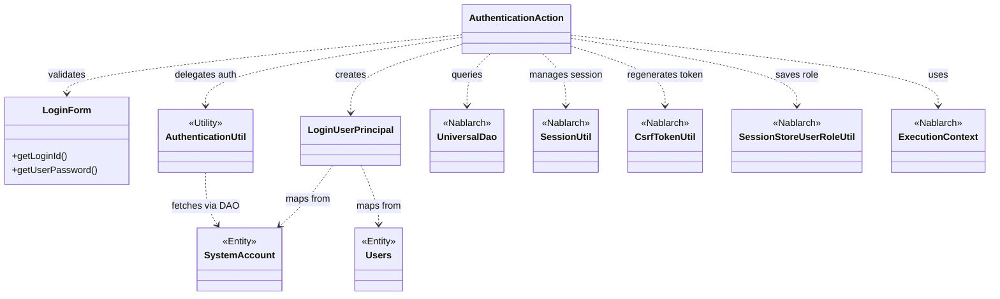
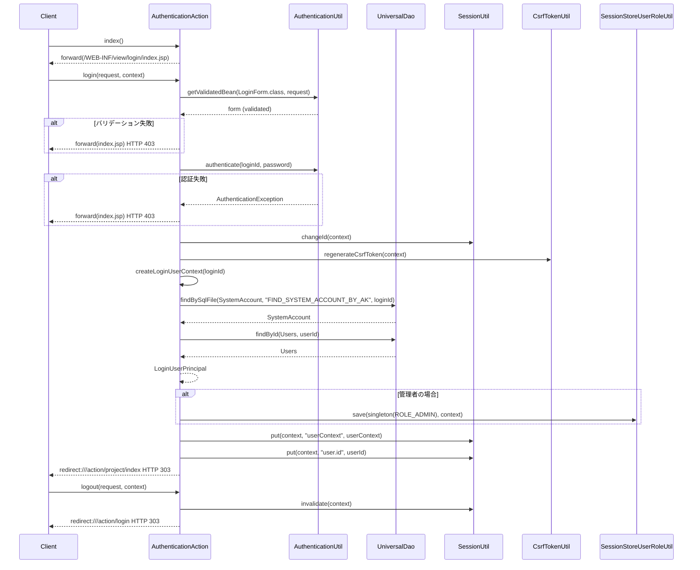

# Code Analysis: AuthenticationAction

**Generated**: 2026-07-03 (benchmark mode)
**Target**: ユーザー認証処理（ログイン・ログアウト）
**Modules**: nablarch-example-web
**Analysis Duration**: 不明(ベンチマークモード)

---

## Overview

`AuthenticationAction` は、Nablarch Web アプリケーションにおけるユーザー認証を担うアクションクラスです。ログイン画面の表示（`index`）、認証処理（`login`）、ログアウト処理（`logout`）の3メソッドで構成されます。

認証フローでは、`LoginForm` による入力バリデーション → `AuthenticationUtil` によるパスワード認証 → セッション ID 変更・CSRF トークン再生成 → `LoginUserPrincipal` セッション保存 → トップ画面リダイレクト の順で処理します。管理者ロールは `SessionStoreUserRoleUtil` によってセッションに保存されます。ログアウトは `SessionUtil.invalidate()` でセッションを破棄し、ログイン画面へリダイレクトします。

---

## Architecture

### Dependency Graph



**Note**: This diagram uses Mermaid `classDiagram` syntax to show class names and their relationships. Use `--|>` for inheritance (extends/implements) and `..>` for dependencies (uses/creates).

### Component Summary

| Component | Role | Type | Dependencies |
|-----------|------|------|--------------|
| AuthenticationAction | ログイン・ログアウト処理のアクションクラス | Action | LoginForm, AuthenticationUtil, LoginUserPrincipal, UniversalDao, SessionUtil, CsrfTokenUtil, SessionStoreUserRoleUtil |
| LoginForm | ログイン入力フォームのバリデーション | Form | なし |
| AuthenticationUtil | 認証・Bean バリデーション・パスワード暗号化のユーティリティ | Utility | BeanUtil, ValidatorUtil, SystemRepository |
| LoginUserPrincipal | ログインユーザー情報をセッションに保持するデータオブジェクト | Principal | なし |
| SystemAccount | システムアカウント情報のエンティティ | Entity | なし |
| Users | ユーザー情報のエンティティ | Entity | なし |

---

## Flow

### Processing Flow

**ログイン画面表示 (`index`)**: ログイン JSP をそのまま返す単純なメソッド（L42-44）。

**ログイン処理 (`login`)**: L54-87
1. `AuthenticationUtil.getValidatedBean()` で `LoginForm` を生成しバリデーション実行
2. バリデーション失敗時は `ApplicationException`（errors.login）を `@OnError` が JSP に転送（HTTP 403）
3. `AuthenticationUtil.authenticate()` でパスワード認証；失敗時は同じ errors.login メッセージ
4. 認証成功後、`SessionUtil.changeId()` でセッション固定化攻撃対策としてセッション ID を変更
5. `CsrfTokenUtil.regenerateCsrfToken()` で CSRF トークンを再生成
6. `createLoginUserContext()` で DB から `SystemAccount` と `Users` を取得して `LoginUserPrincipal` を生成
7. 管理者の場合は `SessionStoreUserRoleUtil.save()` でロールを保存
8. `SessionUtil.put()` でユーザーコンテキストとユーザー ID をセッションに格納
9. プロジェクト一覧画面（HTTP 303）へリダイレクト

**認証情報取得 (`createLoginUserContext`)**: L95-108（プライベートヘルパー）
- `UniversalDao.findBySqlFile()` で SQL ファイル `FIND_SYSTEM_ACCOUNT_BY_AK` を使用してログイン ID から `SystemAccount` を取得
- `UniversalDao.findById()` でユーザー ID から `Users` を取得
- `LoginUserPrincipal` に userId・kanjiName・adminFlag・lastLoginDateTime をセット

**ログアウト処理 (`logout`)**: L118-122
- `SessionUtil.invalidate()` でセッション破棄
- ログイン画面（HTTP 303）へリダイレクト

### Sequence Diagram



---

## Components

### AuthenticationAction

**ファイル**: [`nablarch-example-web/src/main/java/com/nablarch/example/app/web/action/AuthenticationAction.java`](../../nablarch-example-web/src/main/java/com/nablarch/example/app/web/action/AuthenticationAction.java)

**役割**: システム利用者のログイン・ログアウトを管理する認証アクション

**主要メソッド**:
- `index()` (L42-44): ログイン画面 JSP を返す
- `login()` (L54-87): バリデーション → 認証 → セッション管理 → リダイレクト
- `createLoginUserContext()` (L95-108): DB からユーザー情報を取得して `LoginUserPrincipal` を生成するプライベートヘルパー
- `logout()` (L118-122): セッション破棄してログイン画面へリダイレクト

**依存**: LoginForm, AuthenticationUtil, LoginUserPrincipal, UniversalDao, SessionUtil, CsrfTokenUtil, SessionStoreUserRoleUtil, ExecutionContext

**重要な実装ポイント**:
- `@OnError(type = ApplicationException.class, path = "...", statusCode = 403)` でバリデーションエラーと認証エラーを統一的に処理（L53）
- 認証成功後に `SessionUtil.changeId()` と `CsrfTokenUtil.regenerateCsrfToken()` を必ず呼び出してセキュリティ対策（L75-76）
- バリデーション例外は catch して汎用エラーメッセージ `errors.login` に変換（L60-62）—ユーザーへの情報漏洩防止

---

### LoginForm

**ファイル**: [`nablarch-example-web/src/main/java/com/nablarch/example/app/web/form/LoginForm.java`](../../nablarch-example-web/src/main/java/com/nablarch/example/app/web/form/LoginForm.java)

**役割**: ログイン入力値（loginId・userPassword）の保持とバリデーション宣言

**主要フィールド**:
- `loginId` (L23): `@Required` + `@Domain("loginId")` アノテーション
- `userPassword` (L28): `@Required` + `@Domain("password")` アノテーション

**重要な実装ポイント**:
- Bean Validation アノテーションで宣言的にバリデーションを定義。実際の検証は `AuthenticationUtil.getValidatedBean()` が `ValidatorUtil.validate()` を呼び出して実行する。

---

### AuthenticationUtil

**ファイル**: [`nablarch-example-web/src/main/java/com/nablarch/example/app/web/common/authentication/AuthenticationUtil.java`](../../nablarch-example-web/src/main/java/com/nablarch/example/app/web/common/authentication/AuthenticationUtil.java)

**役割**: 認証・バリデーション・パスワード暗号化の静的ユーティリティ

**主要メソッド**:
- `getValidatedBean()` (L77-81): `BeanUtil.createAndCopy()` でリクエストパラメータから Bean 生成 + `ValidatorUtil.validate()` で検証
- `authenticate()` (L64-68): `SystemRepository` から `PasswordAuthenticator` を取得して認証実行
- `encryptPassword()` (L46-48): `SystemRepository` から `PasswordEncryptor` を取得して暗号化

**重要な実装ポイント**:
- `SystemRepository.get()` でコンポーネントを取得する DI パターン。`passwordEncryptor` と `authenticator` というコンポーネント名は設定ファイルで定義する必要がある。

---

### LoginUserPrincipal

**ファイル**: [`nablarch-example-web/src/main/java/com/nablarch/example/app/web/common/authentication/context/LoginUserPrincipal.java`](../../nablarch-example-web/src/main/java/com/nablarch/example/app/web/common/authentication/context/LoginUserPrincipal.java)

**役割**: セッションに格納するログインユーザー情報の保持（Serializable）

**主要フィールド**: `userId`, `kanjiName`, `admin`, `lastLoginDateTime`
**定数**: `ROLE_ADMIN = "ADMIN"` (L15) — 管理者ロール名

**重要な実装ポイント**:
- `Serializable` を実装することでセッションストアへの保存・復元が可能。`serialVersionUID` の明示的定義（L18）が必須。

---

## Nablarch Framework Usage

### UniversalDao

**クラス**: `nablarch.common.dao.UniversalDao`

**説明**: SQL ファイルや主キーを使って Entity の CRUD 操作を行う汎用 DAO。Entity クラスとテーブルのマッピングはアノテーションで定義する。

**使用方法**:
```java
// SQLファイルを使った検索
SystemAccount account = UniversalDao.findBySqlFile(
    SystemAccount.class, "FIND_SYSTEM_ACCOUNT_BY_AK", new Object[]{loginId});

// 主キーによる検索
Users users = UniversalDao.findById(Users.class, account.getUserId());
```

**重要ポイント**:
- ✅ **SQLファイルを使った検索**: `findBySqlFile()` は `{EntityClass}_SQL_NAME.sql` という命名規則の SQL ファイルを実行する
- ⚠️ **結果0件の場合**: `findBySqlFile()` や `findById()` は結果が0件の場合に `NoDataException` をスロー（このコードでは認証失敗として `AuthenticationException` でラップされる）
- 💡 **型安全**: 返り値がジェネリクスで型指定できるため、キャスト不要で型安全

**このコードでの使い方**:
- `createLoginUserContext()` (L96-99) でログイン ID から `SystemAccount` を取得し、続けて `Users` を取得してユーザーコンテキストを構築する

**詳細**: [UniversalDao 知識ベース](../../.claude/skills/nabledge-6/docs/features/libraries/database/universal-dao.md)

---

### SessionUtil

**クラス**: `nablarch.common.web.session.SessionUtil`

**説明**: セッションへの値の格納・取得・削除・ID 変更・無効化を行うユーティリティ。

**使用方法**:
```java
// セッションID変更（ログイン後に必ず実行）
SessionUtil.changeId(context);

// セッションへの値格納
SessionUtil.put(context, "userContext", userContext);

// セッション破棄（ログアウト時）
SessionUtil.invalidate(context);
```

**重要ポイント**:
- ✅ **ログイン後は必ず `changeId()` を呼ぶ**: セッション固定化攻撃（Session Fixation）を防ぐためのセキュリティ必須処理（L75）
- ✅ **ログアウト時は `invalidate()` を呼ぶ**: セッション情報を完全に破棄して情報漏洩を防ぐ（L119）
- ⚠️ **`put()` の値は `Serializable` である必要がある**: セッションストアへの保存時にシリアライズされるため

**このコードでの使い方**:
- `login()` (L75): 認証成功直後に `changeId()` で ID を変更
- `login()` (L84-85): `userContext` と `user.id` をセッションに保存
- `logout()` (L119): `invalidate()` でセッションを完全破棄

**詳細**: [セッションストア知識ベース](../../.claude/skills/nabledge-6/docs/features/libraries/session-store.md)

---

### CsrfTokenUtil

**クラス**: `nablarch.common.web.csrf.CsrfTokenUtil`

**説明**: CSRF 攻撃対策のトークンを管理するユーティリティ。ログイン成功後にトークンを再生成することで、認証前に取得した CSRF トークンを無効化する。

**使用方法**:
```java
// ログイン成功後にCSRFトークンを再生成
CsrfTokenUtil.regenerateCsrfToken(context);
```

**重要ポイント**:
- ✅ **ログイン後に必ず `regenerateCsrfToken()` を呼ぶ**: 認証前に取得した古いトークンを使った CSRF 攻撃を防ぐ（L76）
- 💡 **SessionUtil.changeId() とセット**: セッション ID 変更と CSRF トークン再生成は認証成功後に必ずペアで実行する

**このコードでの使い方**:
- `login()` (L76): `SessionUtil.changeId()` の直後に呼び出す

**詳細**: [CSRF トークン検証ハンドラー知識ベース](../../.claude/skills/nabledge-6/docs/features/handlers/web/csrf-token-verification-handler.md)

---

### SessionStoreUserRoleUtil

**クラス**: `nablarch.common.authorization.role.session.SessionStoreUserRoleUtil`

**説明**: ロールベースアクセス制御（RBAC）のためのユーザーロールをセッションストアに保存・取得するユーティリティ。

**使用方法**:
```java
// 管理者ロールをセッションに保存
SessionStoreUserRoleUtil.save(
    Collections.singleton(LoginUserPrincipal.ROLE_ADMIN), context);
```

**重要ポイント**:
- 🎯 **管理者判定が必要な場合**: `isAdmin()` が true のユーザーのみロールを保存する（L80-82）
- ⚠️ **ロール名の定数管理**: `LoginUserPrincipal.ROLE_ADMIN = "ADMIN"` のように定数化して文字列リテラルの散在を防ぐ

**このコードでの使い方**:
- `login()` (L80-82): 管理者フラグが true の場合のみ `ROLE_ADMIN` を `Collections.singleton()` でセットとして保存

---

### ValidatorUtil / BeanUtil (AuthenticationUtil 経由)

**クラス**: `nablarch.core.validation.ee.ValidatorUtil`, `nablarch.core.beans.BeanUtil`

**説明**: `BeanUtil.createAndCopy()` でリクエストパラメータから Bean を生成し、`ValidatorUtil.validate()` で Bean Validation アノテーション（`@Required`, `@Domain`）を評価する。

**使用方法**:
```java
T bean = BeanUtil.createAndCopy(beanClass, request.getParamMap());
ValidatorUtil.validate(bean);  // バリデーション失敗時は ApplicationException をスロー
```

**重要ポイント**:
- ⚠️ **`ApplicationException` をそのまま再スローしない**: このコードでは意図的にキャッチして汎用エラーメッセージに変換（L60-63）。バリデーションエラーの詳細をユーザーに見せないことでセキュリティ向上
- 💡 **宣言的バリデーション**: `@Required`, `@Domain` アノテーションを Form クラスに付けるだけで入力検証が完結

---

## References

### Source Files

- [`AuthenticationAction.java`](../../nablarch-example-web/src/main/java/com/nablarch/example/app/web/action/AuthenticationAction.java) — メインのアクションクラス
- [`LoginForm.java`](../../nablarch-example-web/src/main/java/com/nablarch/example/app/web/form/LoginForm.java) — ログイン入力フォーム
- [`AuthenticationUtil.java`](../../nablarch-example-web/src/main/java/com/nablarch/example/app/web/common/authentication/AuthenticationUtil.java) — 認証ユーティリティ
- [`LoginUserPrincipal.java`](../../nablarch-example-web/src/main/java/com/nablarch/example/app/web/common/authentication/context/LoginUserPrincipal.java) — ログインユーザー情報

### Knowledge Base

- [UniversalDao](../../.claude/skills/nabledge-6/docs/features/libraries/database/universal-dao.md) — DB 検索の詳細
- [セッションストア](../../.claude/skills/nabledge-6/docs/features/libraries/session-store.md) — セッション管理の詳細
- [Bean Validation](../../.claude/skills/nabledge-6/docs/features/libraries/validation/bean-validation.md) — バリデーションの詳細

### Official Documentation

- [Nablarch Web アプリケーション](https://nablarch.github.io/docs/LATEST/doc/application_framework/application_framework/web/index.html)
- [UniversalDao](https://nablarch.github.io/docs/LATEST/doc/application_framework/application_framework/libraries/database/universal_dao.html)
- [セッションストア](https://nablarch.github.io/docs/LATEST/doc/application_framework/application_framework/libraries/session_store.html)
- [CSRF トークン検証](https://nablarch.github.io/docs/LATEST/doc/application_framework/application_framework/handlers/web/csrf_token_verification_handler.html)

---

**Output**: `.nabledge/20260703/code-analysis-AuthenticationAction.md`

**Note**: This documentation was generated by the code-analysis workflow of the nabledge-6 skill.