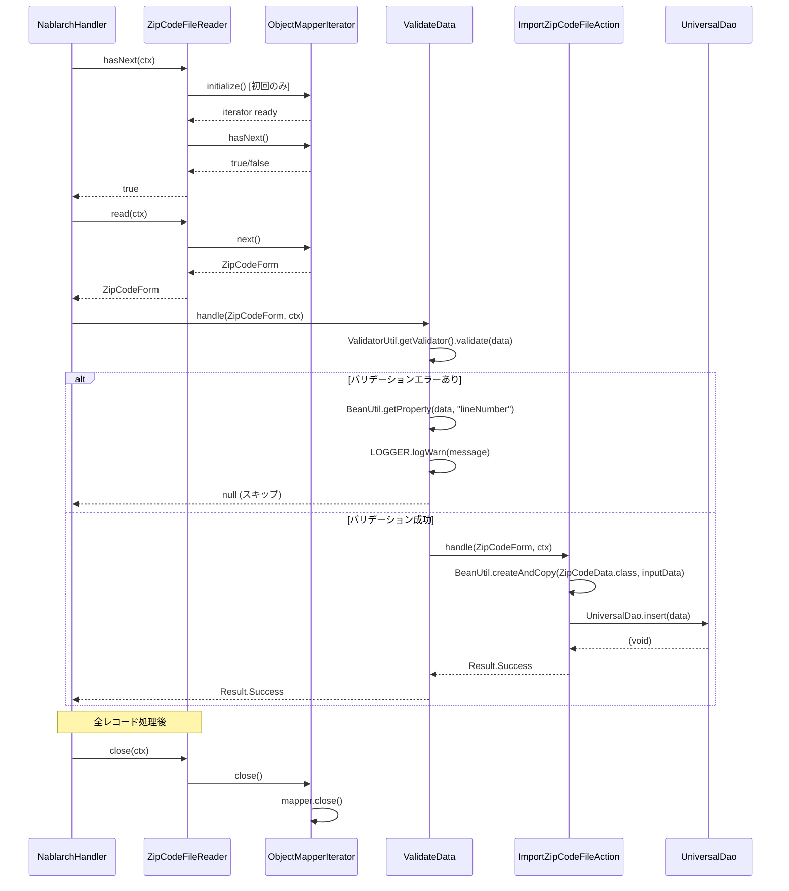

# Code Analysis: ImportZipCodeFileAction

**Generated**: 2026-07-03 (benchmark mode)
**Target**: 郵便番号CSVファイルをDBに一括登録するNablarchバッチアクション
**Modules**: nablarch-example-batch
**Analysis Duration**: 不明(ベンチマークモード)

---

## Overview

`ImportZipCodeFileAction` は、郵便番号CSVファイルを読み込み、1レコードずつDBに登録するNablarchバッチアクションクラスである。`BatchAction<ZipCodeForm>` を継承し、データリーダ `ZipCodeFileReader` が提供する `ZipCodeForm` レコードを受け取って `ZipCodeData` エンティティに変換後、`UniversalDao.insert()` でINSERT処理を行う。バリデーションは `@ValidateData` インターセプタが担当し、エラー行はWARNログに記録されてスキップされる。

アーキテクチャは「ハンドラキュー → DataReader → Interceptor → BatchAction」という標準的なNablarchバッチ処理パターンに従っており、業務ロジックはアクションクラスの `handle()` メソッドに集約されている。

---

## Architecture

### Dependency Graph

```mermaid
classDiagram
    class ImportZipCodeFileAction {
        <<Action>>
    }
    class BatchAction {
        <<Nablarch>>
    }
    class ZipCodeForm {
        <<Form>>
    }
    class ZipCodeData {
        <<Entity>>
    }
    class ZipCodeFileReader {
        <<Reader>>
    }
    class ObjectMapperIterator {
        <<Iterator>>
    }
    class UniversalDao {
        <<Nablarch>>
    }
    class BeanUtil {
        <<Nablarch>>
    }
    class FilePathSetting {
        <<Nablarch>>
    }
    class ObjectMapperFactory {
        <<Nablarch>>
    }
    class ValidateData {
        <<Interceptor>>
    }
    class ExecutionContext {
        <<Nablarch>>
    }
    class DataReader {
        <<Nablarch>>
    }

    BatchAction <|-- ImportZipCodeFileAction : extends
    DataReader <|.. ZipCodeFileReader : implements
    ImportZipCodeFileAction ..> ZipCodeForm : handles
    ImportZipCodeFileAction ..> ZipCodeData : inserts
    ImportZipCodeFileAction ..> UniversalDao : persists
    ImportZipCodeFileAction ..> BeanUtil : converts
    ImportZipCodeFileAction ..> ZipCodeFileReader : creates
    ImportZipCodeFileAction ..> ValidateData : intercepted by
    ZipCodeFileReader ..> ObjectMapperIterator : delegates
    ZipCodeFileReader ..> FilePathSetting : resolves path
    ZipCodeFileReader ..> ObjectMapperFactory : creates mapper
    ObjectMapperIterator ..> ZipCodeForm : iterates
    ImportZipCodeFileAction ..> ExecutionContext : uses
```



**Note**: This diagram uses Mermaid `classDiagram` syntax to show class names and their relationships. Use `--|>` for inheritance (extends/implements) and `..>` for dependencies (uses/creates).

### Component Summary

| Component | Role | Type | Dependencies |
|-----------|------|------|--------------|
| ImportZipCodeFileAction | 郵便番号CSV一括登録バッチアクション | Action | ZipCodeForm, ZipCodeData, UniversalDao, BeanUtil, ZipCodeFileReader |
| ZipCodeForm | CSVレコードのバインド先・バリデーション対象フォーム | Form | なし (アノテーションのみ) |
| ZipCodeFileReader | 郵便番号CSVファイルのデータリーダ | DataReader | ObjectMapperIterator, FilePathSetting, ObjectMapperFactory |
| ObjectMapperIterator | ObjectMapperをIteratorインタフェースでラップ | Iterator | ObjectMapper |
| ValidateData | handle()実行前にBean Validationを実施するインターセプタ | Interceptor | ValidatorUtil, BeanUtil, LoggerManager |
| ZipCodeData | 郵便番号テーブルのエンティティ | Entity | なし |

---

## Flow

### Processing Flow

**メインフロー**:
1. Nablarchバッチフレームワークのハンドラキューがループしながら `ZipCodeFileReader.read()` を呼び出す
2. `ZipCodeFileReader` は初回呼び出し時に `initialize()` を実行し、`FilePathSetting` から論理名 `"csv-input"` / ファイル名 `"importZipCode"` でCSVファイルを解決し、`ObjectMapperFactory.create()` でマッパを生成、`ObjectMapperIterator` を構築する
3. `iterator.next()` が1レコード分の `ZipCodeForm` を返す
4. `@ValidateData` インターセプタが `ValidateData.ValidateDataImpl.handle()` をインターセプトし、`ValidatorUtil.getValidator()` でBean Validationを実行する
5. バリデーションエラーがある場合は `lineNumber` プロパティを読み取り、WARNログを出力して `null` を返す（スキップ）
6. バリデーション成功時は `ImportZipCodeFileAction.handle()` が呼ばれる
7. `BeanUtil.createAndCopy()` で `ZipCodeForm` → `ZipCodeData` へプロパティをコピー
8. `UniversalDao.insert(data)` でINSERT実行
9. `Result.Success` を返却し、次レコードへ進む
10. 全レコード処理後、`ZipCodeFileReader.close()` で `ObjectMapperIterator.close()` → `mapper.close()` によりリソース解放

**エラーフロー**:
- バリデーションエラー行: ログ出力後にスキップ（バッチは継続）
- ファイル未存在: `ZipCodeFileReader.initialize()` で `FileNotFoundException` → `IllegalStateException` に変換してスロー（バッチ異常終了）

### Sequence Diagram



---

## Components

### ImportZipCodeFileAction

**ファイル**: [`nablarch-example-batch/src/main/java/com/nablarch/example/app/batch/action/ImportZipCodeFileAction.java`](../../nablarch-example-batch/src/main/java/com/nablarch/example/app/batch/action/ImportZipCodeFileAction.java)

**役割**: 郵便番号CSVファイルをDBに一括登録するバッチアクション。BatchActionを継承し、handleメソッドでレコードごとのDB登録処理を担当する。

**主要メソッド**:
- `handle(ZipCodeForm inputData, ExecutionContext ctx)` ([L35-41](../../nablarch-example-batch/src/main/java/com/nablarch/example/app/batch/action/ImportZipCodeFileAction.java#L35-L41)): `BeanUtil.createAndCopy()` でFormをEntityに変換し、`UniversalDao.insert()` でDB登録。`@ValidateData` アノテーションによりバリデーション済みデータのみ受け取る
- `createReader(ExecutionContext ctx)` ([L50-52](../../nablarch-example-batch/src/main/java/com/nablarch/example/app/batch/action/ImportZipCodeFileAction.java#L50-L52)): `ZipCodeFileReader` インスタンスを生成して返す

**依存関係**: ZipCodeForm, ZipCodeData, UniversalDao, BeanUtil, ZipCodeFileReader, ExecutionContext

---

### ZipCodeForm

**ファイル**: [`nablarch-example-batch/src/main/java/com/nablarch/example/app/batch/form/ZipCodeForm.java`](../../nablarch-example-batch/src/main/java/com/nablarch/example/app/batch/form/ZipCodeForm.java)

**役割**: CSVレコードのバインド先フォームクラス。`@Csv`・`@CsvFormat` でCSVフォーマットを定義し、`@Domain`・`@Required` でバリデーションルールを宣言する。全15フィールドがString型で定義されており、行番号(`lineNumber`)は `@LineNumber` アノテーションで自動設定される。

**主要フィールド**:
- 15プロパティ: `localGovernmentCode`, `zipCode5digit`, `zipCode7digit`, `prefectureKana`, `cityKana`, `addressKana`, `prefectureKanji`, `cityKanji`, `addressKanji`, `multipleZipCodes`, `numberedEveryKoaza`, `addressWithChome`, `multipleAddress`, `updateData`, `updateDataReason`
- `lineNumber` ([L135](../../nablarch-example-batch/src/main/java/com/nablarch/example/app/batch/form/ZipCodeForm.java#L135)): `@LineNumber` でObjectMapperが行番号を自動設定

**依存関係**: Nablarch databind アノテーション (`@Csv`, `@CsvFormat`, `@LineNumber`), Bean Validation アノテーション (`@Domain`, `@Required`)

---

### ZipCodeFileReader

**ファイル**: [`nablarch-example-batch/src/main/java/com/nablarch/example/app/batch/reader/ZipCodeFileReader.java`](../../nablarch-example-batch/src/main/java/com/nablarch/example/app/batch/reader/ZipCodeFileReader.java)

**役割**: `DataReader<ZipCodeForm>` を実装し、CSVファイルを1レコードずつ提供するリーダ。遅延初期化パターンを採用し、初回の `read()` または `hasNext()` 呼び出し時に `initialize()` を実行する。

**主要メソッド**:
- `read(ExecutionContext ctx)` ([L40-45](../../nablarch-example-batch/src/main/java/com/nablarch/example/app/batch/reader/ZipCodeFileReader.java#L40-L45)): iteratorがnullなら `initialize()` を呼び、`iterator.next()` で次レコードを返す
- `hasNext(ExecutionContext ctx)` ([L54-59](../../nablarch-example-batch/src/main/java/com/nablarch/example/app/batch/reader/ZipCodeFileReader.java#L54-L59)): iteratorがnullなら `initialize()` を呼び、`iterator.hasNext()` を返す
- `close(ExecutionContext ctx)` ([L68-70](../../nablarch-example-batch/src/main/java/com/nablarch/example/app/batch/reader/ZipCodeFileReader.java#L68-L70)): `iterator.close()` でリソース解放
- `initialize()` ([L78-89](../../nablarch-example-batch/src/main/java/com/nablarch/example/app/batch/reader/ZipCodeFileReader.java#L78-L89)): `FilePathSetting.getInstance()` で論理名 `"csv-input"` を解決し、`ObjectMapperFactory.create()` でマッパを生成

**依存関係**: ObjectMapperIterator, FilePathSetting, ObjectMapperFactory

---

### ObjectMapperIterator

**ファイル**: [`nablarch-example-batch/src/main/java/com/nablarch/example/app/batch/reader/iterator/ObjectMapperIterator.java`](../../nablarch-example-batch/src/main/java/com/nablarch/example/app/batch/reader/iterator/ObjectMapperIterator.java)

**役割**: `ObjectMapper<E>` を `Iterator<E>` としてラップするアダプタクラス。コンストラクタで初回データを先読みし、`hasNext()` は `form != null` で判定する。

**主要メソッド**:
- コンストラクタ ([L32-37](../../nablarch-example-batch/src/main/java/com/nablarch/example/app/batch/reader/iterator/ObjectMapperIterator.java#L32-L37)): `mapper.read()` で初回データを先読み
- `hasNext()` ([L45-47](../../nablarch-example-batch/src/main/java/com/nablarch/example/app/batch/reader/iterator/ObjectMapperIterator.java#L45-L47)): `form != null` で次レコードの有無を判定
- `next()` ([L56-60](../../nablarch-example-batch/src/main/java/com/nablarch/example/app/batch/reader/iterator/ObjectMapperIterator.java#L56-L60)): 現在のformを返しつつ次データを先読み
- `close()` ([L66-68](../../nablarch-example-batch/src/main/java/com/nablarch/example/app/batch/reader/iterator/ObjectMapperIterator.java#L66-L68)): `mapper.close()` でリソース解放

**依存関係**: ObjectMapper (nablarch.common.databind)

---

### ValidateData (インターセプタ)

**ファイル**: [`nablarch-example-batch/src/main/java/com/nablarch/example/app/batch/interceptor/ValidateData.java`](../../nablarch-example-batch/src/main/java/com/nablarch/example/app/batch/interceptor/ValidateData.java)

**役割**: `@ValidateData` アノテーションが付与されたメソッドをインターセプトし、引数オブジェクトにBean Validationを実行する。バリデーションエラー時はWARNログを出力してnullを返し（処理スキップ）、成功時は元のハンドラを呼び出す。

**主要メソッド**:
- `ValidateDataImpl.handle(Object data, ExecutionContext context)` ([L60-92](../../nablarch-example-batch/src/main/java/com/nablarch/example/app/batch/interceptor/ValidateData.java#L60-L92)): バリデーション実行、エラー時はlineNumberを取得してWARNログ出力後にnullを返す

**依存関係**: ValidatorUtil, BeanUtil, LoggerManager, MessageUtil

---

## Nablarch Framework Usage

### BatchAction

**クラス**: `nablarch.fw.action.BatchAction<TData>`

**説明**: Nablarchバッチアプリケーションの業務ロジックを実装する基底クラス。`DataReader` から提供されるデータを1件ずつ処理する `handle()` と、`DataReader` を生成する `createReader()` を実装する。

**使用方法**:
```java
public class ImportZipCodeFileAction extends BatchAction<ZipCodeForm> {

    @Override
    public Result handle(ZipCodeForm inputData, ExecutionContext ctx) {
        // 業務ロジック
        return new Result.Success();
    }

    @Override
    public DataReader<ZipCodeForm> createReader(ExecutionContext ctx) {
        return new ZipCodeFileReader();
    }
}
```

**重要ポイント**:
- ✅ **`createReader()` をオーバーライドする**: DataReaderの生成責務はアクションクラスが持つ。フレームワークは `createReader()` を1回だけ呼び出す
- ⚠️ **`handle()` の戻り値が重要**: `Result.Success` 以外 (`null` など) を返すと、そのレコードのコミットが行われない場合がある。バリデーション後にnullを返す `@ValidateData` の動作と合わせて理解が必要
- 💡 **型パラメータがフォームクラスを決定**: `BatchAction<ZipCodeForm>` とすることで、DataReaderから提供されるデータ型が型安全になる

**このコードでの使い方**:
- `ImportZipCodeFileAction` が `BatchAction<ZipCodeForm>` を継承
- `handle()` でZipCodeFormを受け取り、ZipCodeDataに変換してDB登録
- `createReader()` で `ZipCodeFileReader` インスタンスを返す

---

### UniversalDao

**クラス**: `nablarch.common.dao.UniversalDao`

**説明**: Jakarta PersistenceアノテーションをEntityに付けるだけでSQLを書かずに単純なCRUDが実現できる、簡易O/Rマッパー。内部では `nablarch.fw.database` を使用する。

**使用方法**:
```java
// INSERT
ZipCodeData data = BeanUtil.createAndCopy(ZipCodeData.class, inputData);
UniversalDao.insert(data);

// SELECT (主キー検索)
ZipCodeData found = UniversalDao.findById(ZipCodeData.class, id);
```

**重要ポイント**:
- ✅ **EntityにJakarta PersistenceアノテーションをつけてDB設定だけでINSERT可能**: SQLファイルが不要
- ⚠️ **主キー以外の条件を指定した更新・削除はできない**: その場合は `nablarch.fw.database` を直接使う
- ⚠️ **共通項目(登録ユーザ等)の自動設定はない**: 挿入前にアプリケーション側で明示的に設定する必要がある
- 💡 **`findAllBySqlFile()` でSQLファイルと組み合わせた検索も可能**: 複雑な検索はSQLファイルを使う

**このコードでの使い方**:
- `handle()` の L38 で `UniversalDao.insert(data)` を呼び出し、ZipCodeDataを直接INSERTする

---

### ObjectMapper / ObjectMapperFactory (データバインド)

**クラス**: `nablarch.common.databind.ObjectMapper`, `nablarch.common.databind.ObjectMapperFactory`

**説明**: CSV/TSV/固定長データをJava BeansオブジェクトとしてRead/Writeする機能を提供する。`ObjectMapperFactory.create()` でマッパを生成し、`read()` で1レコードずつ読み込む。

**使用方法**:
```java
// 読み込み
ObjectMapper<ZipCodeForm> mapper = ObjectMapperFactory.create(
    ZipCodeForm.class, new FileInputStream(zipCodeFile));
ZipCodeForm form = mapper.read(); // null で終端
mapper.close();
```

**重要ポイント**:
- ✅ **必ず `close()` を呼ぶ**: バッファをフラッシュしリソースを解放する。`ZipCodeFileReader.close()` → `iterator.close()` → `mapper.close()` の連鎖で解放
- ✅ **フォームの全プロパティをString型で定義**: 外部ファイルの不正データでも型変換例外を防ぎ、業務エラーとして処理できる
- ⚠️ **`read()` がnullを返したら終端**: `ObjectMapperIterator` は `form != null` でこれを判定している
- 💡 **`@Csv`・`@CsvFormat` アノテーションでフォーマットを宣言的に定義**: `ZipCodeForm` では `CsvType.CUSTOM` + `@CsvFormat` で詳細なCSV設定を実現
- 💡 **`@LineNumber` で行番号の自動設定**: エラーログに行番号を出力するために `ZipCodeForm.lineNumber` に使用

**このコードでの使い方**:
- `ZipCodeFileReader.initialize()` (L84) で `ObjectMapperFactory.create(ZipCodeForm.class, stream)` を呼び出す
- `ObjectMapperIterator` がラップし、`next()` 内で `mapper.read()` を都度呼び出す
- `close()` は `ZipCodeFileReader.close()` から委譲される

---

### FilePathSetting

**クラス**: `nablarch.core.util.FilePathSetting`

**説明**: システムで使用するファイルの入出力先ディレクトリや拡張子を論理名で管理する。コンポーネント設定ファイルに `filePathSetting` という名前で定義し、`getInstance()` でシングルトン取得する。

**使用方法**:
```java
FilePathSetting filePathSetting = FilePathSetting.getInstance();
File zipCodeFile = filePathSetting.getFileWithoutCreate("csv-input", "importZipCode");
```

**重要ポイント**:
- ✅ **コンポーネント名を `filePathSetting` にする**: フレームワークがこの名前でDIコンテナから取得する
- 💡 **論理名でパスを管理**: 環境差異をコンポーネント設定で吸収し、コードにパスをハードコードしない
- 🎯 **`getFileWithoutCreate()` はファイルが存在しなくてもFileオブジェクトを返す**: バッチでは入力ファイルが存在するかどうかの確認を別途行う必要がある

**このコードでの使い方**:
- `ZipCodeFileReader.initialize()` (L79-80) で `FilePathSetting.getInstance()` を呼び出し、論理名 `"csv-input"`・ファイル名 `"importZipCode"` でCSVファイルのパスを解決する

---

### BeanUtil

**クラス**: `nablarch.core.beans.BeanUtil`

**説明**: Java Beansに対するプロパティの取得・設定・Bean間のコピーを提供するユーティリティクラス。`createAndCopy()` は新しいインスタンスを生成しながら同名プロパティを一括コピーする。

**使用方法**:
```java
// Formからエンティティへコピー
ZipCodeData data = BeanUtil.createAndCopy(ZipCodeData.class, inputData);

// プロパティ値の取得（ValidateData内で使用）
Long lineNumber = (Long) BeanUtil.getProperty(data, "lineNumber");
```

**重要ポイント**:
- ✅ **`createAndCopy()` はプロパティ名が一致するフィールドを自動コピー**: FormとEntityのプロパティ名を揃えることで手動のセッタ呼び出しが不要
- ⚠️ **`getProperty()` で存在しないプロパティを取得すると `BeansException`**: `ValidateData` では `lineNumber` プロパティが存在しないBeanへの対応として catch して NOP している

**このコードでの使い方**:
- `ImportZipCodeFileAction.handle()` (L37) で `BeanUtil.createAndCopy(ZipCodeData.class, inputData)` を呼び出し、ZipCodeFormの全プロパティをZipCodeDataにコピー
- `ValidateData.ValidateDataImpl.handle()` (L75) で `BeanUtil.getProperty(data, "lineNumber")` を呼び出し、ログ用の行番号を取得

---

## References

### Source Files

- [`ImportZipCodeFileAction.java`](../../nablarch-example-batch/src/main/java/com/nablarch/example/app/batch/action/ImportZipCodeFileAction.java) — メインのバッチアクション
- [`ZipCodeForm.java`](../../nablarch-example-batch/src/main/java/com/nablarch/example/app/batch/form/ZipCodeForm.java) — CSVバインド・バリデーション用フォーム
- [`ZipCodeFileReader.java`](../../nablarch-example-batch/src/main/java/com/nablarch/example/app/batch/reader/ZipCodeFileReader.java) — CSVファイル読み込みリーダ
- [`ObjectMapperIterator.java`](../../nablarch-example-batch/src/main/java/com/nablarch/example/app/batch/reader/iterator/ObjectMapperIterator.java) — ObjectMapperのIteratorアダプタ
- [`ValidateData.java`](../../nablarch-example-batch/src/main/java/com/nablarch/example/app/batch/interceptor/ValidateData.java) — Bean Validationインターセプタ

### Knowledge Base

- [ユニバーサルDAO](../../nablarch-document/ja/application_framework/application_framework/libraries/database/universal_dao.rst) — UniversalDaoの詳細仕様
- [データバインド](../../nablarch-document/ja/application_framework/application_framework/libraries/data_io/data_bind.rst) — ObjectMapper/CsvFormatの詳細
- [Nablarchバッチアーキテクチャ](../../nablarch-document/ja/application_framework/application_framework/batch/nablarch_batch/architecture.rst) — BatchActionとハンドラキューの構成
- [BeanUtil](../../nablarch-document/ja/application_framework/application_framework/libraries/bean_util.rst) — BeanUtil APIの詳細
- [ファイルパス管理](../../nablarch-document/ja/application_framework/application_framework/libraries/file_path_management.rst) — FilePathSettingの設定方法

### Official Documentation

- [Nablarchバッチ処理](https://nablarch.github.io/docs/LATEST/doc/application_framework/application_framework/batch/index.html)
- [ユニバーサルDAO](https://nablarch.github.io/docs/LATEST/doc/application_framework/application_framework/libraries/database/universal_dao.html)
- [データバインド](https://nablarch.github.io/docs/LATEST/doc/application_framework/application_framework/libraries/data_io/data_bind.html)
- [ファイルパス管理](https://nablarch.github.io/docs/LATEST/doc/application_framework/application_framework/libraries/file_path_management.html)

---

**Output**: `.nabledge/20260703/code-analysis-ImportZipCodeFileAction.md`

**Note**: This documentation was generated by the code-analysis workflow of the nabledge-6 skill.