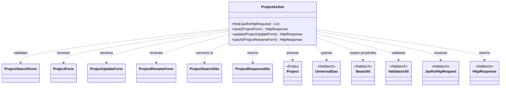
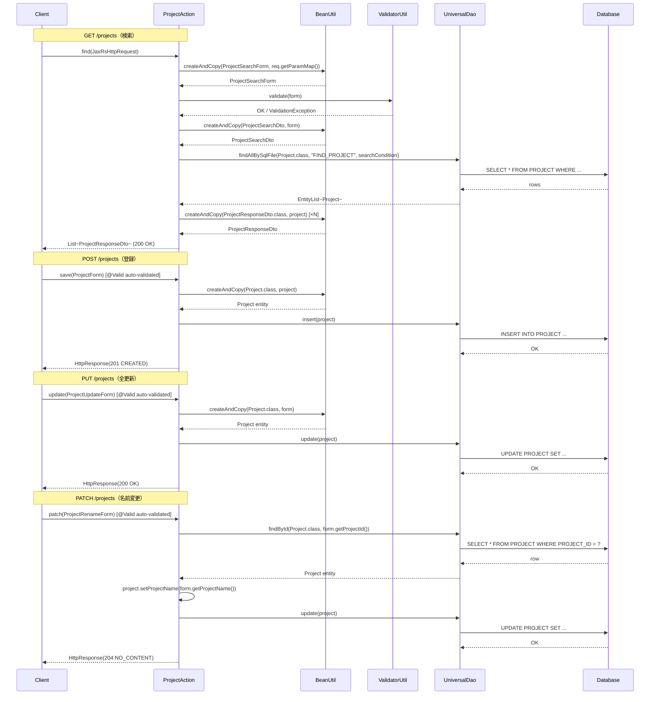

# Code Analysis: ProjectAction

**Generated**: 2026-07-03 (current session)
**Target**: プロジェクト検索・登録・更新RESTアクション
**Modules**: nablarch-example-rest
**Analysis Duration**: 不明(ベンチマークモード)

---

## Overview

`ProjectAction` は JAX-RS ベースの REST エンドポイントクラスで、`/projects` パスに対するプロジェクト情報の検索・登録・全更新・部分更新（名前変更）の4つのHTTPメソッドを提供する。Nablarch の `UniversalDao` を介してデータベースへのCRUD操作を行い、`BeanUtil` でフォーム/DTO/エンティティ間のプロパティコピーを行う。`ValidatorUtil` による明示的なBean Validationと、JAX-RS の `@Valid` アノテーションによる自動バリデーションの両方を用いる。

---

## Architecture

### Dependency Graph



**Note**: This diagram uses Mermaid `classDiagram` syntax to show class names and their relationships. Use `--|>` for inheritance (extends/implements) and `..>` for dependencies (uses/creates).

### Component Summary

| Component | Role | Type | Dependencies |
|-----------|------|------|--------------|
| ProjectAction | プロジェクトCRUD RESTエンドポイント | Action | ProjectSearchForm, ProjectForm, ProjectUpdateForm, ProjectRenameForm, ProjectSearchDto, ProjectResponseDto, Project, UniversalDao, BeanUtil, ValidatorUtil |
| ProjectSearchForm | プロジェクト検索パラメータのバリデーション付きフォーム | Form | なし |
| ProjectForm | プロジェクト登録用フォーム（バリデーション含む） | Form | なし |
| ProjectUpdateForm | プロジェクト全更新用フォーム（バリデーション含む） | Form | なし |
| ProjectRenameForm | プロジェクト名変更用フォーム | Form | なし |
| ProjectSearchDto | DB検索条件DTO | DTO | なし |
| ProjectResponseDto | レスポンス用プロジェクトDTO | DTO | Client, SystemAccount |
| Project | プロジェクトエンティティ（DB対応） | Entity | なし |

---

## Flow

### Processing Flow

**GET /projects（検索）**: リクエストパラメータを `BeanUtil.createAndCopy` で `ProjectSearchForm` に変換後、`ValidatorUtil.validate` でBean Validationを実行する。次に `ProjectSearchForm` → `ProjectSearchDto` に変換し、`UniversalDao.findAllBySqlFile` で `FIND_PROJECT` SQLを使って条件検索を行う。取得した `EntityList<Project>` を Stream API で `ProjectResponseDto` のリストに変換してレスポンスとする。

**POST /projects（登録）**: `@Valid` アノテーションにより JAX-RS フレームワークが自動的に `ProjectForm` をバリデーションする。バリデーション通過後、`BeanUtil.createAndCopy` で `Project` エンティティに変換し、`UniversalDao.insert` で登録する。HTTP 201 を返す。

**PUT /projects（全更新）**: `@Valid` による自動バリデーション後、`BeanUtil.createAndCopy` で `ProjectUpdateForm` → `Project` に変換して `UniversalDao.update` で更新する。HTTP 200 を返す。

**PATCH /projects（名前変更）**: `@Valid` による自動バリデーション後、`UniversalDao.findById` でプロジェクトを取得し、プロジェクト名のみ更新してから `UniversalDao.update` を呼ぶ。HTTP 204 を返す。

### Sequence Diagram



---

## Components

### 1. ProjectAction

**ファイル**: [`src/main/java/com/nablarch/example/action/ProjectAction.java`](../../src/main/java/com/nablarch/example/action/ProjectAction.java)

**役割**: JAX-RS の `@Path("/projects")` を持つ REST リソースクラス。プロジェクトに対するCRUD操作を4つのメソッドで提供する。

**キーメソッド**:
- `find(JaxRsHttpRequest req)` (L45–59): GET リクエストを処理。`BeanUtil` でパラメータ変換 → `ValidatorUtil` でバリデーション → `UniversalDao` で検索 → DTO変換してリスト返却
- `save(ProjectForm project)` (L70–73): POST リクエストを処理。`@Valid` による自動バリデーション後、`UniversalDao.insert` で登録
- `update(ProjectUpdateForm form)` (L84–90): PUT リクエストを処理。`@Valid` 後、`UniversalDao.update` で全更新
- `patch(ProjectRenameForm form)` (L101–108): PATCH リクエストを処理。`findById` で取得後、名前変更して `update`

**依存関係**: ProjectSearchForm, ProjectForm, ProjectUpdateForm, ProjectRenameForm, ProjectSearchDto, ProjectResponseDto, Project (entity), UniversalDao, BeanUtil, ValidatorUtil, JaxRsHttpRequest, HttpResponse

**実装の特徴**:
- `find` メソッドのみ `ValidatorUtil.validate` を明示的に呼び出す（GETリクエストでは `@Valid` が効かないため）
- `save`/`update`/`patch` は `@Valid` アノテーションによる自動バリデーション
- `patch` のみ `findById` → 変更 → `update` の3ステップを経る（最適化の余地あり）

---

### 2. ProjectSearchForm

**ファイル**: [`src/main/java/com/nablarch/example/form/ProjectSearchForm.java`](../../src/main/java/com/nablarch/example/form/ProjectSearchForm.java)

**役割**: プロジェクト検索パラメータ（顧客ID、プロジェクト名）の入力受付とドメインバリデーション定義。

**フィールド**: `clientId` (`@Domain("id")`), `projectName` (`@Domain("projectName")`)

---

### 3. ProjectForm

**ファイル**: [`src/main/java/com/nablarch/example/form/ProjectForm.java`](../../src/main/java/com/nablarch/example/form/ProjectForm.java)

**役割**: プロジェクト登録時の入力値受付・バリデーション定義フォーム。`@AssertTrue` によるクロスフィールドバリデーション（開始日 ≤ 終了日）を含む。

**主要フィールド**: `projectName`/`projectType`/`projectClass` (`@Required @Domain(...)`), `projectStartDate`/`projectEndDate`, `clientId` (`@Required`), 財務情報 (sales, costOfGoodsSold, sga, allocationOfCorpExpenses)

---

### 4. ProjectUpdateForm

**ファイル**: [`src/main/java/com/nablarch/example/form/ProjectUpdateForm.java`](../../src/main/java/com/nablarch/example/form/ProjectUpdateForm.java)

**役割**: プロジェクト全更新用フォーム。`ProjectForm` に `projectId` (`@Required`) が追加された構成。

---

### 5. ProjectRenameForm

**ファイル**: [`src/main/java/com/nablarch/example/form/ProjectRenameForm.java`](../../src/main/java/com/nablarch/example/form/ProjectRenameForm.java)

**役割**: プロジェクト名変更専用フォーム。`projectId` と `projectName` のみを保持するシンプルなフォーム。

---

### 6. ProjectSearchDto / ProjectResponseDto

**ファイル**: [`ProjectSearchDto.java`](../../src/main/java/com/nablarch/example/dto/ProjectSearchDto.java), [`ProjectResponseDto.java`](../../src/main/java/com/nablarch/example/dto/ProjectResponseDto.java)

**役割**: `ProjectSearchDto` は SQL 検索条件のキャリア（`clientId`, `projectName`）。`ProjectResponseDto` はレスポンスJSON用の出力DTOで `@JsonSerialize(using = DateSerializer.class)` により日付形式を制御する。

---

### 7. Project（Entity）

**SQLファイル**: [`src/main/resources/com/nablarch/example/entity/Project.sql`](../../src/main/resources/com/nablarch/example/entity/Project.sql)

**役割**: PROJECT テーブル対応エンティティ。`FIND_PROJECT` SQLは `$if` 条件による動的WHERE句（`clientId` と `projectName` で条件付き絞り込み）。

---

## Nablarch Framework Usage

### UniversalDao

**クラス**: `nablarch.common.dao.UniversalDao`

**説明**: SQL ファイルベースまたはメソッド名ベースでDBアクセスを行う Nablarch の汎用 DAO。

**使用方法**:
```java
// SQLファイルを使った検索
EntityList<Project> list = UniversalDao.findAllBySqlFile(
    Project.class, "FIND_PROJECT", searchCondition);

// 主キー検索
Project project = UniversalDao.findById(Project.class, projectId);

// 登録・更新
UniversalDao.insert(project);
UniversalDao.update(project);
```

**重要ポイント**:
- ✅ **SQLファイルの命名規則**: SQL ID はクラス名と同じパッケージの `.sql` ファイルに定義する（`com/nablarch/example/entity/Project.sql`）
- ⚠️ **`findAllBySqlFile` の第3引数**: 検索条件オブジェクトのプロパティ名が SQL の `:paramName` にバインドされる
- 💡 **`$if` 条件**: SQL ファイル内で `$if(clientId) {...}` とすることで、null 値のパラメータを条件から除外できる（動的検索）
- 🎯 **`findById`**: PK 検索は `findById` を使うとシンプルに記述できる

**このコードでの使い方**:
- `find` (L54): `findAllBySqlFile` で `FIND_PROJECT` SQL を使い動的条件検索
- `save` (L71): `insert` でプロジェクト新規登録
- `update` (L87): `update` でプロジェクト全更新
- `patch` (L102, L105): `findById` で取得 → `update` で名前変更

---

### BeanUtil

**クラス**: `nablarch.core.beans.BeanUtil`

**説明**: Java Beans 間でプロパティを自動コピーするユーティリティ。型変換も自動で行う。

**使用方法**:
```java
// リクエストパラメータMap → Form
ProjectSearchForm form = BeanUtil.createAndCopy(
    ProjectSearchForm.class, req.getParamMap());

// Form → DTO
ProjectSearchDto dto = BeanUtil.createAndCopy(
    ProjectSearchDto.class, form);

// Entity → ResponseDto
ProjectResponseDto resp = BeanUtil.createAndCopy(
    ProjectResponseDto.class, project);
```

**重要ポイント**:
- ✅ **プロパティ名の一致が必須**: コピー元と先でゲッター/セッター名が一致しないとコピーされない
- 💡 **型変換**: `String` → `Integer` など基本的な型変換は自動で行われる
- ⚠️ **存在しないプロパティは無視**: コピー先に存在しないプロパティはエラーにならず無視される

**このコードでの使い方**:
- `find` (L48): `Map<String, String[]>` から `ProjectSearchForm` を生成
- `find` (L53): `ProjectSearchForm` → `ProjectSearchDto` に変換
- `find` (L57): `Project` → `ProjectResponseDto` に変換（Streamラムダ内）
- `save` (L71): `ProjectForm` → `Project` に変換
- `update` (L85): `ProjectUpdateForm` → `Project` に変換

---

### ValidatorUtil

**クラス**: `nablarch.core.validation.ee.ValidatorUtil`

**説明**: Jakarta Bean Validation を手動で実行するユーティリティ。JAX-RS の `@Valid` が自動的に動作しないケース（GETリクエストのクエリパラメータなど）で使用する。

**使用方法**:
```java
ValidatorUtil.validate(form);  // バリデーション失敗時は例外をスロー
```

**重要ポイント**:
- 🎯 **GET リクエストでの使用**: JAX-RS では GET リクエストのパラメータに `@Valid` が効かないため、`ValidatorUtil.validate` を明示的に呼ぶ
- ⚠️ **`@Valid` との使い分け**: POST/PUT/PATCH のリクエストボディは `@Valid` アノテーションで自動バリデーション、GET のクエリパラメータは `ValidatorUtil.validate` で手動バリデーション

**このコードでの使い方**:
- `find` (L51): `ProjectSearchForm` の `@Domain` アノテーションによるバリデーションを実行

---

### JaxRsHttpRequest

**クラス**: `nablarch.fw.jaxrs.JaxRsHttpRequest`

**説明**: Nablarch の JAX-RS 対応 HTTP リクエストオブジェクト。`getParamMap()` でクエリパラメータを `Map<String, String[]>` として取得できる。

**使用方法**:
```java
Map<String, String[]> params = req.getParamMap();
```

**重要ポイント**:
- 🎯 **GET リクエストのみ**: リクエストボディを持つ POST/PUT/PATCH ではフォームオブジェクトを直接受け取るため不要
- 💡 **`getParamMap`**: クエリ文字列の全パラメータを `Map<String, String[]>` 形式で返す。これを `BeanUtil.createAndCopy` に渡してフォームに変換する

**このコードでの使い方**:
- `find` (L45, L48): GET リクエストのクエリパラメータ取得に使用

---

## References

### Source Files

- [ProjectAction.java](../../src/main/java/com/nablarch/example/action/ProjectAction.java)
- [ProjectSearchForm.java](../../src/main/java/com/nablarch/example/form/ProjectSearchForm.java)
- [ProjectForm.java](../../src/main/java/com/nablarch/example/form/ProjectForm.java)
- [ProjectUpdateForm.java](../../src/main/java/com/nablarch/example/form/ProjectUpdateForm.java)
- [ProjectRenameForm.java](../../src/main/java/com/nablarch/example/form/ProjectRenameForm.java)
- [ProjectSearchDto.java](../../src/main/java/com/nablarch/example/dto/ProjectSearchDto.java)
- [ProjectResponseDto.java](../../src/main/java/com/nablarch/example/dto/ProjectResponseDto.java)
- [Project.sql](../../src/main/resources/com/nablarch/example/entity/Project.sql)

### Knowledge Base

知識ベースファイルへのアクセスが今回のセッションでは制限されており、リンクを生成できませんでした。

### Official Documentation

- [Nablarch Universal DAO](https://nablarch.github.io/docs/LATEST/doc/application_framework/application_framework/libraries/database/universal_dao.html)
- [Nablarch Bean Util](https://nablarch.github.io/docs/LATEST/doc/application_framework/application_framework/libraries/bean_util.html)
- [Nablarch RESTful Web サービス](https://nablarch.github.io/docs/LATEST/doc/application_framework/application_framework/web_service/rest/index.html)
- [Jakarta Bean Validation (Nablarch)](https://nablarch.github.io/docs/LATEST/doc/application_framework/application_framework/libraries/validation/bean_validation.html)

---

**Output**: `.nabledge/20260703/code-analysis-ProjectAction.md`

**Note**: This documentation was generated by the code-analysis workflow of the nabledge-6 skill.