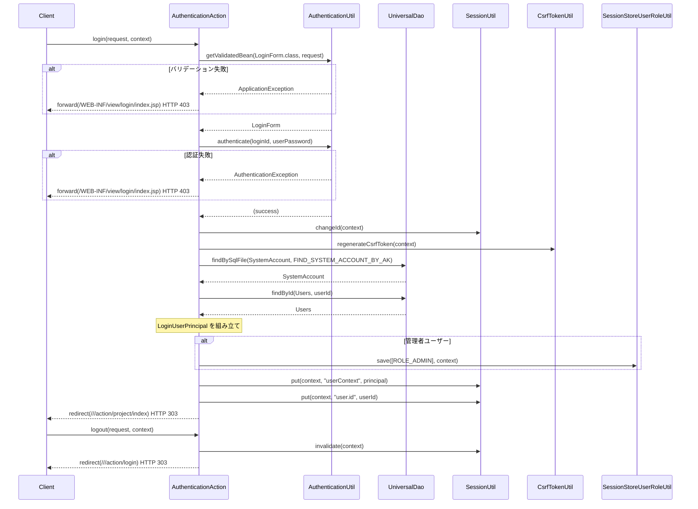

# Code Analysis: AuthenticationAction

**Generated**: 2026-07-03 (今日)
**Target**: ユーザー認証処理（ログイン・ログアウト）
**Modules**: nablarch-example-web
**Analysis Duration**: 不明(ベンチマークモード)

---

## Overview

`AuthenticationAction` は Nablarch ウェブアプリケーションにおけるログイン／ログアウト処理を担う認証アクションクラスである。ログイン画面の表示、資格情報の検証、セッション管理（固定化攻撃対策を含む）、ロールベースの認可情報の保存、およびセッション無効化によるログアウトを提供する。`AuthenticationUtil` を介して `PasswordAuthenticator` と `BeanUtil` に処理を委譲し、`UniversalDao` でセッション用ユーザー情報を取得する。

---

## Architecture

### Dependency Graph

```mermaid
classDiagram
    class AuthenticationAction
    class LoginForm {
        <<Form>>
    }
    class AuthenticationUtil {
        <<Utility>>
    }
    class LoginUserPrincipal {
        <<Context>>
    }
    class SystemAccount {
        <<Entity>>
    }
    class Users {
        <<Entity>>
    }
    class UniversalDao {
        <<Nablarch>>
    }
    class SessionUtil {
        <<Nablarch>>
    }
    class CsrfTokenUtil {
        <<Nablarch>>
    }
    class SessionStoreUserRoleUtil {
        <<Nablarch>>
    }
    class ExecutionContext {
        <<Nablarch>>
    }
    class ApplicationException {
        <<Nablarch>>
    }
    class MessageUtil {
        <<Nablarch>>
    }
    class OnError {
        <<Nablarch>>
    }

    AuthenticationAction ..> LoginForm : validates
    AuthenticationAction ..> AuthenticationUtil : delegates to
    AuthenticationAction ..> LoginUserPrincipal : creates
    AuthenticationAction ..> UniversalDao : queries
    AuthenticationAction ..> SessionUtil : invokes
    AuthenticationAction ..> CsrfTokenUtil : invokes
    AuthenticationAction ..> SessionStoreUserRoleUtil : invokes
    AuthenticationAction ..> ApplicationException : throws
    AuthenticationAction ..> MessageUtil : invokes
    AuthenticationAction ..> OnError : annotated by
    AuthenticationAction ..> ExecutionContext : uses
    LoginUserPrincipal ..> SystemAccount : populated from
    LoginUserPrincipal ..> Users : populated from
    UniversalDao ..> SystemAccount : queries
    UniversalDao ..> Users : queries
```



**Note**: This diagram uses Mermaid `classDiagram` syntax to show class names and their relationships. Use `--|>` for inheritance (extends/implements) and `..>` for dependencies (uses/creates).

### Component Summary

| Component | Role | Type | Dependencies |
|-----------|------|------|--------------|
| AuthenticationAction | ログイン・ログアウト処理の認証アクション | Action | LoginForm, AuthenticationUtil, LoginUserPrincipal, UniversalDao, SessionUtil, CsrfTokenUtil, SessionStoreUserRoleUtil |
| LoginForm | ログイン入力フォーム（ID・パスワード） | Form | なし（Nablarchバリデーションアノテーション使用） |
| AuthenticationUtil | 認証・バリデーション処理のユーティリティ | Utility | PasswordAuthenticator, BeanUtil, ValidatorUtil |
| LoginUserPrincipal | ログインユーザーのセッション情報コンテキスト | Context | なし |
| SystemAccount | システムアカウントエンティティ | Entity | なし |
| Users | ユーザーエンティティ | Entity | なし |

---

## Flow

### Processing Flow

**ログイン処理** (`login()` メソッド、L54–87):

1. `AuthenticationUtil.getValidatedBean()` で `LoginForm` を生成しバリデーション実施。バリデーション失敗時は `ApplicationException` に変換して `@OnError` でログイン画面に戻す (L58–63)。
2. `AuthenticationUtil.authenticate()` でパスワード認証。認証失敗時は同様に汎用エラーメッセージで `ApplicationException` を throw (L65–71)。
3. 認証成功後、セッション固定化攻撃対策として `SessionUtil.changeId()` でセッションID を変更し (L75)、`CsrfTokenUtil.regenerateCsrfToken()` で CSRF トークンを再生成 (L76)。
4. `createLoginUserContext()` で `UniversalDao` を使い `SystemAccount` と `Users` を取得して `LoginUserPrincipal` を生成 (L78)。
5. 管理者の場合は `SessionStoreUserRoleUtil.save()` でロール情報をセッションに保存 (L80–82)。
6. `SessionUtil.put()` でユーザーコンテキストとユーザーIDをセッションに保存し、プロジェクト一覧画面に 303 リダイレクト (L84–86)。

**ログアウト処理** (`logout()` メソッド、L118–122):

`SessionUtil.invalidate()` でセッションを無効化し、ログイン画面に 303 リダイレクト。

**補助処理** (`createLoginUserContext()` メソッド、L95–108):

`UniversalDao.findBySqlFile()` で SQL ファイル `FIND_SYSTEM_ACCOUNT_BY_AK` を実行してアカウント情報を取得し、`UniversalDao.findById()` でユーザー情報を取得して `LoginUserPrincipal` に組み立てる。

### Sequence Diagram



---

## Components

### 1. AuthenticationAction

**ファイル**: [`nablarch-example-web/src/main/java/com/nablarch/example/app/web/action/AuthenticationAction.java`](../../nablarch-example-web/src/main/java/com/nablarch/example/app/web/action/AuthenticationAction.java)

**役割**: システム利用者のログイン・ログアウトを担う認証アクション。

**主要メソッド**:
- `index()` (L42–44): ログイン画面 JSP へのフォワード
- `login()` (L54–87): バリデーション → 認証 → セッション管理 → リダイレクト
- `logout()` (L118–122): セッション無効化 → リダイレクト
- `createLoginUserContext()` (L95–108): DBからユーザー情報を取得して `LoginUserPrincipal` を生成するプライベートメソッド

**依存**: LoginForm, AuthenticationUtil, LoginUserPrincipal, UniversalDao, SessionUtil, CsrfTokenUtil, SessionStoreUserRoleUtil

---

### 2. LoginForm

**ファイル**: [`nablarch-example-web/src/main/java/com/nablarch/example/app/web/form/LoginForm.java`](../../nablarch-example-web/src/main/java/com/nablarch/example/app/web/form/LoginForm.java)

**役割**: ログインID とパスワードを保持する入力フォーム。

**主要フィールド**:
- `loginId` (L23): `@Required` + `@Domain("loginId")` アノテーション付き
- `userPassword` (L28): `@Required` + `@Domain("password")` アノテーション付き

**依存**: なし（Nablarch バリデーションアノテーションを利用）

---

### 3. AuthenticationUtil

**ファイル**: [`nablarch-example-web/src/main/java/com/nablarch/example/app/web/common/authentication/AuthenticationUtil.java`](../../nablarch-example-web/src/main/java/com/nablarch/example/app/web/common/authentication/AuthenticationUtil.java)

**役割**: 認証・フォームバリデーションのユーティリティクラス。`SystemRepository` からコンポーネントを取得して処理を委譲する。

**主要メソッド**:
- `authenticate()` (L64–68): `SystemRepository` から `PasswordAuthenticator` を取得して認証実行
- `getValidatedBean()` (L77–81): `BeanUtil.createAndCopy()` でフォームを生成し `ValidatorUtil.validate()` で検証
- `encryptPassword()` (L46–49): `PasswordEncryptor` でパスワードを暗号化（`AuthenticationAction` では直接使用しない）

**依存**: PasswordAuthenticator, PasswordEncryptor, BeanUtil, ValidatorUtil, SystemRepository

---

### 4. LoginUserPrincipal

**ファイル**: [`nablarch-example-web/src/main/java/com/nablarch/example/app/web/common/authentication/context/LoginUserPrincipal.java`](../../nablarch-example-web/src/main/java/com/nablarch/example/app/web/common/authentication/context/LoginUserPrincipal.java)

**役割**: セッションに保存するログインユーザー情報のコンテキストオブジェクト。`Serializable` を実装。

**主要フィールド**:
- `userId` (L23): ユーザーID
- `kanjiName` (L26): 漢字氏名
- `admin` (L29): 管理者フラグ（`ROLE_ADMIN` ロール判定に使用）
- `lastLoginDateTime` (L32): 最終ログイン日時

**依存**: なし

---

## Nablarch Framework Usage

### UniversalDao

**クラス**: `nablarch.common.dao.UniversalDao`

**説明**: SQL ファイルや条件指定でエンティティを検索・更新するユニバーサル DAO。JPA アノテーション付きエンティティと組み合わせて使用する。

**使用方法**:
```java
// SQL ファイルを使用した検索
SystemAccount account = UniversalDao.findBySqlFile(
    SystemAccount.class,
    "FIND_SYSTEM_ACCOUNT_BY_AK",
    new Object[]{loginId}
);

// 主キー検索
Users users = UniversalDao.findById(Users.class, account.getUserId());
```

**重要ポイント**:
- ✅ **SQL ファイルの命名規則**: `findBySqlFile` の第2引数はSQLファイル内のSQL ID を指定する
- ⚠️ **結果なしの場合**: 0件の場合は `NoDataException` がスローされる — ログインIDが存在しない場合は `authenticate()` 側で先に検出されるため、ここでは考慮不要
- 💡 **エンティティクラスの自動マッピング**: JPA アノテーション（`@Entity`, `@Column`等）によりカラム名とフィールドが自動マッピングされる

**このコードでの使い方**:
- `createLoginUserContext()` (L96–99) で `FIND_SYSTEM_ACCOUNT_BY_AK` SQL でログインIDに紐づくアカウントを取得し、続けて `findById()` でユーザー詳細情報を取得

**詳細**: [ユニバーサルDAO](../../nablarch-document/ja/application_framework/application_framework/libraries/database/universal_dao.rst)

---

### SessionUtil

**クラス**: `nablarch.common.web.session.SessionUtil`

**説明**: セッションストアへのアクセス（読み書き・ID変更・無効化）を提供するユーティリティ。

**使用方法**:
```java
// セッション固定化攻撃対策（ログイン成功直後に必須）
SessionUtil.changeId(context);

// セッションへのデータ保存
SessionUtil.put(context, "userContext", userContext);

// セッション無効化（ログアウト）
SessionUtil.invalidate(context);
```

**重要ポイント**:
- ✅ **`changeId()` はログイン成功直後に呼ぶ**: セッション固定化攻撃を防ぐため、認証成功後・セッション書き込み前に必ず実行する
- ⚠️ **`changeId()` はセッション情報を維持したままIDのみ変更する**: このため CSRF トークンも再生成が必要（下記 `CsrfTokenUtil` 参照）
- 💡 **`invalidate()` で完全削除**: ログアウト時は `invalidate()` でセッション全体を無効化することでセキュリティを確保

**このコードでの使い方**:
- `login()` (L75): `changeId()` でセッション固定化攻撃対策
- `login()` (L84–85): `put()` でユーザーコンテキストとユーザーIDを保存
- `logout()` (L119): `invalidate()` でセッション無効化

**詳細**: [セッションストア](../../nablarch-document/ja/application_framework/application_framework/libraries/session_store.rst)

---

### CsrfTokenUtil

**クラス**: `nablarch.common.web.csrf.CsrfTokenUtil`

**説明**: CSRF トークンの再生成・取得を提供するユーティリティ。`CsrfTokenVerificationHandler` と組み合わせて使用する。

**使用方法**:
```java
// セッションID変更後にCSRFトークンを再生成
CsrfTokenUtil.regenerateCsrfToken(context);
```

**重要ポイント**:
- ✅ **`SessionUtil.changeId()` の直後に呼ぶ**: セッションIDが変わっても旧トークンが残るため、必ず `regenerateCsrfToken()` で新しいトークンを生成する
- 🎯 **セッションID変更とセットで使用**: ログイン時のセッション固定化対策とCSRF対策を両立させる必須パターン

**このコードでの使い方**:
- `login()` (L76): `changeId()` 直後に `regenerateCsrfToken()` を呼び出す

**詳細**: [CSRFトークン検証ハンドラ](../../nablarch-document/ja/application_framework/application_framework/handlers/web/csrf_token_verification_handler.rst)

---

### SessionStoreUserRoleUtil

**クラス**: `nablarch.common.authorization.role.session.SessionStoreUserRoleUtil`

**説明**: ユーザーのロール情報をセッションストアに保存・取得するユーティリティ。ロールベースの認可チェック機能と連携する。

**使用方法**:
```java
// 管理者ロールをセッションに保存
SessionStoreUserRoleUtil.save(
    Collections.singleton(LoginUserPrincipal.ROLE_ADMIN),
    context
);
```

**重要ポイント**:
- 🎯 **ログイン時のみ保存**: ロール情報はログイン処理中に1回だけ保存する。以降のリクエストではセッションから自動取得される
- ⚠️ **管理者のみ保存している**: このコードでは `isAdmin()` が `true` の場合のみ `ROLE_ADMIN` を保存する（一般ユーザーはロールなし）

**このコードでの使い方**:
- `login()` (L80–82): 管理者ユーザーの場合のみ `ROLE_ADMIN` をセッションに保存

**詳細**: [ロールチェック](../../nablarch-document/ja/application_framework/application_framework/libraries/authorization/role_check.rst)

---

### OnError (インターセプタ)

**アノテーション**: `nablarch.fw.web.interceptor.OnError`

**説明**: 業務アクションのメソッドで特定の例外が発生した場合に、指定パスへのフォワードを自動で行うインターセプタアノテーション。

**使用方法**:
```java
@OnError(type = ApplicationException.class,
         path = "/WEB-INF/view/login/index.jsp",
         statusCode = 403)
public HttpResponse login(HttpRequest request, ExecutionContext context) { ... }
```

**重要ポイント**:
- ✅ **`type` には `RuntimeException` のサブクラスを指定**: `ApplicationException` を含むその全サブクラスが対象となる
- 💡 **エラー処理の宣言的記述**: `try-catch` でフォワードを書く必要がなく、アノテーションで一元管理できる
- ⚠️ **`statusCode` を指定しない場合は 400**: このコードでは認証エラーを 403 として返している

**このコードでの使い方**:
- `login()` (L53): `ApplicationException` 発生時にログイン画面に 403 で戻す

**詳細**: [OnErrorインターセプタ](../../nablarch-document/ja/application_framework/application_framework/handlers/web_interceptor/on_error.rst)

---

## References

### Source Files

- [`AuthenticationAction.java`](../../nablarch-example-web/src/main/java/com/nablarch/example/app/web/action/AuthenticationAction.java) — 認証アクション本体
- [`LoginForm.java`](../../nablarch-example-web/src/main/java/com/nablarch/example/app/web/form/LoginForm.java) — ログイン入力フォーム
- [`AuthenticationUtil.java`](../../nablarch-example-web/src/main/java/com/nablarch/example/app/web/common/authentication/AuthenticationUtil.java) — 認証ユーティリティ
- [`LoginUserPrincipal.java`](../../nablarch-example-web/src/main/java/com/nablarch/example/app/web/common/authentication/context/LoginUserPrincipal.java) — ログインユーザーコンテキスト

### Knowledge Base

nabledge-6 の知識ファイルはこのワーキングディレクトリ内にアクセスできませんでした。

### Official Documentation

- [ユニバーサルDAO](https://nablarch.github.io/docs/LATEST/doc/application_framework/application_framework/libraries/database/universal_dao.html)
- [セッションストア](https://nablarch.github.io/docs/LATEST/doc/application_framework/application_framework/libraries/session_store.html)
- [CSRFトークン検証ハンドラ](https://nablarch.github.io/docs/LATEST/doc/application_framework/application_framework/handlers/web/csrf_token_verification_handler.html)
- [ロールチェック](https://nablarch.github.io/docs/LATEST/doc/application_framework/application_framework/libraries/authorization/role_check.html)
- [OnErrorインターセプタ](https://nablarch.github.io/docs/LATEST/doc/application_framework/application_framework/handlers/web_interceptor/on_error.html)

---

**Output**: `.nabledge/20260703/code-analysis-AuthenticationAction.md`

**Note**: This documentation was generated by the code-analysis workflow of the nabledge-6 skill.