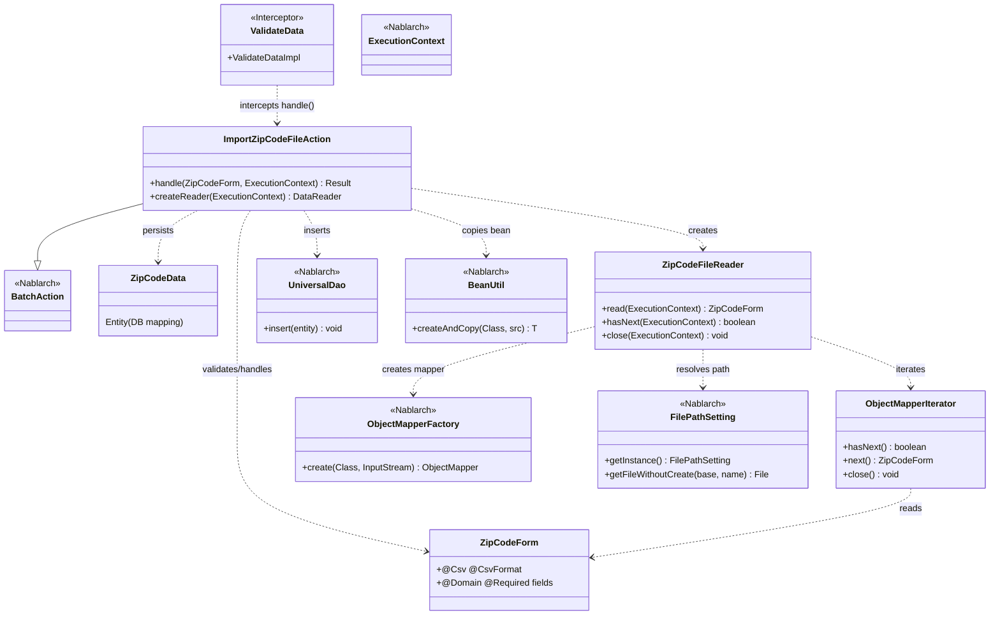
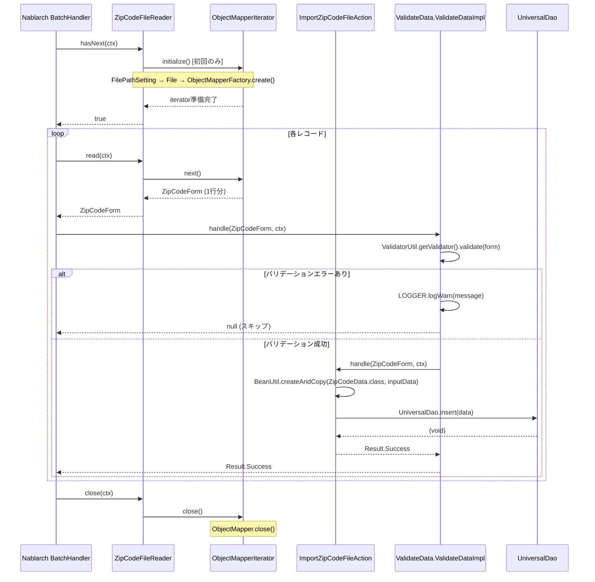

# Code Analysis: ImportZipCodeFileAction

**Generated**: 2026-07-03 (not measured)
**Target**: 郵便番号CSVファイルをDBに一括登録するバッチアクション
**Modules**: nablarch-example-batch
**Analysis Duration**: 不明(ベンチマークモード)

---

## Overview

`ImportZipCodeFileAction` は、郵便番号CSVファイル（KEN_ALL形式）を1行ずつ読み込み、`ZipCodeData` エンティティとしてDBに登録するNablarchバッチアクションクラスです。`BatchAction<ZipCodeForm>` を継承しており、`ZipCodeFileReader` がCSVをパース・行単位に供給し、`@ValidateData` インターセプタがBean Validationを適用した上で `handle()` に渡します。バリデーションエラー行はWARNログに記録され処理をスキップ、正常行は `BeanUtil.createAndCopy()` でエンティティに変換後 `UniversalDao.insert()` でDB登録します。

---

## Architecture

### Dependency Graph



**Note**: This diagram uses Mermaid `classDiagram` syntax to show class names and their relationships. Use `--|>` for inheritance (extends/implements) and `..>` for dependencies (uses/creates).

### Component Summary

| Component | Role | Type | Dependencies |
|-----------|------|------|--------------|
| ImportZipCodeFileAction | CSVバッチ処理のエントリポイント。1行ずつhandleを呼び出す | Action | ZipCodeForm, ZipCodeData, ZipCodeFileReader, UniversalDao, BeanUtil |
| ZipCodeForm | CSVの1行をバインドし、Bean Validationを行うフォーム | Form | @Csv, @CsvFormat, @Domain, @Required |
| ZipCodeFileReader | CSVファイルを開き、行単位でZipCodeFormを供給するリーダ | DataReader | ObjectMapperIterator, FilePathSetting, ObjectMapperFactory |
| ObjectMapperIterator | ObjectMapperをIteratorとしてラップし、先読みしながら行を返す | Utility | ObjectMapper |
| ValidateData | handleメソッドをインターセプトし、Bean Validationを実行するインターセプタ | Interceptor | ValidatorUtil, MessageUtil, Logger |
| ZipCodeData | 郵便番号テーブルのエンティティクラス（Jakarta Persistence） | Entity | なし |

---

## Flow

### Processing Flow

バッチ起動時、NablarchのMain→ハンドラキュー→DispatchHandlerが`ImportZipCodeFileAction`を特定します。フレームワークはループごとに`ZipCodeFileReader.read()`を呼び出してCSVの1行を取得します。`ZipCodeFileReader`は初回呼び出し時に`FilePathSetting`から`csv-input/importZipCode`のファイルパスを解決し、`ObjectMapperFactory.create(ZipCodeForm.class, inputStream)`でCSVマッパを生成。`ObjectMapperIterator`が先読みしながら行を返します。

`handle(ZipCodeForm, ctx)` は`@ValidateData`インターセプタによりラップされており、まず`ValidateData.ValidateDataImpl`がBean Validationを実行します。バリデーションエラー行はWARNログ出力後`null`を返してスキップ。正常行は`BeanUtil.createAndCopy(ZipCodeData.class, inputData)`でエンティティへコピーし、`UniversalDao.insert(data)`でINSERTを実行、`Result.Success`を返します。データが尽きると`ZipCodeFileReader.hasNext()`が`false`を返してバッチ終了、`close()`でマッパをクローズします。

### Sequence Diagram



---

## Components

### 1. ImportZipCodeFileAction

**ファイル**: [`nablarch-example-batch/src/main/java/com/nablarch/example/app/batch/action/ImportZipCodeFileAction.java`](../../nablarch-example-batch/src/main/java/com/nablarch/example/app/batch/action/ImportZipCodeFileAction.java)

**役割**: `BatchAction<ZipCodeForm>` を継承し、CSVファイルから読み込まれた郵便番号データをDBに登録するバッチの業務ロジック中核クラス。

**主要メソッド**:
- `handle(ZipCodeForm, ExecutionContext)` (:35-41) — `@ValidateData`でインターセプトされ、バリデーション済みフォームをエンティティへ変換してINSERT。常に`Result.Success`を返す。
- `createReader(ExecutionContext)` (:50-52) — `ZipCodeFileReader`インスタンスを生成して返す。フレームワークがデータリーダとして使用する。

**依存関係**: ZipCodeForm, ZipCodeData, ZipCodeFileReader, UniversalDao, BeanUtil

---

### 2. ZipCodeForm

**ファイル**: [`nablarch-example-batch/src/main/java/com/nablarch/example/app/batch/form/ZipCodeForm.java`](../../nablarch-example-batch/src/main/java/com/nablarch/example/app/batch/form/ZipCodeForm.java)

**役割**: CSVの1行をバインドするフォームクラス。`@Csv`・`@CsvFormat`でCSVフォーマットを宣言的に定義。全15フィールドはString型で`@Domain`・`@Required`アノテーションでバリデーションルールを指定。`@LineNumber`で行番号を保持し、バリデーションエラー時のログ出力に使用。

**主要メソッド**:
- `getLineNumber()` (:143-145) — `@LineNumber`アノテーション付き。`ValidateData`インターセプタが行番号をログに記録するために参照する。

**依存関係**: @Csv, @CsvFormat, @Domain, @Required, @LineNumber (すべてNablarch/Jakarta EEアノテーション)

---

### 3. ZipCodeFileReader

**ファイル**: [`nablarch-example-batch/src/main/java/com/nablarch/example/app/batch/reader/ZipCodeFileReader.java`](../../nablarch-example-batch/src/main/java/com/nablarch/example/app/batch/reader/ZipCodeFileReader.java)

**役割**: `DataReader<ZipCodeForm>`を実装するカスタムデータリーダ。CSVファイル読み込みを遅延初期化（`initialize()`は初回`read()`/`hasNext()`呼び出し時のみ実行）。

**主要メソッド**:
- `read(ExecutionContext)` (:40-45) — iteratorから次の行を返す。初回は`initialize()`を呼ぶ。
- `hasNext(ExecutionContext)` (:54-58) — 次の行の有無を返す。
- `close(ExecutionContext)` (:68-70) — `ObjectMapperIterator.close()`経由でCSVストリームをクローズ。
- `initialize()` (:78-88) — `FilePathSetting.getInstance()`でファイルパスを解決し、`ObjectMapperFactory.create()`でCSVマッパを生成。ファイル未存在時は`IllegalStateException`をスロー。

**依存関係**: ObjectMapperIterator, FilePathSetting, ObjectMapperFactory, ZipCodeForm

---

### 4. ObjectMapperIterator

**ファイル**: [`nablarch-example-batch/src/main/java/com/nablarch/example/app/batch/reader/iterator/ObjectMapperIterator.java`](../../nablarch-example-batch/src/main/java/com/nablarch/example/app/batch/reader/iterator/ObjectMapperIterator.java)

**役割**: `ObjectMapper<E>`を`Iterator<E>`としてラップするユーティリティクラス。コンストラクタで初回読み込みを実行し、`next()`は現在の行を返すと同時に次の行を先読みする先読みバッファパターンを採用。

**主要メソッド**:
- `hasNext()` (:45-47) — `form != null`を返す（先読み結果がnullなら終端）。
- `next()` (:56-61) — 現在行を返しつつ次行を`mapper.read()`で先読み。
- `close()` (:66-68) — `mapper.close()`でCSVストリームをクローズ。

**依存関係**: ObjectMapper (Nablarch databind)

---

### 5. ValidateData (インターセプタ)

**ファイル**: [`nablarch-example-batch/src/main/java/com/nablarch/example/app/batch/interceptor/ValidateData.java`](../../nablarch-example-batch/src/main/java/com/nablarch/example/app/batch/interceptor/ValidateData.java)

**役割**: `@Interceptor(ValidateData.ValidateDataImpl.class)`として定義されたメソッドアノテーション。`handle()`にアノテーションを付けるだけでBean Validationが差し込まれる。バリデーションエラー行は処理をスキップし、エラー内容（フィールド名、メッセージ、行番号）をWARNログに出力する。

**主要メソッド（内部クラス ValidateDataImpl）**:
- `handle(Object, ExecutionContext)` (:60-92) — `ValidatorUtil.getValidator()`でバリデーション実行。エラーなければ元ハンドラに委譲、エラーあれば全違反をWARNログしnullを返す。

**依存関係**: ValidatorUtil, MessageUtil, Logger, LoggerManager, BeanUtil

---

## Nablarch Framework Usage

### BatchAction

**クラス**: `nablarch.fw.action.BatchAction<T>`

**説明**: 汎用的なバッチアクションのテンプレートクラス。データリーダから供給されるレコード1件ずつ`handle()`を呼ぶフレームワーク処理の基底クラス。

**使用方法**:
```java
public class ImportZipCodeFileAction extends BatchAction<ZipCodeForm> {
    @Override
    public Result handle(ZipCodeForm inputData, ExecutionContext ctx) { ... }

    @Override
    public DataReader<ZipCodeForm> createReader(ExecutionContext ctx) { ... }
}
```

**重要ポイント**:
- ✅ **`createReader()`のオーバーライドが必須**: フレームワークはこのメソッドで取得したリーダを使ってレコードを供給する
- 🎯 **`data_bind`を使う場合はBatchActionを選択**: `FileBatchAction`は`data_format`専用のため、CSVアノテーションベースのデータバインドには`BatchAction`を継承すること
- ⚠️ **常駐バッチ利用時の注意**: マルチスレッドでの遅延問題があるため、新規開発では`db_messaging`の使用を推奨

**このコードでの使い方**:
- `ImportZipCodeFileAction`が継承し、`ZipCodeForm`型パラメータで型安全にレコードを受け取る
- `createReader()`で`ZipCodeFileReader`を返し、CSVファイルからのデータ供給をフレームワークに通知

**詳細**: [Nablarchバッチアーキテクチャ](../../nablarch-document/ja/application_framework/application_framework/batch/nablarch_batch/architecture.rst)

---

### UniversalDao

**クラス**: `nablarch.common.dao.UniversalDao`

**説明**: Jakarta PersistenceアノテーションをEntityに付与するだけでSQLを自動生成してCRUDを実行できる簡易O/Rマッパー。

**使用方法**:
```java
ZipCodeData data = BeanUtil.createAndCopy(ZipCodeData.class, inputData);
UniversalDao.insert(data);
```

**重要ポイント**:
- ✅ **Entityに`@Table`・`@Column`等のJakarta Persistenceアノテーションが必要**: アノテーションを元にSQL文を実行時に構築する
- ⚠️ **主キー以外の条件での更新・削除は非対応**: その場合は`database`モジュールを直接使うこと
- 💡 **内部では`database`モジュールを使用**: ユニバーサルDAOを使うには`database`の設定が必要

**このコードでの使い方**:
- `handle()`内でBeanUtilコピー後に`UniversalDao.insert(data)`を1回呼び出し、1行1INSERT

**詳細**: [ユニバーサルDAO](../../nablarch-document/ja/application_framework/application_framework/libraries/database/universal_dao.rst)

---

### BeanUtil

**クラス**: `nablarch.core.beans.BeanUtil`

**説明**: Java Beansのプロパティ値を他のBeanにコピー・設定・取得するユーティリティ。同名プロパティを自動的にマッピングし型変換も行う。

**使用方法**:
```java
ZipCodeData data = BeanUtil.createAndCopy(ZipCodeData.class, inputData);
```

**重要ポイント**:
- ✅ **コピー元・先のプロパティ名が一致している必要がある**: 名前が一致しない場合はコピーされない
- 💡 **インスタンス生成と値コピーを1メソッドで完結**: `createAndCopy()`は対象クラスのインスタンスを生成してコピーまで行う
- ⚠️ **型変換失敗時は例外スロー**: data_bindドキュメントに記載の通り、外部入力データはすべてString型で受け取ること

**このコードでの使い方**:
- `handle()`内で`ZipCodeForm`(フォーム)から`ZipCodeData`(エンティティ)へプロパティをコピー

**詳細**: [BeanUtil](../../nablarch-document/ja/application_framework/application_framework/libraries/bean_util.rst)

---

### ObjectMapper / ObjectMapperFactory (データバインド)

**クラス**: `nablarch.common.databind.ObjectMapper`, `nablarch.common.databind.ObjectMapperFactory`

**説明**: CSV/TSV/固定長データをJava Beansオブジェクトとして読み書きする機能。フォーマットは`@Csv`・`@CsvFormat`アノテーションで宣言的に定義する。

**使用方法**:
```java
// 読み込み
ObjectMapper<ZipCodeForm> mapper = ObjectMapperFactory.create(
    ZipCodeForm.class, new FileInputStream(zipCodeFile));
ZipCodeForm form = mapper.read(); // null で終端
mapper.close();
```

**重要ポイント**:
- ✅ **外部入力ファイルのBeanはすべてStringで定義**: 型変換失敗で異常終了しないよう必須
- ✅ **`close()`を必ず呼ぶ**: ストリームのフラッシュとリソース解放が必要（`ObjectMapperIterator.close()`経由）
- 💡 **`@Csv`の`properties`順序がCSVのカラム順序に対応**: `ZipCodeForm`の`@Csv(properties = {...})`の配列順がCSVのカラム順と一致している必要がある

**このコードでの使い方**:
- `ZipCodeFileReader.initialize()`で`ObjectMapperFactory.create(ZipCodeForm.class, inputStream)`を生成
- `ObjectMapperIterator`にラップして先読みIteratorとして使用

**詳細**: [データバインド](../../nablarch-document/ja/application_framework/application_framework/libraries/data_io/data_bind.rst)

---

### FilePathSetting

**クラス**: `nablarch.core.util.FilePathSetting`

**説明**: ファイルの入出力ディレクトリと拡張子を論理名で管理する機能。コンポーネント設定ファイルで`basePathSettings`にディレクトリを設定し、`getFileWithoutCreate()`で論理名からFileオブジェクトを取得する。

**使用方法**:
```java
FilePathSetting filePathSetting = FilePathSetting.getInstance();
File zipCodeFile = filePathSetting.getFileWithoutCreate("csv-input", FILE_NAME);
```

**重要ポイント**:
- ✅ **コンポーネント名は`filePathSetting`固定**: `FilePathSetting.getInstance()`はこのコンポーネント名で取得する
- 🎯 **論理名によるパス管理**: 環境ごとに物理パスが異なる場合でも、論理名で統一して扱える
- ⚠️ **`classpathスキーム`はWASによっては使用不可**: バッチファイル入力では`file`スキームを使うこと

**このコードでの使い方**:
- 論理名`"csv-input"`・ファイル名`"importZipCode"`から入力CSVファイルの物理パスを取得

**詳細**: [ファイルパス管理](../../nablarch-document/ja/application_framework/application_framework/libraries/file_path_management.rst)

---

## References

### Source Files

- [`ImportZipCodeFileAction.java`](../../nablarch-example-batch/src/main/java/com/nablarch/example/app/batch/action/ImportZipCodeFileAction.java) — バッチアクション本体 (L1-53)
- [`ZipCodeForm.java`](../../nablarch-example-batch/src/main/java/com/nablarch/example/app/batch/form/ZipCodeForm.java) — CSVバインドフォーム (L1-426)
- [`ZipCodeFileReader.java`](../../nablarch-example-batch/src/main/java/com/nablarch/example/app/batch/reader/ZipCodeFileReader.java) — カスタムデータリーダ (L1-91)
- [`ObjectMapperIterator.java`](../../nablarch-example-batch/src/main/java/com/nablarch/example/app/batch/reader/iterator/ObjectMapperIterator.java) — ObjectMapperイテレータ (L1-69)
- [`ValidateData.java`](../../nablarch-example-batch/src/main/java/com/nablarch/example/app/batch/interceptor/ValidateData.java) — Bean Validationインターセプタ (L1-94)

### Knowledge Base

- [Nablarchバッチアーキテクチャ](../../nablarch-document/ja/application_framework/application_framework/batch/nablarch_batch/architecture.rst) — BatchAction、DataReader、処理フロー
- [ユニバーサルDAO](../../nablarch-document/ja/application_framework/application_framework/libraries/database/universal_dao.rst) — UniversalDao.insert()の詳細仕様
- [データバインド](../../nablarch-document/ja/application_framework/application_framework/libraries/data_io/data_bind.rst) — ObjectMapper、@Csv、@CsvFormat
- [BeanUtil](../../nablarch-document/ja/application_framework/application_framework/libraries/bean_util.rst) — createAndCopy()の仕様
- [ファイルパス管理](../../nablarch-document/ja/application_framework/application_framework/libraries/file_path_management.rst) — FilePathSettingの設定方法
- [Bean Validation](../../nablarch-document/ja/application_framework/application_framework/libraries/validation/bean_validation.rst) — @Domain、@Required、ValidatorUtil

### Official Documentation

- [Nablarchバッチ処理](https://nablarch.github.io/docs/LATEST/doc/application_framework/application_framework/batch/nablarch_batch/index.html)
- [ユニバーサルDAO](https://nablarch.github.io/docs/LATEST/doc/application_framework/application_framework/libraries/database/universal_dao.html)
- [データバインド](https://nablarch.github.io/docs/LATEST/doc/application_framework/application_framework/libraries/data_io/data_bind.html)
- [BeanUtil](https://nablarch.github.io/docs/LATEST/doc/application_framework/application_framework/libraries/bean_util.html)
- [ファイルパス管理](https://nablarch.github.io/docs/LATEST/doc/application_framework/application_framework/libraries/file_path_management.html)
- [Bean Validation](https://nablarch.github.io/docs/LATEST/doc/application_framework/application_framework/libraries/validation/bean_validation.html)

---

**Output**: `.nabledge/20260703/code-analysis-ImportZipCodeFileAction.md`

**Note**: This documentation was generated by the code-analysis workflow of the nabledge-6 skill.