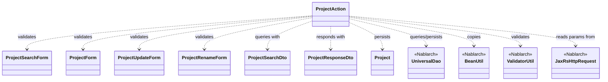
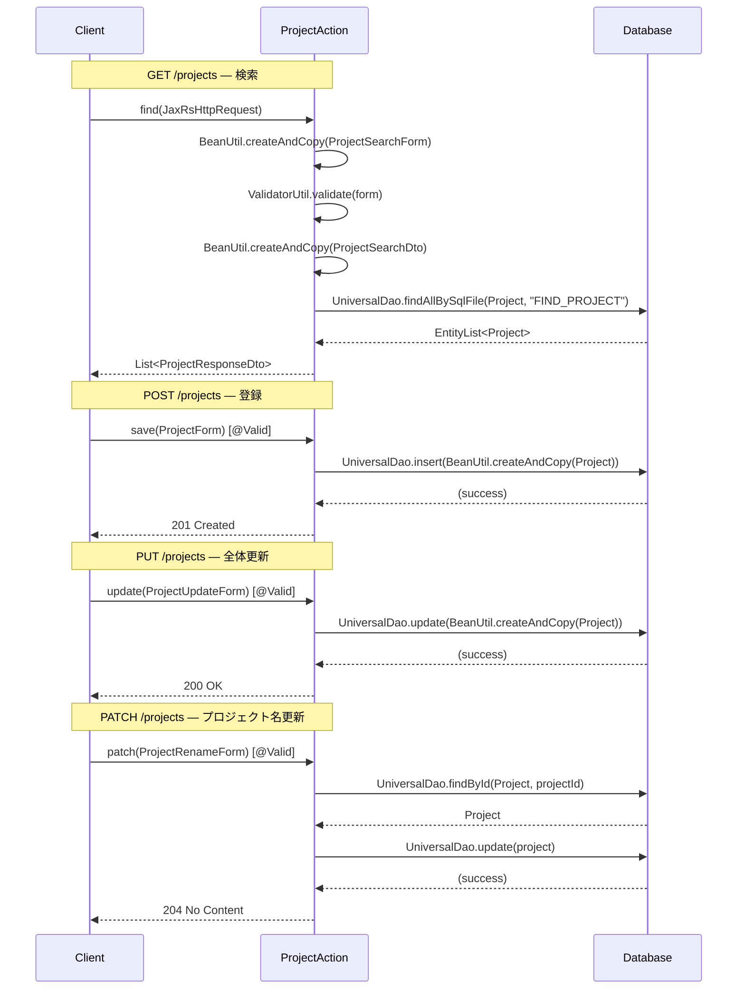

# Code Analysis: ProjectAction

**Generated**: 2026-07-09 (benchmark mode)
**Target**: プロジェクトCRUD REST APIアクション（検索・登録・更新・部分更新）
**Modules**: nablarch-example-rest
**Analysis Duration**: 不明(ベンチマークモード)

---

## Overview

プロジェクトリソースに対するCRUD操作をRESTful APIとして提供するアクションクラス。`@Path("/projects")` で `/projects` エンドポイントにマッピングされ、GET（検索）・POST（登録）・PUT（全体更新）・PATCH（プロジェクト名の部分更新）の4つのHTTPメソッドに対応する。入力値のバリデーションにはBean ValidationとNablarchの `ValidatorUtil` を組み合わせて使用し、DBアクセスは `UniversalDao` で行う。

---

## Architecture

### Dependency Graph



**Note**: This diagram uses Mermaid `classDiagram` syntax to show class names and their relationships. Use `--|>` for inheritance (extends/implements) and `..>` for dependencies (uses/creates).

### Component Summary

| Component | Role | Type | Dependencies |
|-----------|------|------|--------------|
| ProjectAction | プロジェクトCRUD REST APIアクション | Action | ProjectSearchForm, ProjectForm, ProjectUpdateForm, ProjectRenameForm, ProjectSearchDto, ProjectResponseDto, Project, UniversalDao, BeanUtil, ValidatorUtil |
| ProjectSearchForm | 検索条件の入力・バリデーション用フォーム | Form | なし |
| ProjectForm | プロジェクト登録用フォーム（@Domain, @AssertTrue） | Form | なし |
| ProjectUpdateForm | プロジェクト全体更新用フォーム（@Domain, @AssertTrue） | Form | なし |
| ProjectRenameForm | プロジェクト名部分更新用フォーム | Form | なし |
| ProjectSearchDto | 検索条件を保持するDTO（型変換後） | DTO | なし |
| ProjectResponseDto | レスポンス用プロジェクトDTO（Client/SystemAccount含む） | DTO | なし |
| Project | プロジェクトDBエンティティ | Entity | なし |

---

## Flow

### Processing Flow

GETリクエスト（検索）では、クエリーパラメータを `BeanUtil.createAndCopy` で `ProjectSearchForm` に変換後、`ValidatorUtil.validate` でバリデーションを実行し、`ProjectSearchDto` に変換して `UniversalDao.findAllBySqlFile(Project.class, "FIND_PROJECT", searchCondition)` でDB検索を行い、結果を `ProjectResponseDto` リストとして返す。

POSTリクエスト（登録）では、`@Valid` アノテーションによるリクエストボディのBean Validation後、`BeanUtil.createAndCopy` で `Project` エンティティに変換して `UniversalDao.insert` でDB登録し、201 Createdを返す。

PUTリクエスト（全体更新）では、`@Valid` 後に `BeanUtil.createAndCopy` で `Project` エンティティに変換して `UniversalDao.update` でDB更新し、200 OKを返す。

PATCHリクエスト（名称更新）では、`@Valid` 後に `UniversalDao.findById` で現在の `Project` エンティティを取得し、プロジェクト名を書き換えて `UniversalDao.update` でDB更新し、204 No Contentを返す。

### Sequence Diagram



---

## Components

### 1. ProjectAction

**ファイル**: [`src/main/java/com/nablarch/example/action/ProjectAction.java`](../../src/main/java/com/nablarch/example/action/ProjectAction.java)

**役割**: `/projects` エンドポイントのRESTfulアクションクラス。HTTP GET/POST/PUT/PATCHを処理する。

**主要メソッド**:

| メソッド | 行 | HTTP | 説明 |
|--------|-----|------|------|
| `find(JaxRsHttpRequest)` | L45-59 | GET | クエリーパラメータでプロジェクトを検索し、DTOリストを返す |
| `save(ProjectForm)` | L70-73 | POST | プロジェクトを新規登録し、201を返す |
| `update(ProjectUpdateForm)` | L84-89 | PUT | プロジェクト情報を全体更新し、200を返す |
| `patch(ProjectRenameForm)` | L101-108 | PATCH | プロジェクト名を部分更新し、204を返す |

**依存**: `UniversalDao`, `BeanUtil`, `ValidatorUtil`, `JaxRsHttpRequest`, Forms, DTOs, `Project`

---

### 2. ProjectSearchForm

**ファイル**: [`src/main/java/com/nablarch/example/form/ProjectSearchForm.java`](../../src/main/java/com/nablarch/example/form/ProjectSearchForm.java)

**役割**: GET検索のクエリーパラメータを受け取り、`@Domain` でドメインバリデーションを定義するフォーム。

**フィールド**: `clientId`（`@Domain("id")`）、`projectName`（`@Domain("projectName")`）

---

### 3. ProjectForm

**ファイル**: [`src/main/java/com/nablarch/example/form/ProjectForm.java`](../../src/main/java/com/nablarch/example/form/ProjectForm.java)

**役割**: プロジェクト登録用フォーム。`@Required`・`@Domain`・`@AssertTrue` でバリデーションを定義する。

**ポイント**: `isValidProjectPeriod()`（`@AssertTrue`）で開始日〜終了日の前後関係を相関チェックする。`DateRange` ヘルパークラスを使用。

---

### 4. ProjectUpdateForm

**ファイル**: [`src/main/java/com/nablarch/example/form/ProjectUpdateForm.java`](../../src/main/java/com/nablarch/example/form/ProjectUpdateForm.java)

**役割**: プロジェクト全体更新用フォーム。ProjectFormにprojectIdを加えた構成。`@AssertTrue` による相関チェックも含む。

---

### 5. ProjectRenameForm

**ファイル**: [`src/main/java/com/nablarch/example/form/ProjectRenameForm.java`](../../src/main/java/com/nablarch/example/form/ProjectRenameForm.java)

**役割**: プロジェクト名のみの部分更新（PATCH）用フォーム。`projectId` と `projectName` の2フィールドのみを持ち、ともに `@Required`・`@Domain` で検証する。

---

### 6. ProjectSearchDto / ProjectResponseDto

**ファイル**:
- [`src/main/java/com/nablarch/example/dto/ProjectSearchDto.java`](../../src/main/java/com/nablarch/example/dto/ProjectSearchDto.java)
- [`src/main/java/com/nablarch/example/dto/ProjectResponseDto.java`](../../src/main/java/com/nablarch/example/dto/ProjectResponseDto.java)

**役割**: `ProjectSearchDto` は `BeanUtil.createAndCopy` でフォームから生成される検索条件DTO（`clientId` を `Integer` 型で保持）。`ProjectResponseDto` はレスポンス用の完全なプロジェクト情報DTOで、`@JsonSerialize(using = DateSerializer.class)` による日付のJSON変換を含む。

---

## Nablarch Framework Usage

### UniversalDao

**クラス**: `nablarch.common.dao.UniversalDao`

**説明**: Jakarta PersistenceアノテーションをEntityに付けるだけでCRUDができ、SQLファイルを使った柔軟な検索も可能なDAOクラス。

**使用方法**:
```java
// SQLファイルを使った検索
EntityList<Project> list = UniversalDao.findAllBySqlFile(
    Project.class, "FIND_PROJECT", searchCondition);

// 主キーで1件取得
Project project = UniversalDao.findById(Project.class, form.getProjectId());

// 登録 / 更新
UniversalDao.insert(project);
UniversalDao.update(project);
```

**重要ポイント**:
- 🎯 **findAllBySqlFile**: SQLファイル（`FIND_PROJECT.sql`）とDTOを使って柔軟な検索条件を表現できる。検索条件はDTO/Formのプロパティ名とSQLの`:name`パラメータで一致させる
- ✅ **findById**: 主キーで1件取得。PATCHの楽観的更新前取得パターンで使用される
- ⚠️ **update**: 主キーを含むEntityが必要。PATCHでは `findById` で取得した後に値を変更して `update` することで部分更新を実現する

**このコードでの使い方**:
- `find()` (L54): `findAllBySqlFile(Project.class, "FIND_PROJECT", searchCondition)` で検索
- `save()` (L71): `insert(BeanUtil.createAndCopy(Project.class, project))` で登録
- `update()` (L87): `update(project)` で全体更新
- `patch()` (L102, L105): `findById` で取得 → 名前変更 → `update` で部分更新

**詳細**: [ユニバーサルDAO](../../.claude/skills/nabledge-6/docs/component/libraries/libraries-universal-dao.md)
  SQLを書かなくても単純なCRUDができる
  検索結果をBeanにマッピングできる

---

### BeanUtil

**クラス**: `nablarch.core.beans.BeanUtil`

**説明**: Java Beansオブジェクト間でプロパティをコピーするユーティリティクラス。型変換も自動で行う。

**使用方法**:
```java
// リクエストパラメータ(Map)→Formへのコピー
ProjectSearchForm form = BeanUtil.createAndCopy(
    ProjectSearchForm.class, req.getParamMap());

// Form→DTO、Form→Entityへのコピー
ProjectSearchDto dto = BeanUtil.createAndCopy(ProjectSearchDto.class, form);
Project project = BeanUtil.createAndCopy(Project.class, projectForm);

// Entity→ResponseDtoへのコピー
ProjectResponseDto responseDto = BeanUtil.createAndCopy(
    ProjectResponseDto.class, project);
```

**重要ポイント**:
- 💡 **型変換**: `String` から `Integer` への変換など、型が異なっていても同名プロパティを自動変換してコピーする。`ProjectSearchForm`の`clientId`(String) → `ProjectSearchDto`の`clientId`(Integer) もこれで実現
- ✅ **createAndCopy**: 新規インスタンスを生成しつつプロパティをコピーする最も一般的な使い方
- ⚠️ **Map→Bean**: `req.getParamMap()` の返却型はHTTPパラメータの `Map<String, String[]>` 。BeanUtilはこれをBeanのプロパティ型に合わせて変換する

**このコードでの使い方**:
- L48: `req.getParamMap()` → `ProjectSearchForm`
- L53: `ProjectSearchForm` → `ProjectSearchDto`
- L54-57: `Project` → `ProjectResponseDto`（streamのmap内）
- L71, L85: Form → `Project` エンティティ

**詳細**: [BeanUtil](../../.claude/skills/nabledge-6/docs/component/libraries/libraries-bean-util.md)
  使用方法

---

### ValidatorUtil

**クラス**: `nablarch.core.validation.ee.ValidatorUtil`

**説明**: Nablarch ValidationエンジンのBean Validation実行ユーティリティ。フォームに付与された制約アノテーションを検証する。

**使用方法**:
```java
// フォームのバリデーション実行（失敗時は例外をスロー）
ValidatorUtil.validate(form);
```

**重要ポイント**:
- 🎯 **GET検索での使用**: GETリクエストでは `@Valid` アノテーションが使えないため（引数がFormでなくJaxRsHttpRequest）、`ValidatorUtil.validate(form)` で明示的にバリデーションを呼び出す
- ✅ **POST/PUT/PATCHは @Valid**: リクエストボディをFormで受け取るメソッドはメソッドに `@Valid` を付与することでBean Validationを自動実行できる
- ⚠️ **バリデーション失敗時**: 例外（`ApplicationException`）がスローされ、JaxRs Bean Validationハンドラが適切なエラーレスポンスに変換する

**このコードでの使い方**:
- L51: `find()` 内で `ValidatorUtil.validate(form)` を明示的に呼び出し
- L69, L83, L100: `@Valid` アノテーションでBean Validationを自動実行

**詳細**: [Nablarch Validation](../../.claude/skills/nabledge-6/docs/component/libraries/libraries-nablarch-validation.md)
  バリデーションを実行する

---

### JaxRsHttpRequest

**クラス**: `nablarch.fw.jaxrs.JaxRsHttpRequest`

**説明**: RESTfulウェブサービス専用のHTTPリクエストクラス。クエリーパラメータ・パスパラメータ・HTTPヘッダーの取得に使用する。

**使用方法**:
```java
public List<ProjectResponseDto> find(JaxRsHttpRequest req) {
    // クエリーパラメータをMapとして取得
    ProjectSearchForm form = BeanUtil.createAndCopy(
        ProjectSearchForm.class, req.getParamMap());
    ...
}
```

**重要ポイント**:
- 🎯 **GETリクエストのパラメータ取得**: クエリーパラメータは `req.getParamMap()` でMapとして取得し、BeanUtilでFormに変換するパターンが標準
- ✅ **後方互換**: `HttpRequest` も使用可能だが、RESTfulウェブサービスでは原則 `JaxRsHttpRequest` を使用する
- 💡 **型安全**: パスパラメータは `req.getPathParam("id")` でString型として取得できる

**このコードでの使い方**:
- L45: `find(JaxRsHttpRequest req)` の引数として受け取り、L48で `req.getParamMap()` を呼び出す

**詳細**: [リソース(アクション)クラスの実装に関して](../../.claude/skills/nabledge-6/docs/processing-pattern/restful-web-service/restful-web-service-resource-signature.md)
  リソースクラスのメソッドのシグネチャ

---

## References

### Source Files

- [ProjectAction.java](../../src/main/java/com/nablarch/example/action/ProjectAction.java) — メインアクションクラス
- [ProjectForm.java](../../src/main/java/com/nablarch/example/form/ProjectForm.java) — 登録用フォーム
- [ProjectUpdateForm.java](../../src/main/java/com/nablarch/example/form/ProjectUpdateForm.java) — 更新用フォーム
- [ProjectRenameForm.java](../../src/main/java/com/nablarch/example/form/ProjectRenameForm.java) — 部分更新用フォーム
- [ProjectSearchForm.java](../../src/main/java/com/nablarch/example/form/ProjectSearchForm.java) — 検索用フォーム
- [ProjectResponseDto.java](../../src/main/java/com/nablarch/example/dto/ProjectResponseDto.java) — レスポンスDTO
- [ProjectSearchDto.java](../../src/main/java/com/nablarch/example/dto/ProjectSearchDto.java) — 検索条件DTO

### Knowledge Base

- [ユニバーサルDAO](../../.claude/skills/nabledge-6/docs/component/libraries/libraries-universal-dao.md) — UniversalDaoの詳細仕様（CRUD、SQLファイル検索）
- [BeanUtil](../../.claude/skills/nabledge-6/docs/component/libraries/libraries-bean-util.md) — BeanUtilの使用方法と型変換規則
- [Nablarch Validation](../../.claude/skills/nabledge-6/docs/component/libraries/libraries-nablarch-validation.md) — ValidatorUtilによるバリデーション実行
- [リソース(アクション)クラスの実装に関して](../../.claude/skills/nabledge-6/docs/processing-pattern/restful-web-service/restful-web-service-resource-signature.md) — JaxRsHttpRequestの使い方、メソッドシグネチャ
- [RESTfulウェブサービス アーキテクチャ概要](../../.claude/skills/nabledge-6/docs/processing-pattern/restful-web-service/restful-web-service-architecture.md) — RESTfulウェブサービスの全体構成

### Official Documentation

- [ユニバーサルDAO](https://nablarch.github.io/docs/LATEST/doc/application_framework/application_framework/libraries/database/universal_dao.html)
- [BeanUtil](https://nablarch.github.io/docs/LATEST/doc/application_framework/application_framework/libraries/utility/bean_util.html)
- [Nablarch Validation](https://nablarch.github.io/docs/LATEST/doc/application_framework/application_framework/libraries/validation/nablarch_validation.html)
- [RESTfulウェブサービス](https://nablarch.github.io/docs/LATEST/doc/application_framework/application_framework/web_service/rest/index.html)

---

**Output**: `.nabledge/20260709/code-analysis-ProjectAction.md`

**Note**: This documentation was generated by the code-analysis workflow of the nabledge-6 skill.