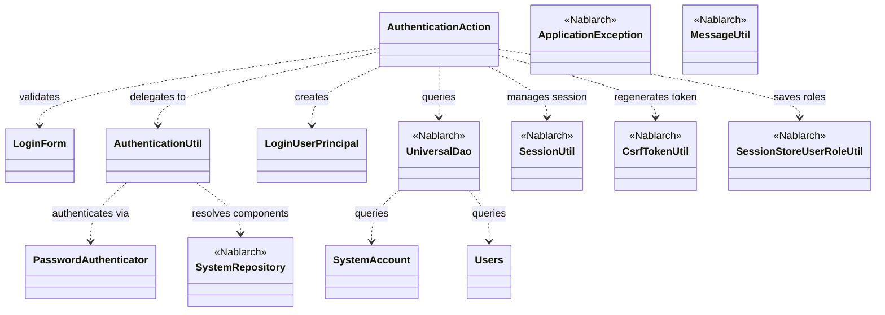
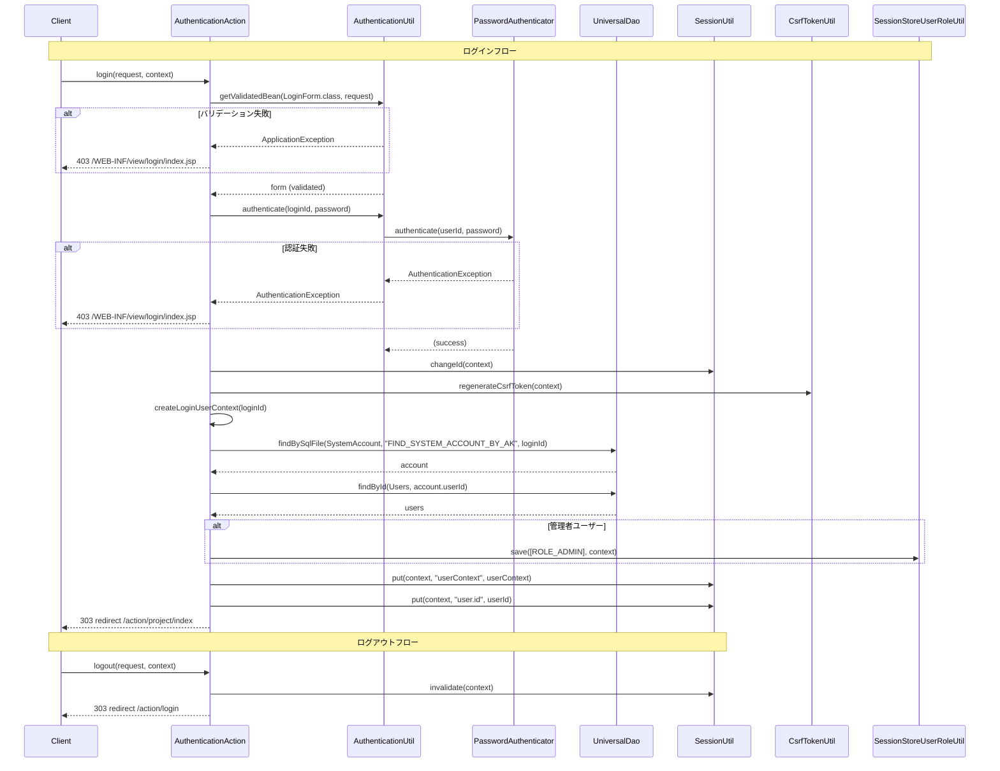

# Code Analysis: AuthenticationAction

**Generated**: 2026-07-09 (ベンチマークモード)
**Target**: ログイン・ログアウト認証処理アクション
**Modules**: nablarch-example-web
**Analysis Duration**: 不明(ベンチマークモード)

---

## Overview

`AuthenticationAction` は、Webアプリケーションのログイン・ログアウトを担うアクションクラスです。ログイン時は入力フォームのバリデーション、パスワード認証、セッションID変更、CSRFトークン再生成、ロール保存、ユーザーコンテキストのセッション格納を順次実行します。ログアウト時はセッションを無効化してリダイレクトします。`AuthenticationUtil` にパスワード認証とBean生成を委譲し、`UniversalDao` でDBからユーザー情報を取得する構造です。

---

## Architecture

### Dependency Graph



**Note**: This diagram uses Mermaid `classDiagram` syntax to show class names and their relationships. Use `--|>` for inheritance (extends/implements) and `..>` for dependencies (uses/creates).

### Component Summary

| Component | Role | Type | Dependencies |
|-----------|------|------|--------------|
| AuthenticationAction | ログイン・ログアウト処理の制御 | Action | LoginForm, AuthenticationUtil, LoginUserPrincipal, UniversalDao, SessionUtil, CsrfTokenUtil, SessionStoreUserRoleUtil |
| LoginForm | ログイン入力フォーム（バリデーション付き） | Form | なし |
| AuthenticationUtil | 認証・Bean生成ユーティリティ | Utility | PasswordAuthenticator, BeanUtil, ValidatorUtil, SystemRepository |
| LoginUserPrincipal | セッション格納用ログインユーザー情報 | Bean | なし |
| SystemAccount | システムアカウントエンティティ | Entity | なし |
| Users | ユーザーエンティティ | Entity | なし |

---

## Flow

### Processing Flow

**ログインフロー (`login`):**
1. `AuthenticationUtil.getValidatedBean()` でリクエストから `LoginForm` を生成してバリデーション。失敗時は `errors.login` メッセージで `ApplicationException` をスロー（`@OnError` により403でログイン画面に戻る）。
2. `AuthenticationUtil.authenticate()` でID・パスワード認証。失敗時も同様に `errors.login` でスローし、認証失敗の詳細はクライアントに露出させない。
3. 認証成功後: `SessionUtil.changeId()` でセッションID変更 → `CsrfTokenUtil.regenerateCsrfToken()` でCSRFトークン再生成 → `createLoginUserContext()` でユーザー情報取得 → 管理者ならロールを `SessionStoreUserRoleUtil.save()` で保存 → `SessionUtil.put()` でユーザーコンテキスト・ユーザーIDをセッションに格納 → プロジェクト一覧にリダイレクト。

**`createLoginUserContext()` (private):** `UniversalDao.findBySqlFile()` でログインIDをキーに `SystemAccount` を取得し、`UniversalDao.findById()` でユーザー詳細 `Users` を取得。両エンティティから `LoginUserPrincipal` を構築して返す。

**ログアウトフロー (`logout`):** `SessionUtil.invalidate()` でセッション無効化後、ログイン画面にリダイレクト。

### Sequence Diagram



---

## Components

### 1. AuthenticationAction

**ファイル**: [`nablarch-example-web/src/main/java/com/nablarch/example/app/web/action/AuthenticationAction.java`](../../nablarch-example-web/src/main/java/com/nablarch/example/app/web/action/AuthenticationAction.java)

**役割**: ログイン・ログアウトを制御するWebアクションクラス。認証処理の全体フローを管理し、セッション・CSRFトークン・ロールの管理を横断的に行う。

**主要メソッド**:

| メソッド | 行 | 説明 |
|----------|----|------|
| `index()` | L42-44 | ログイン画面を返す |
| `login()` | L54-87 | ログイン処理（バリデーション→認証→セッション更新→リダイレクト） |
| `logout()` | L118-122 | セッション無効化してログイン画面へリダイレクト |
| `createLoginUserContext()` | L95-108 | DBからユーザー情報取得してLoginUserPrincipalを構築（private） |

**依存関係**: LoginForm, AuthenticationUtil, LoginUserPrincipal, UniversalDao, SessionUtil, CsrfTokenUtil, SessionStoreUserRoleUtil

**重要な実装ポイント**:
- `@OnError(type = ApplicationException.class, path = "...", statusCode = 403)` で例外ハンドリングを宣言的に定義（L53）
- バリデーション失敗・認証失敗いずれも `errors.login` の同一メッセージを返すことで、エラー種別の情報漏洩を防止（L61, L69）
- 認証成功直後にセッションIDを変更してセッション固定攻撃を防止（L75）

---

### 2. LoginForm

**ファイル**: [`nablarch-example-web/src/main/java/com/nablarch/example/app/web/form/LoginForm.java`](../../nablarch-example-web/src/main/java/com/nablarch/example/app/web/form/LoginForm.java)

**役割**: ログイン入力フォーム。ログインIDとパスワードを保持し、Nablarchのアノテーションベースバリデーションを適用する。

**フィールドとバリデーション**:

| フィールド | 型 | アノテーション |
|------------|----|----------------|
| `loginId` | String | `@Required`, `@Domain("loginId")` |
| `userPassword` | String | `@Required`, `@Domain("password")` |

**依存関係**: `nablarch.core.validation.ee.Domain`, `nablarch.core.validation.ee.Required`

---

### 3. AuthenticationUtil

**ファイル**: [`nablarch-example-web/src/main/java/com/nablarch/example/app/web/common/authentication/AuthenticationUtil.java`](../../nablarch-example-web/src/main/java/com/nablarch/example/app/web/common/authentication/AuthenticationUtil.java)

**役割**: 認証処理のファサード。`SystemRepository` からコンポーネントを動的取得して委譲するユーティリティクラス。

**主要メソッド**:

| メソッド | 行 | 説明 |
|----------|----|------|
| `authenticate()` | L56-60 | SystemRepositoryから`PasswordAuthenticator`を取得して認証 |
| `getValidatedBean()` | L67-71 | BeanUtil + ValidatorUtilでフォームBean生成・検証 |
| `encryptPassword()` | L40-44 | パスワード暗号化（このコードでは直接呼ばれない） |

**依存関係**: PasswordAuthenticator, PasswordEncryptor, BeanUtil, ValidatorUtil, SystemRepository

---

### 4. LoginUserPrincipal

**ファイル**: [`nablarch-example-web/src/main/java/com/nablarch/example/app/web/common/authentication/context/LoginUserPrincipal.java`](../../nablarch-example-web/src/main/java/com/nablarch/example/app/web/common/authentication/context/LoginUserPrincipal.java)

**役割**: セッションに格納されるログインユーザー情報Bean。ユーザーID、漢字氏名、管理者フラグ、最終ログイン日時を保持する。`Serializable` 実装によりセッション永続化に対応。

**フィールド**: `userId`, `kanjiName`, `admin`, `lastLoginDateTime`, `ROLE_ADMIN` (定数)

---

## Nablarch Framework Usage

### UniversalDao

**クラス**: `nablarch.common.dao.UniversalDao`

**説明**: SQLファイルやEntityクラスを使ったDB操作を提供するNablarchのデータアクセスユーティリティ。JPAアノテーションで定義したEntityと対応するSQLで検索・更新・登録が可能。

**使用方法**:
```java
// SQLファイルを使った検索（検索条件をObject配列で渡す）
SystemAccount account = UniversalDao.findBySqlFile(
    SystemAccount.class, "FIND_SYSTEM_ACCOUNT_BY_AK", new Object[]{loginId});

// 主キー検索
Users users = UniversalDao.findById(Users.class, account.getUserId());
```

**重要ポイント**:
- ✅ **`findBySqlFile` の第3引数**: 検索条件はSQL中の`$conditions`に展開されるObject配列で渡す（L97-98）
- ⚠️ **結果0件のとき**: `findBySqlFile`/`findById` は結果0件の場合 `NoDataException` をスロー — ログインIDが存在しないケースは `AuthenticationUtil.authenticate()` 側で事前に弾く設計
- 💡 **StaticメソッドAPI**: DI不要で静的メソッドとして呼び出せる。テスト時はモックが必要な点に注意

---

### SessionUtil

**クラス**: `nablarch.common.web.session.SessionUtil`

**説明**: Nablarchセッションの読み書き・無効化・IDの変更を行うユーティリティクラス。セッションストアの実装に依存せずに操作できる抽象化レイヤー。

**使用方法**:
```java
// セッションID変更（セッション固定攻撃対策）
SessionUtil.changeId(context);

// セッションへのオブジェクト格納
SessionUtil.put(context, "userContext", userContext);
SessionUtil.put(context, "user.id", String.valueOf(userContext.getUserId()));

// セッション無効化（ログアウト）
SessionUtil.invalidate(context);
```

**重要ポイント**:
- ✅ **認証直後に必ず `changeId()`**: セッション固定攻撃（Session Fixation Attack）を防ぐためのセキュリティ要件（L75）
- ⚠️ **セッションへの格納型**: `SessionUtil.put()` に格納するオブジェクトは `Serializable` でなければならない — `LoginUserPrincipal` が `implements Serializable` である理由
- 💡 **`invalidate()` はセッション全体を削除**: ログアウト時には `invalidate()` を使う（個別キーの `delete()` では不十分）

---

### CsrfTokenUtil

**クラス**: `nablarch.common.web.csrf.CsrfTokenUtil`

**説明**: CSRFトークンの生成・検証・再生成を行うユーティリティ。Nablarchの自動CSRF検証ハンドラーと連携して動作する。

**使用方法**:
```java
// ログイン成功後にCSRFトークンを再生成
CsrfTokenUtil.regenerateCsrfToken(context);
```

**重要ポイント**:
- ✅ **ログイン後は必ず `regenerateCsrfToken()`**: 認証前後でCSRFトークンを引き継ぐとログイン前のトークンが悪用される可能性がある。`changeId()` の直後に呼ぶことでセッションID変更と合わせてトークンを更新（L76）
- ⚠️ **JSP側にトークン出力が必要**: ログインフォームの `<form>` タグに `<nablarch:csrfToken/>` カスタムタグでトークンをhiddenフィールドとして埋め込む必要がある

---

### SessionStoreUserRoleUtil

**クラス**: `nablarch.common.authorization.role.session.SessionStoreUserRoleUtil`

**説明**: ロールベースアクセス制御（RBAC）のためにユーザーロールをセッションに保存・取得するユーティリティ。`@Permit` アノテーションと組み合わせてアクセス制御を行う。

**使用方法**:
```java
// 管理者ロールをセッションに保存
if (userContext.isAdmin()) {
    SessionStoreUserRoleUtil.save(
        Collections.singleton(LoginUserPrincipal.ROLE_ADMIN), context);
}
```

**重要ポイント**:
- ✅ **管理者フラグ確認後にロール保存**: `isAdmin()` が true の場合のみ `ROLE_ADMIN` をセッションに保存。一般ユーザーはロールなし（L80-82）
- 🎯 **`@Permit(roles = "ADMIN")` との連携**: 管理者専用アクションに `@Permit` アノテーションを付与すると、このセッション保存が前提条件になる
- ⚠️ **ロールのコレクション**: `save()` の第1引数は `Collection<String>` — 複数ロールを持つ場合はSetで渡す

---

### ApplicationException / MessageUtil

**クラス**: `nablarch.core.message.ApplicationException`, `nablarch.core.message.MessageUtil`

**説明**: ビジネスエラーを表す例外クラスと、メッセージプロパティファイルからメッセージを生成するユーティリティ。`@OnError` インターセプターと連携して画面遷移を制御する。

**使用方法**:
```java
// メッセージIDからApplicationExceptionを生成してスロー
throw new ApplicationException(
    MessageUtil.createMessage(MessageLevel.ERROR, "errors.login"));
```

**重要ポイント**:
- ✅ **`@OnError` との組み合わせ**: `@OnError(type = ApplicationException.class, path = "...", statusCode = 403)` を付けることで、スローされた `ApplicationException` を宣言的に特定パスへの遷移に変換できる（L53）
- 💡 **エラーメッセージの共通化**: バリデーション失敗と認証失敗で同一の `errors.login` メッセージを使うことで、クライアントにどちらで失敗したか伝えないセキュリティ設計（L61, L69）

---

## References

### Source Files

- [`AuthenticationAction.java`](../../nablarch-example-web/src/main/java/com/nablarch/example/app/web/action/AuthenticationAction.java) (L1-124)
- [`LoginForm.java`](../../nablarch-example-web/src/main/java/com/nablarch/example/app/web/form/LoginForm.java) (L1-57)
- [`AuthenticationUtil.java`](../../nablarch-example-web/src/main/java/com/nablarch/example/app/web/common/authentication/AuthenticationUtil.java) (L1-76)
- [`LoginUserPrincipal.java`](../../nablarch-example-web/src/main/java/com/nablarch/example/app/web/common/authentication/context/LoginUserPrincipal.java) (L1-104)

### Knowledge Base

- ユニバーサルDAO — DB検索・更新のAPIリファレンス
- Webアプリケーションのセッション管理 — SessionUtil、セッションストアの設定
- CSRF対策 — CsrfTokenUtil、自動検証ハンドラーの設定
- ロールによるアクセス制御 — SessionStoreUserRoleUtil、@Permitアノテーション

### Official Documentation

- [ユニバーサルDAO](https://nablarch.github.io/docs/LATEST/doc/application_framework/application_framework/libraries/database/universal_dao.html)
- [セッション管理](https://nablarch.github.io/docs/LATEST/doc/application_framework/application_framework/libraries/session_store.html)
- [CSRF対策](https://nablarch.github.io/docs/LATEST/doc/application_framework/application_framework/handlers/web/csrf_token_verification_handler.html)
- [ロールによるアクセス制御](https://nablarch.github.io/docs/LATEST/doc/application_framework/application_framework/libraries/authorization/role_check.html)

---

**Output**: `.nabledge/20260709/code-analysis-AuthenticationAction.md`

**Note**: This documentation was generated by the code-analysis workflow of the nabledge-6 skill.