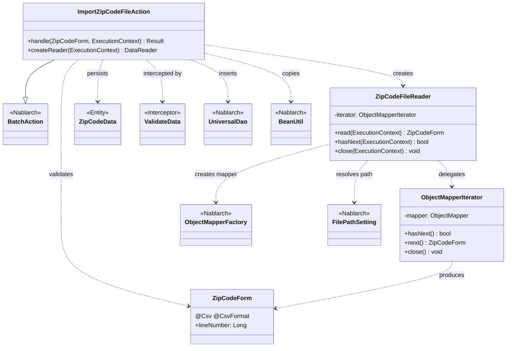
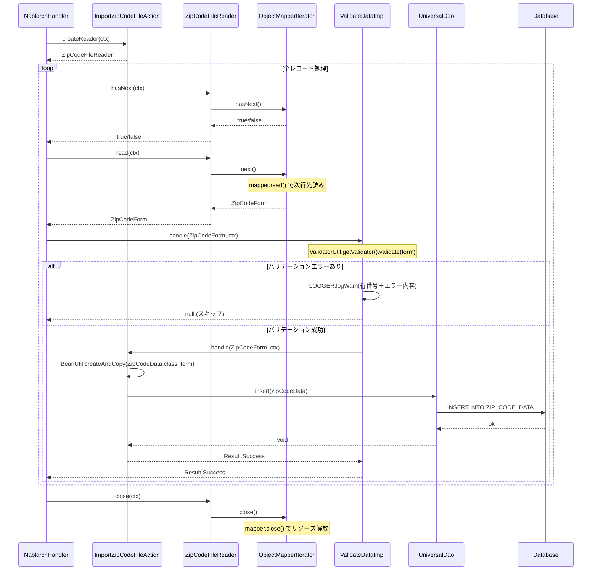

# Code Analysis: ImportZipCodeFileAction

**Generated**: 2026-07-09 (today)
**Target**: 住所CSVファイルをDBに一件ずつ登録するNablarchバッチアクション
**Modules**: nablarch-example-batch
**Analysis Duration**: 不明(ベンチマークモード)

---

## Overview

`ImportZipCodeFileAction` はNablarchバッチフレームワーク上で動作するファイル→DB取り込みバッチである。`ZipCodeFileReader` が住所CSVファイルを1行ずつ読み込み、`@ValidateData` インターセプタが Bean Validation を実行した後、`handle()` メソッドで `ZipCodeData` エンティティをDBに1件 INSERT する。アクション自体の責務は最小限で、フォーム→エンティティへのコピーとDB登録の2行に集約されている。

---

## Architecture

### Dependency Graph



**Note**: This diagram uses Mermaid `classDiagram` syntax to show class names and their relationships. Use `--|>` for inheritance (extends/implements) and `..>` for dependencies (uses/creates).

### Component Summary

| Component | Role | Type | Dependencies |
|-----------|------|------|--------------|
| ImportZipCodeFileAction | バッチメインアクション：CSVレコードをDBへ登録 | Action | ZipCodeForm, ZipCodeData, UniversalDao, BeanUtil, ValidateData |
| ZipCodeFileReader | CSVファイルを1行ずつ読み込むDataReader実装 | Reader | ObjectMapperIterator, ObjectMapperFactory, FilePathSetting |
| ObjectMapperIterator | ObjectMapperをIteratorパターンでラップ | Utility | ObjectMapper |
| ZipCodeForm | CSVバインド＋Bean Validationを担うフォーム | Form | @Csv, @CsvFormat, @Domain, @Required, @LineNumber |
| ZipCodeData | 住所情報を格納するDBエンティティ | Entity | — |
| ValidateData | handleメソッドをインターセプトしバリデーション実行 | Interceptor | ValidatorUtil, BeanUtil, Logger |

---

## Flow

### Processing Flow

バッチ起動時、Nablarchフレームワークが `createReader()` で `ZipCodeFileReader` を取得する。フレームワークは `hasNext()` が `false` を返すまでループし、毎ループ `read()` で `ZipCodeForm` を1件取り出して `handle()` を呼ぶ。`handle()` には `@ValidateData` インターセプタが適用されており、Jakarta Bean Validationで全フィールドをチェックする。バリデーションエラーがあれば WARNログを出力して `handle()` 本体は呼ばれず、次のレコードへ進む。バリデーション通過後、`BeanUtil.createAndCopy()` で `ZipCodeForm` → `ZipCodeData` にプロパティをコピーし、`UniversalDao.insert()` で1件 INSERT する。全レコード処理後、フレームワークが `close()` を呼び、`ObjectMapper` がクローズされる。

### Sequence Diagram



---

## Components

### 1. ImportZipCodeFileAction

**ファイル**: [`nablarch-example-batch/src/main/java/com/nablarch/example/app/batch/action/ImportZipCodeFileAction.java`](../../nablarch-example-batch/src/main/java/com/nablarch/example/app/batch/action/ImportZipCodeFileAction.java)

**役割**: バッチのエントリポイント。DataReaderから渡された1行分のデータをDBに登録する。

**主要メソッド**:
- `handle(ZipCodeForm, ExecutionContext)` [:35-41](../../nablarch-example-batch/src/main/java/com/nablarch/example/app/batch/action/ImportZipCodeFileAction.java#L35-41) — フォームからエンティティへコピーしINSERT
- `createReader(ExecutionContext)` [:50-52](../../nablarch-example-batch/src/main/java/com/nablarch/example/app/batch/action/ImportZipCodeFileAction.java#L50-52) — ZipCodeFileReaderを返す

**依存**: ZipCodeForm, ZipCodeData, UniversalDao, BeanUtil, ValidateData (インターセプタ)

---

### 2. ZipCodeFileReader

**ファイル**: [`nablarch-example-batch/src/main/java/com/nablarch/example/app/batch/reader/ZipCodeFileReader.java`](../../nablarch-example-batch/src/main/java/com/nablarch/example/app/batch/reader/ZipCodeFileReader.java)

**役割**: CSVファイルを1行ずつ読み込んでフレームワークに提供する `DataReader` 実装。

**主要メソッド**:
- `read(ExecutionContext)` [:40-45](../../nablarch-example-batch/src/main/java/com/nablarch/example/app/batch/reader/ZipCodeFileReader.java#L40-45) — イテレータ未初期化なら `initialize()` を呼び `iterator.next()` を返す
- `hasNext(ExecutionContext)` [:54-59](../../nablarch-example-batch/src/main/java/com/nablarch/example/app/batch/reader/ZipCodeFileReader.java#L54-59) — イテレータに次行があるか確認
- `initialize()` [:78-89](../../nablarch-example-batch/src/main/java/com/nablarch/example/app/batch/reader/ZipCodeFileReader.java#L78-89) — FilePathSettingでCSVファイルを解決し、ObjectMapperIteratorを生成

**依存**: ObjectMapperIterator, ObjectMapperFactory, FilePathSetting, ZipCodeForm

---

### 3. ObjectMapperIterator

**ファイル**: [`nablarch-example-batch/src/main/java/com/nablarch/example/app/batch/reader/iterator/ObjectMapperIterator.java`](../../nablarch-example-batch/src/main/java/com/nablarch/example/app/batch/reader/iterator/ObjectMapperIterator.java)

**役割**: `ObjectMapper` を `Iterator` パターンでラップ。先読みにより `hasNext()` の判定を実現する。

**主要メソッド**:
- コンストラクタ [:32-37](../../nablarch-example-batch/src/main/java/com/nablarch/example/app/batch/reader/iterator/ObjectMapperIterator.java#L32-37) — 生成時に初回 `mapper.read()` を呼んでデータを先読み
- `next()` [:56-61](../../nablarch-example-batch/src/main/java/com/nablarch/example/app/batch/reader/iterator/ObjectMapperIterator.java#L56-61) — 現在の `form` を返しつつ次行を先読み
- `close()` [:66-68](../../nablarch-example-batch/src/main/java/com/nablarch/example/app/batch/reader/iterator/ObjectMapperIterator.java#L66-68) — `mapper.close()` でストリームを解放

---

### 4. ZipCodeForm

**ファイル**: [`nablarch-example-batch/src/main/java/com/nablarch/example/app/batch/form/ZipCodeForm.java`](../../nablarch-example-batch/src/main/java/com/nablarch/example/app/batch/form/ZipCodeForm.java)

**役割**: CSVの1行をバインドするフォームクラス。データバインドとBean Validationの両方を担う。

**ポイント**:
- `@Csv(type = CsvType.CUSTOM)` + `@CsvFormat` でカスタムCSVフォーマットを定義 [:17-23](../../nablarch-example-batch/src/main/java/com/nablarch/example/app/batch/form/ZipCodeForm.java#L17-23)
- 全フィールドに `@Required` + `@Domain` を付与
- `lineNumber` フィールドに `@LineNumber` を付与し、バリデーションエラー時の行番号ログに使用 [:142-145](../../nablarch-example-batch/src/main/java/com/nablarch/example/app/batch/form/ZipCodeForm.java#L142-145)

---

### 5. ValidateData

**ファイル**: [`nablarch-example-batch/src/main/java/com/nablarch/example/app/batch/interceptor/ValidateData.java`](../../nablarch-example-batch/src/main/java/com/nablarch/example/app/batch/interceptor/ValidateData.java)

**役割**: `@ValidateData` アノテーション付きメソッドをインターセプトしてBean Validationを実行する。バリデーションエラーがあればWARNログを出力してハンドラ本体をスキップする。

**ポイント**:
- バリデーションエラーごとに行番号+プロパティパス+メッセージをログ出力 [:71-90](../../nablarch-example-batch/src/main/java/com/nablarch/example/app/batch/interceptor/ValidateData.java#L71-90)
- エラー行はスキップ（`null` を返す）し、バッチ処理は続行する

---

## Nablarch Framework Usage

### UniversalDao

**クラス**: `nablarch.common.dao.UniversalDao`

**説明**: Jakarta PersistenceアノテーションをEntityに付けるだけでCRUDが可能な簡易O/Rマッパー。SQLを書かずに登録・更新・削除・検索ができる。

**使用方法**:
```java
ZipCodeData data = BeanUtil.createAndCopy(ZipCodeData.class, inputData);
UniversalDao.insert(data);  // Entityのアノテーションから自動でINSERT文を生成
```

**重要ポイント**:
- ✅ **エンティティにJakarta Persistenceアノテーション必須**: `@Entity`, `@Table`, `@Id`, `@Column` がないと実行時エラー
- 💡 **単純CRUDはSQL不要**: アノテーションからSQL自動生成。INSERT/UPDATE/DELETE/SELECT(主キー)に対応
- ⚠️ **主キー以外の条件での更新・削除は不可**: その場合はJDBCラッパーを使う

**このコードでの使い方**:
- `handle()` 内で `UniversalDao.insert(data)` を呼び、ZipCodeDataを1件INSERT（L38）

**詳細**: [ユニバーサルDAO](../../.claude/skills/nabledge-6/docs/component/libraries/libraries-universal-dao.md)
  SQLを書かなくても単純なCRUDができる

---

### ObjectMapper / ObjectMapperFactory

**クラス**: `nablarch.common.databind.ObjectMapper`, `nablarch.common.databind.ObjectMapperFactory`

**説明**: CSVや固定長データをJava Beansオブジェクトとして読み書きする機能。`@Csv`/`@CsvFormat` アノテーションで定義されたフォーマットに従って自動変換する。

**使用方法**:
```java
// ZipCodeForm の @Csv, @CsvFormat アノテーションを元にCSVを読み込む
ObjectMapper<ZipCodeForm> mapper = ObjectMapperFactory.create(
    ZipCodeForm.class, new FileInputStream(zipCodeFile));
// ObjectMapperIterator 経由で1行ずつ取得
ZipCodeForm form = mapper.read();  // nullが返ったら終端
mapper.close();  // 必須
```

**重要ポイント**:
- ✅ **必ず `close()` を呼ぶ**: ストリームのリソースを解放する（ObjectMapperIterator.close() 経由で実施）
- 💡 **アノテーション駆動**: フォームクラスに `@Csv` + `@CsvFormat` を付けるだけでフォーマット定義完了
- 💡 **`@LineNumber` で行番号取得**: バリデーションエラー時のログに行番号を含められる

**このコードでの使い方**:
- `ZipCodeFileReader.initialize()` で `ObjectMapperFactory.create()` を呼びマッパー生成（L84）
- `ObjectMapperIterator` 経由で `mapper.read()` を呼び1行ずつ取得

**詳細**: [データバインド](../../.claude/skills/nabledge-6/docs/component/libraries/libraries-data-bind.md)
  データをJava Beansオブジェクトとして読み込む
  ファイルのデータの論理行番号を取得する
  CSVファイルのフォーマットを指定する

---

### BeanUtil

**クラス**: `nablarch.core.beans.BeanUtil`

**説明**: Java Beansクラス間でプロパティをコピーするユーティリティ。フォームクラスからエンティティクラスへのデータ移送に使用する。

**使用方法**:
```java
// ZipCodeForm の全プロパティを ZipCodeData にコピーして新規インスタンスを生成
ZipCodeData data = BeanUtil.createAndCopy(ZipCodeData.class, inputData);
```

**重要ポイント**:
- 💡 **プロパティ名が一致するフィールドを自動コピー**: フォームとエンティティのプロパティ名を揃えておく必要がある
- ⚠️ **型変換は自動**: 型が一致しない場合は変換を試みるが、失敗すると例外発生

**このコードでの使い方**:
- `handle()` 内で `BeanUtil.createAndCopy(ZipCodeData.class, inputData)` によりフォーム→エンティティに変換（L37）

---

### FilePathSetting

**クラス**: `nablarch.core.util.FilePathSetting`

**説明**: ファイルパス管理機能。設定ファイルに定義したベースパスと論理名からファイルオブジェクトを解決する。

**使用方法**:
```java
// "csv-input" ベースパス + "importZipCode" 論理名 でファイルを解決
FilePathSetting setting = FilePathSetting.getInstance();
File file = setting.getFileWithoutCreate("csv-input", "importZipCode");
```

**重要ポイント**:
- 💡 **環境依存パスを設定から分離**: ハードコードせずに component 定義ファイルでパスを管理
- 🎯 **`getFileWithoutCreate`**: ファイルが存在しなくても例外を投げず `File` オブジェクトを返す（存在チェックは呼び出し側で行う）

**このコードでの使い方**:
- `ZipCodeFileReader.initialize()` 内で `csv-input/importZipCode` のCSVファイルを解決（L79-80）

---

## References

### Source Files

- [`ImportZipCodeFileAction.java`](../../nablarch-example-batch/src/main/java/com/nablarch/example/app/batch/action/ImportZipCodeFileAction.java)
- [`ZipCodeFileReader.java`](../../nablarch-example-batch/src/main/java/com/nablarch/example/app/batch/reader/ZipCodeFileReader.java)
- [`ObjectMapperIterator.java`](../../nablarch-example-batch/src/main/java/com/nablarch/example/app/batch/reader/iterator/ObjectMapperIterator.java)
- [`ZipCodeForm.java`](../../nablarch-example-batch/src/main/java/com/nablarch/example/app/batch/form/ZipCodeForm.java)
- [`ValidateData.java`](../../nablarch-example-batch/src/main/java/com/nablarch/example/app/batch/interceptor/ValidateData.java)

### Knowledge Base

- [ユニバーサルDAO](../../.claude/skills/nabledge-6/docs/component/libraries/libraries-universal-dao.md) — 単純CRUDの使い方、INSERT
- [データバインド](../../.claude/skills/nabledge-6/docs/component/libraries/libraries-data-bind.md) — ObjectMapper/ObjectMapperFactory、CSVフォーマット指定、@LineNumber
- [Bean Validation](../../.claude/skills/nabledge-6/docs/component/libraries/libraries-bean-validation.md) — バリデーションアノテーション、@Domain/@Required

### Official Documentation

- [ファイルをDBに登録するバッチの作成](https://nablarch.github.io/docs/LATEST/doc/application_framework/application_framework/batch/nablarch_batch/getting_started/nablarch_batch/index.html)
- [Nablarchバッチアーキテクチャ](https://nablarch.github.io/docs/LATEST/doc/application_framework/application_framework/batch/nablarch_batch/architecture.html)
- [データバインド](https://nablarch.github.io/docs/LATEST/doc/application_framework/application_framework/libraries/data_io/data_bind.html)
- [ユニバーサルDAO](https://nablarch.github.io/docs/LATEST/doc/application_framework/application_framework/libraries/database/universal_dao.html)

---

**Output**: `.nabledge/YYYYMMDD/code-analysis-ImportZipCodeFileAction.md`

**Note**: This documentation was generated by the code-analysis workflow of the nabledge-6 skill.