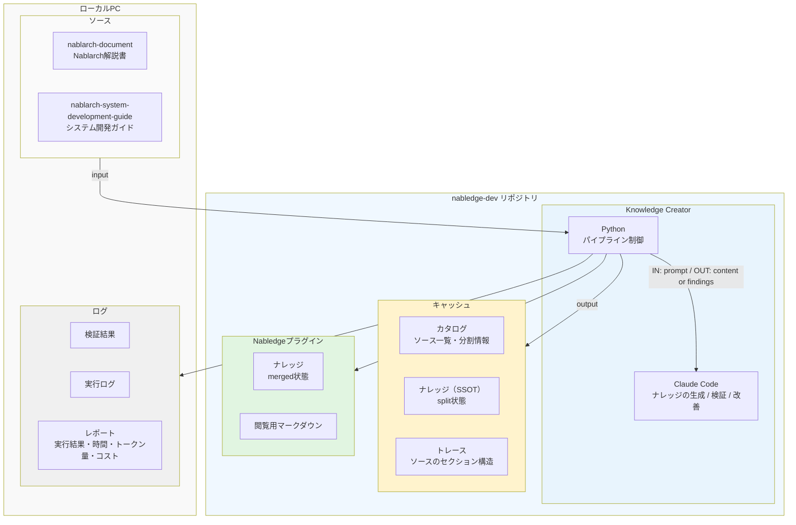
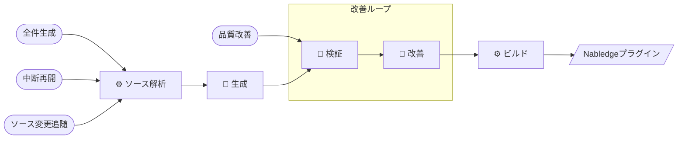

# Knowledge Creator

Nablarch公式ドキュメント（RST/MD/Excel）をNabledgeプラグイン用ナレッジファイル（JSON）に変換するパイプラインツール。

## Overview

### 設計判断

- ソースは大量にあるが、AIにすべてを任せるとコンテキストの肥大化とドリフトで再現性が下がる。AIにしかできない判断だけをピンポイントで委ね、それ以外はルールベースで処理する
- ソースファイルのサイズが大きいと同じ問題が起きるため、400行未満にソースを分割してAIに渡す
- AIは確率的で一度で完璧にはならない。生成はコストが大きいので一度だけ行い、改善ループで繰り返しブラッシュアップする
- 既存ナレッジへの変更差分の適用はAIが苦手なため、変更の取り込みは対象を指定して新規に生成する
- パイプラインが長く途中で失敗する可能性があるため、生成済みファイルをスキップして再開できるようにしている





### ディレクトリ構造

```
tools/knowledge-creator/
├── kc.sh           # CLIエントリポイント
├── scripts/        # パイプライン実装
├── prompts/        # AI呼び出し用プロンプト
├── tests/          # テスト
├── reports/        # 実行レポート出力先
├── .cache/v6/      # キャッシュ（カタログ, ナレッジSSOT, トレース）
└── .logs/v6/       # ログ（run_id単位、gitignore）
```

## Ops

### セットアップ

```bash
cd /path/to/nabledge-dev
./setup.sh
source ~/.bashrc
cp .env.example .env
# .env を編集（AWS認証情報、GitHubトークン）
source .env
```

### コマンド

`tools/knowledge-creator/` ディレクトリから実行する。オプション詳細は `./kc.sh` で確認。

| 用途 | コマンド |
|------|---------|
| 全件生成 | `./kc.sh gen 6` |
| 中断再開 | `./kc.sh gen 6 --resume` |
| ソース変更追随 | `./kc.sh regen 6` |
| 特定ファイル再生成 | `./kc.sh regen 6 --target FILE_ID` |
| 品質改善（全件） | `./kc.sh fix 6` |
| 品質改善（特定） | `./kc.sh fix 6 --target FILE_ID` |

`--target` にはナレッジファイルのベース名（拡張子なし）を指定する。

```bash
# 3ファイル指定の例
./kc.sh fix 6 --target handlers-data_read_handler --target handlers-request_path_java_package_mapping --target handlers-thread_context_handler
```

### テストモード

本番実行前の動作確認用。`tests/ut/mode/` 配下のファイルセットを `--test` で指定する。

```bash
./kc.sh gen 6 --test smallest3.json
```

| ファイル | 内容 |
|---------|------|
| `smallest3.json` | 最小3ファイル — 最速検証 |
| `largest3.json` | 最大3ファイル（分割後22エントリ） — 高速検証 |
| `batch.json` | 37ファイル（分割後51エントリ） — main準拠 |

### レポート

実行完了時に `reports/` へ出力される。

| ファイル | 内容 |
|---------|------|
| `{run_id}.json` | 機械可読な実行レポート |
| `{run_id}.md` | サマリー（コスト・品質指標） |
| `{run_id}-files.md` | ファイル別詳細（サイズ・ターン数・コスト・検証結果） |

## Dev

### run.py 直接実行

`kc.sh` を介さずフェーズを選択して実行できる。

```bash
python scripts/run.py --version 6 --phase CD
python scripts/run.py --version 6 --phase CDEM --clean-phase D
python scripts/run.py --version 6 --run-id 20260309T111451
```

`--phase` は実行するフェーズの文字列（例: `B`, `CD`, `ABCDEM`）。`--clean-phase` は指定フェーズの中間成果物を事前削除する。

### ファサード関数

| コマンド | ファサード | フェーズ | clean-phase |
|---------|-----------|---------|-------------|
| `gen` | `kc_gen` | ABCDEM | なし（事前にclean.py実行） |
| `regen --target` | `kc_regen_target` | ABCDEM | BD |
| `fix` | `kc_fix` | ACDEM | D |
| `fix --target` | `kc_fix_target` | ACDEM | D |

フェーズ記号とパイプラインステップの対応: A=ソース解析, B=生成, C+D=検証, E=改善, M=ビルド。

### テスト

```bash
cd tools/knowledge-creator
pytest tests/ -v       # 全テスト
pytest tests/ut/ -v    # UT: 構造バリデーション、split、merge等
pytest tests/e2e/ -v   # E2E: フルパイプライン（CCモック付き）
```

### AI呼び出しの仕組み

生成・検証（内容）・改善は `ThreadPoolExecutor` + `subprocess.run()` で `claude -p` を並列呼び出しする。AWS Bedrock認証情報は環境変数に必須。

| プロンプト | ステップ |
|-----------|---------|
| `prompts/generate.md` | 生成 |
| `prompts/content_check.md` | 検証（内容） |
| `prompts/fix.md` | 改善 |
