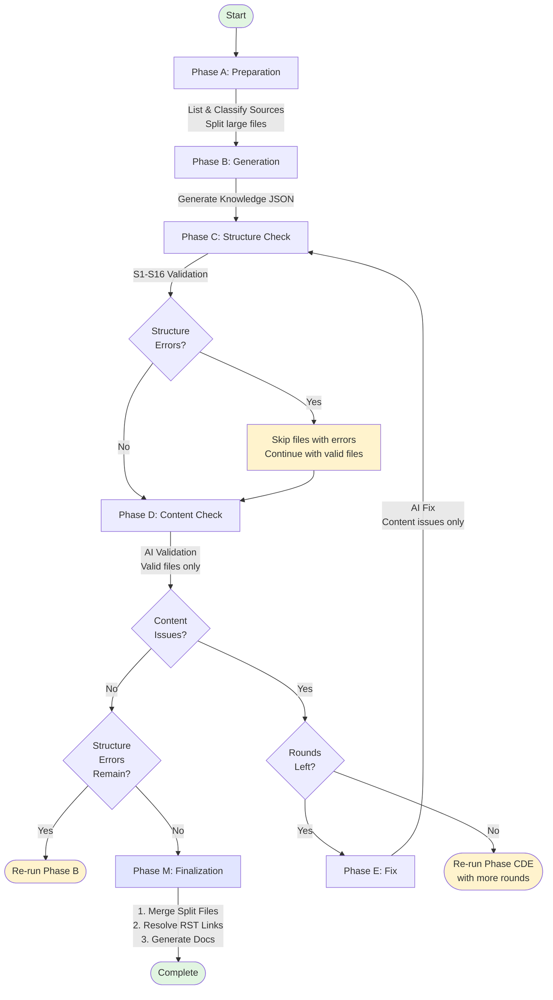

# Knowledge Creator

Nablarch公式ドキュメント（RST/MD/Excel）をAI用ナレッジファイル（JSON）に変換するマルチフェーズパイプライン。



### フェーズ詳細

| フェーズ | 処理内容 | 種別 | 並列 |
|----------|----------|------|------|
| **A** | ソースファイルの一覧・分類・分割 | Python | No |
| **B** | Claude APIによるナレッジJSON生成 | AI | Yes |
| **C** | JSON構造バリデーション（S1-S16） | Python | No |
| **D** | Claude APIによるコンテンツ検証 | AI | Yes |
| **E** | Phase Dで検出した問題の自動修正 | AI | Yes |
| **M** | 分割ファイル統合 → RSTリンク解決 → インデックス・ドキュメント生成 | Hybrid | No |

Phase C→D→Eは `--max-rounds` 回（デフォルト: 2、最大: 10）まで繰り返す。

## セットアップ

```bash
cd /path/to/nabledge-dev
./setup.sh
source ~/.bashrc
```

## 運用コマンド

### kc.sh

| 用途 | コマンド |
|------|---------|
| 全件生成 | `./kc.sh gen 6` |
| 中断再開 | `./kc.sh gen 6 --resume` |
| ソース変更追随 | `./kc.sh regen 6` |
| 特定ファイル再生成 | `./kc.sh regen 6 --target FILE_ID` |
| 品質改善 | `./kc.sh fix 6` |
| 特定ファイル修正 | `./kc.sh fix 6 --target FILE_ID` |

FILE_ID はナレッジファイルの拡張子なしファイル名（例: `handlers-data_read_handler`）。`.claude/skills/nabledge-6/knowledge/` 配下で確認できる。

### オプション

| オプション | 説明 | デフォルト |
|-----------|------|-----------|
| `--version` | バージョン（6, 5, all） | **必須** |
| `--resume` | 中断再開（genのみ） | - |
| `--target FILE_ID` | 対象ファイル指定（複数可） | 全件 |
| `--yes` | 確認プロンプトスキップ | `False` |
| `--dry-run` | ドライラン | `False` |
| `--max-rounds N` | CDEループ回数 | `2` |
| `--concurrency N` | 並列数 | `4` |
| `--test FILE` | テストファイル指定 | `None` |

### テストモードファイル

`tests/mode/` 配下。`--test` オプションにファイル名を指定する。

| ファイル | 内容 |
|---------|------|
| `largest3.json` | 最大3ファイル（分割後22エントリー）— 高速検証向け |
| `smallest3.json` | 最小3ファイル — 最速検証向け |
| `batch.json` | main branch準拠の37ファイル（分割後51エントリー） |

## 開発ガイド

### テスト種類

- **Unit Tests**: Phase C構造バリデーション、分割ロジック等
- **Integration Tests**: Phase C/D/E/M統合、マージ、パイプラインフロー
- **E2E Tests**: 分割ファイル・修正サイクルを含むフルパイプライン

### テスト実行

```bash
cd tools/knowledge-creator

# 全テスト
pytest tests/ -v

# テストモード実行
python scripts/run.py --version 6 --test smallest3.json
```
