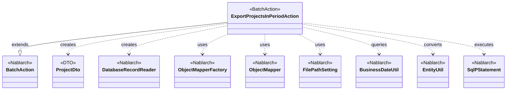
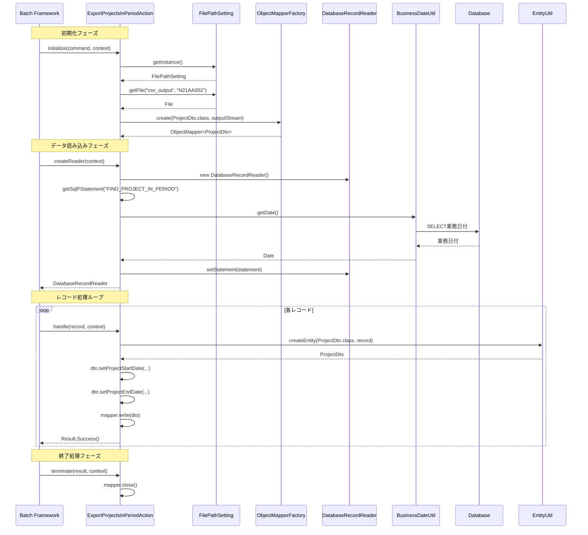

# Code Analysis: ExportProjectsInPeriodAction

**Generated**: 2026-02-26 07:58:10
**Target**: 期間内プロジェクト一覧をCSVファイルに出力する都度起動バッチアクション
**Modules**: proman-batch
**Analysis Duration**: 約2分0秒

---

## Overview

`ExportProjectsInPeriodAction`は、Nablarchの都度起動型バッチアプリケーションとして実装された、期間内プロジェクト一覧をCSVファイルに出力するバッチアクションです。

**主な機能:**
- データベースから業務日付を基準に期間内のプロジェクト情報を検索
- 検索結果を1件ずつ`ProjectDto`に変換してCSVファイルに出力
- `ObjectMapper`を使用したCSVデータバインド処理
- `FilePathSetting`による出力先ディレクトリの論理名管理

**アーキテクチャ:**
- `BatchAction<SqlRow>`を継承した都度起動型バッチアクション
- `DatabaseRecordReader`によるデータベースレコードの逐次読み込み
- `ObjectMapperFactory`によるCSV出力のストリーミング処理
- `BusinessDateUtil`による業務日付の取得と検索条件への適用

---

## Architecture

### Dependency Graph



**Note**: This diagram uses Mermaid `classDiagram` syntax to show class names and their relationships. Use `--|>` for inheritance (extends/implements) and `..>` for dependencies (uses/creates).

### Component Summary

| Component | Role | Type | Dependencies |
|-----------|------|------|--------------|
| ExportProjectsInPeriodAction | バッチアクション本体 | BatchAction | ProjectDto, DatabaseRecordReader, ObjectMapper, FilePathSetting, BusinessDateUtil, EntityUtil |
| ProjectDto | CSV出力用データ転送オブジェクト | DTO | @Csv, @CsvFormat annotations |
| BatchAction | バッチアクションの基底クラス | Nablarch Framework | - |
| DatabaseRecordReader | データベースレコード読み込み | Nablarch Framework | SqlPStatement |
| ObjectMapper/ObjectMapperFactory | CSVデータバインド | Nablarch Framework | ProjectDto |
| FilePathSetting | ファイルパス論理名管理 | Nablarch Framework | - |
| BusinessDateUtil | 業務日付取得 | Nablarch Framework | - |
| EntityUtil | Entity変換ユーティリティ | Nablarch Framework | - |

---

## Flow

### Processing Flow

バッチ処理は以下のフローで実行されます:

1. **初期化フェーズ (`initialize`)**
   - `FilePathSetting`から論理名"csv_output"のディレクトリ取得
   - 出力ファイル"N21AA002"の`FileOutputStream`作成
   - `ObjectMapperFactory`で`ProjectDto`用の`ObjectMapper`を生成

2. **データ読み込みフェーズ (`createReader`)**
   - `DatabaseRecordReader`のインスタンス作成
   - SQL文"FIND_PROJECT_IN_PERIOD"を取得して`SqlPStatement`作成
   - `BusinessDateUtil.getDate()`で業務日付取得
   - 業務日付をSQL文のバインド変数(1番目と2番目)に設定
   - `DatabaseRecordReader`に`SqlPStatement`を設定

3. **レコード処理ループ (`handle`)**
   - `SqlRow`から`EntityUtil.createEntity`で`ProjectDto`を生成
   - 日付型カラム(`PROJECT_START_DATE`, `PROJECT_END_DATE`)を明示的に設定
   - `ObjectMapper.write(dto)`でCSVに1行出力
   - `Result.Success()`を返却して次のレコードへ

4. **終了処理フェーズ (`terminate`)**
   - `ObjectMapper.close()`でファイルストリームをクローズ

### Sequence Diagram



---

## Components

### ExportProjectsInPeriodAction

**Location**: [ExportProjectsInPeriodAction.java:31-81](../.lw/nab-official/v6/nablarch-system-development-guide/Sample_Project/Source_Code/proman-project/proman-batch/src/main/java/com/nablarch/example/proman/batch/project/ExportProjectsInPeriodAction.java#L31-L81)

**Role**: 期間内プロジェクト一覧をCSVファイルに出力する都度起動型バッチアクション

**Key Methods**:
- `initialize(CommandLine, ExecutionContext)` [:44-54](../.lw/nab-official/v6/nablarch-system-development-guide/Sample_Project/Source_Code/proman-project/proman-batch/src/main/java/com/nablarch/example/proman/batch/project/ExportProjectsInPeriodAction.java#L44-L54) - 出力ファイルとObjectMapperの初期化
- `createReader(ExecutionContext)` [:57-65](../.lw/nab-official/v6/nablarch-system-development-guide/Sample_Project/Source_Code/proman-project/proman-batch/src/main/java/com/nablarch/example/proman/batch/project/ExportProjectsInPeriodAction.java#L57-L65) - DatabaseRecordReaderの作成とSQL文の設定
- `handle(SqlRow, ExecutionContext)` [:68-75](../.lw/nab-official/v6/nablarch-system-development-guide/Sample_Project/Source_Code/proman-project/proman-batch/src/main/java/com/nablarch/example/proman/batch/project/ExportProjectsInPeriodAction.java#L68-L75) - 1件のレコードをCSVに出力
- `terminate(Result, ExecutionContext)` [:78-80](../.lw/nab-official/v6/nablarch-system-development-guide/Sample_Project/Source_Code/proman-project/proman-batch/src/main/java/com/nablarch/example/proman/batch/project/ExportProjectsInPeriodAction.java#L78-L80) - ObjectMapperのクローズ処理

**Dependencies**:
- `BatchAction<SqlRow>` (extends) - Nablarchバッチアクションの基底クラス
- `ProjectDto` - CSV出力用DTO
- `ObjectMapper<ProjectDto>` - CSVデータバインド
- `DatabaseRecordReader` - データベースレコード読み込み
- `FilePathSetting` - ファイルパス論理名管理
- `BusinessDateUtil` - 業務日付取得
- `EntityUtil` - SqlRowからDTOへの変換

**Implementation Points**:
- `BatchAction<SqlRow>`を継承し、都度起動型バッチとして実装
- `initialize`でファイル出力ストリームを開き、`ObjectMapper`を生成
- `createReader`で業務日付を検索条件に設定した`DatabaseRecordReader`を返却
- `handle`で1件ずつレコードをDTOに変換してCSV出力
- `terminate`でストリームを確実にクローズ

### ProjectDto

**Location**: [ProjectDto.java:22-269](../.lw/nab-official/v6/nablarch-system-development-guide/Sample_Project/Source_Code/proman-project/proman-batch/src/main/java/com/nablarch/example/proman/batch/project/ProjectDto.java#L22-L269)

**Role**: CSV出力用のデータ転送オブジェクト。プロジェクト情報の13項目を保持

**Key Features**:
- `@Csv`アノテーションでCSVフォーマットとプロパティ順序を定義
- `@CsvFormat`アノテーションで詳細なCSV設定(区切り文字、改行、文字コード等)を指定
- 全項目をString型で保持(日付もString型で出力)
- `setProjectStartDate(Date)`, `setProjectEndDate(Date)`で日付型からString型への変換を実施

**CSV Format**:
- フィールド区切り: `,` (カンマ)
- 行区切り: `\r\n`
- クォート文字: `"`
- クォートモード: `ALL` (全フィールドをクォート)
- 文字コード: `UTF-8`
- ヘッダ行: 不要 (`requiredHeader = false`)

**Dependencies**:
- `@Csv`, `@CsvFormat` - データバインドアノテーション
- `DateUtil` - 日付フォーマット変換

---

## Nablarch Framework Usage

### BatchAction<SqlRow>

**Description**: 都度起動型バッチアクションの基底クラス。データベースから取得したレコードを1件ずつ処理するバッチ処理のテンプレートを提供。

**Usage in This Code**:
```java
public class ExportProjectsInPeriodAction extends BatchAction<SqlRow> {
    @Override
    protected void initialize(CommandLine command, ExecutionContext context) {
        // 初期化処理: ファイル出力ストリームとObjectMapperの準備
    }

    @Override
    public DataReader<SqlRow> createReader(ExecutionContext context) {
        // データリーダ作成: DatabaseRecordReaderを返却
        DatabaseRecordReader reader = new DatabaseRecordReader();
        SqlPStatement statement = getSqlPStatement("FIND_PROJECT_IN_PERIOD");
        // ...
        return reader;
    }

    @Override
    public Result handle(SqlRow record, ExecutionContext context) {
        // 1件処理: レコードをDTOに変換してCSV出力
        ProjectDto dto = EntityUtil.createEntity(ProjectDto.class, record);
        // ...
        return new Success();
    }

    @Override
    protected void terminate(Result result, ExecutionContext context) {
        // 終了処理: リソースのクローズ
        this.mapper.close();
    }
}
```

**Important Points**:
- ✅ **必須実装**: `createReader`と`handle`メソッドは必ず実装が必要
- ✅ **初期化・終了処理**: `initialize`と`terminate`は必要に応じてオーバーライド
- ⚠️ **注意**: `handle`内で例外をスローすると、トランザクションがロールバックされる
- 💡 **メリット**: フレームワークがループ制御とトランザクション管理を自動で行う
- 🎯 **適用場面**: データベースから大量レコードを読み込んで1件ずつ処理する場合

**Knowledge Base**: [Nablarch Batch.json - actions section](../.claude/skills/nabledge-6/knowledge/features/processing/nablarch-batch.json)

### DatabaseRecordReader

**Description**: データベースからレコードを1件ずつ読み込むデータリーダ。`SqlPStatement`を設定することで、SQL実行結果を逐次読み込み可能。

**Usage in This Code**:
```java
@Override
public DataReader<SqlRow> createReader(ExecutionContext context) {
    DatabaseRecordReader reader = new DatabaseRecordReader();
    SqlPStatement statement = getSqlPStatement("FIND_PROJECT_IN_PERIOD");
    Date bizDate = new Date(DateUtil.getDate(BusinessDateUtil.getDate()).getTime());
    statement.setDate(1, bizDate);
    statement.setDate(2, bizDate);
    reader.setStatement(statement);
    return reader;
}
```

**Important Points**:
- ✅ **必須設定**: `setStatement`で`SqlPStatement`を設定する必要がある
- ✅ **SQL管理**: SQL文は別ファイル(SQLファイル)で管理し、SQL IDで取得
- 💡 **メリット**: フレームワークがカーソル管理とリソース解放を自動で行う
- ⚡ **パフォーマンス**: 大量データでもメモリ消費を抑えて逐次処理が可能

**Knowledge Base**: [Nablarch Batch.json - data-readers section](../.claude/skills/nabledge-6/knowledge/features/processing/nablarch-batch.json)

### ObjectMapper / ObjectMapperFactory

**Description**: CSV、TSV、固定長ファイルとJava Beansオブジェクト間の双方向変換を提供するデータバインド機能。

**Usage in This Code**:
```java
// 初期化フェーズでObjectMapper生成
FileOutputStream outputStream = new FileOutputStream(output);
this.mapper = ObjectMapperFactory.create(ProjectDto.class, outputStream);

// レコード処理でCSV出力
mapper.write(dto);

// 終了処理でクローズ
this.mapper.close();
```

**Important Points**:
- ✅ **必須クローズ**: `close()`を呼び出してストリームを確実にクローズする
- ✅ **アノテーション定義**: DTO側で`@Csv`と`@CsvFormat`でフォーマット定義
- ⚠️ **注意**: `ObjectMapper`は1インスタンスで1ファイルのみ扱う
- 💡 **メリット**: アノテーションだけで複雑なCSVフォーマットに対応可能
- 🎯 **適用場面**: CSVファイルの入出力を型安全に実装したい場合

**Knowledge Base**: [Data Bind.json - overview, csv_format_beans sections](../.claude/skills/nabledge-6/knowledge/features/libraries/data-bind.json)

### FilePathSetting

**Description**: ファイルの入出力先ディレクトリや拡張子を論理名で管理する機能。環境ごとに異なるパスを論理名で抽象化。

**Usage in This Code**:
```java
FilePathSetting filePathSetting = FilePathSetting.getInstance();
File output = filePathSetting.getFile("csv_output", OUTPUT_FILE_NAME);
```

**Important Points**:
- ✅ **論理名管理**: コード中では論理名("csv_output")のみを使用
- ✅ **環境差異吸収**: 環境ごとの物理パスは設定ファイルで管理
- 💡 **メリット**: 環境移行時にコード変更不要
- 🎯 **適用場面**: ファイル入出力を行う全ての機能で使用

**Knowledge Base**: [File Path Management.json - overview section](../.claude/skills/nabledge-6/knowledge/features/libraries/file-path-management.json)

### BusinessDateUtil

**Description**: アプリケーションで使用する業務日付を一元的に管理する機能。データベースから業務日付を取得。

**Usage in This Code**:
```java
Date bizDate = new Date(DateUtil.getDate(BusinessDateUtil.getDate()).getTime());
statement.setDate(1, bizDate);
statement.setDate(2, bizDate);
```

**Important Points**:
- ✅ **一元管理**: 業務日付の取得方法が統一される
- ✅ **テスト容易性**: テスト時に業務日付を差し替え可能
- 💡 **メリット**: システム全体で業務日付の整合性が保たれる
- 🎯 **適用場面**: 業務日付を基準とした検索・判定処理

**Knowledge Base**: [Business Date.json - overview section](../.claude/skills/nabledge-6/knowledge/features/libraries/business-date.json)

### EntityUtil

**Description**: `SqlRow`からエンティティ(DTO)オブジェクトを生成するユーティリティ。カラム名とプロパティ名のマッピングを自動実行。

**Usage in This Code**:
```java
ProjectDto dto = EntityUtil.createEntity(ProjectDto.class, record);
// 日付型は手動設定が必要
dto.setProjectStartDate(record.getDate("PROJECT_START_DATE"));
dto.setProjectEndDate(record.getDate("PROJECT_END_DATE"));
```

**Important Points**:
- ✅ **自動マッピング**: カラム名とプロパティ名が一致すれば自動設定
- ⚠️ **型変換制限**: `SqlRow`とDTO間で型が異なる場合は明示的な設定が必要
- 💡 **メリット**: マッピングコードの記述量が削減される
- 🎯 **適用場面**: データベース検索結果をDTOに変換する場合

---

## References

### Source Files

- [ExportProjectsInPeriodAction.java](../.lw/nab-official/v6/nablarch-system-development-guide/Sample_Project/Source_Code/proman-project/proman-batch/src/main/java/com/nablarch/example/proman/batch/project/ExportProjectsInPeriodAction.java) - ExportProjectsInPeriodAction
- [ProjectDto.java](../.lw/nab-official/v6/nablarch-system-development-guide/Sample_Project/Source_Code/proman-project/proman-batch/src/main/java/com/nablarch/example/proman/batch/project/ProjectDto.java) - ProjectDto

### Knowledge Base (Nabledge-6)

- [Nablarch Batch.json](../.claude/skills/nabledge-6/knowledge/features/processing/nablarch-batch.json)
- [Data Bind.json](../.claude/skills/nabledge-6/knowledge/features/libraries/data-bind.json)
- [File Path Management.json](../.claude/skills/nabledge-6/knowledge/features/libraries/file-path-management.json)
- [Business Date.json](../.claude/skills/nabledge-6/knowledge/features/libraries/business-date.json)

### Official Documentation

- [Index](https://nablarch.github.io/docs/LATEST/doc/application_framework/application_framework/batch/nablarch_batch/index.html)
- [Data Bind](https://nablarch.github.io/docs/LATEST/doc/application_framework/application_framework/libraries/data_bind.html)

---

**Note**: This documentation was generated by the code-analysis workflow of the nabledge-6 skill.
